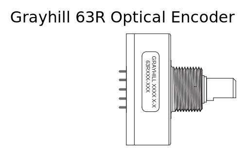
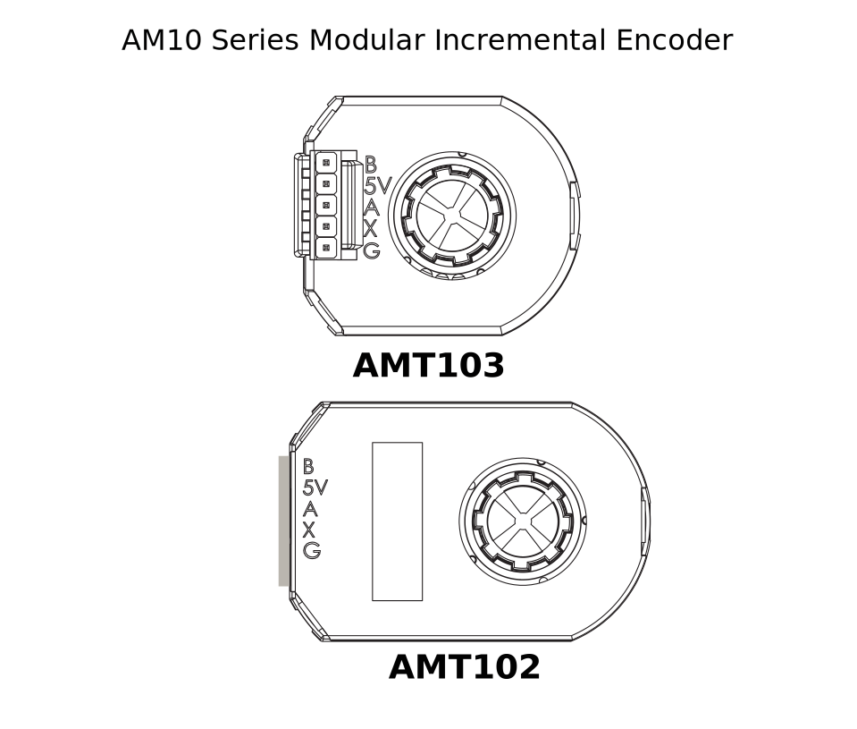
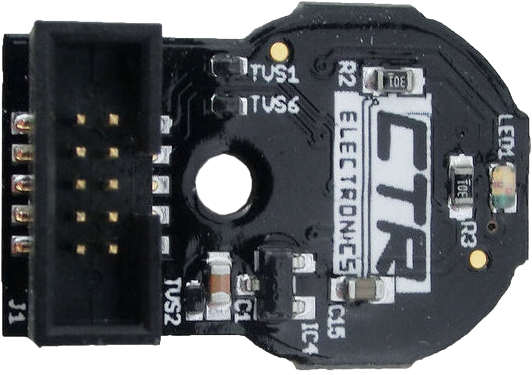

.. include:: <isonum.txt>

Encoders - Hardware
===================

.. note:: This section covers encoder hardware.  For a software guide to encoders, see :ref:`docs/software/hardware-apis/sensors/encoders-software:Encoders - Software`.

Encoders are by far the most common method for measuring rotational motion in FRC\ |reg|, and for good reason - they are cheap, easy-to-use, and reliable.  As they produce digital signals, they are less-prone to noise and interference than analog devices (such as :doc:`potentiometers <analog-potentiometers-hardware>`).

Types of Encoders
-----------------

There are three main ways encoders connect physically that are typically used in FRC:

- `Shafted encoders`_
- `On-shaft encoders`_
- `Magnetic encoders`_

These encoders vary in how they are mounted to the mechanism in question.  In addition to these types of encoders, many FRC mechanisms come with quadrature encoders integrated into their design.

There are also three main ways the encoder data is communicated that are typically used in FRC:

- `Quadrature encoders`_
- `Duty Cycle encoders`_
- `Analog encoders`_

.. note:: Some encoders may support more then one communication method

Shafted Encoders
^^^^^^^^^^^^^^^^

Shafted encoders have a sealed body with a shaft protruding out of it that must be coupled rotationally to a mechanism.  This is often done with a helical beam coupling, or, more cheaply, with a length of flexible tubing (such as surgical tubing or pneumatic tubing), fastened with cable ties and/or adhesive at either end.  Many commercial off-the-shelf FRC gearboxes have purpose-built mounting points for shafted encoders.

Examples of shafted encoders:

- `Grayhill 63r <https://www.grayhill.com/documents/63R-Datasheet>`__
- `US Digital MA3 <https://www.usdigital.com/products/encoders/absolute/shaft/ma3/>`__

On-shaft Encoders
^^^^^^^^^^^^^^^^^

On-shaft encoders couple to a shaft by fitting *around* it, forming a friction coupling between the shaft and a rotating hub inside the encoder.

Examples of On-shaft encoders:

- `AMT103-V <https://www.cuidevices.com/product/motion/rotary-encoders/incremental/modular/amt10-v-kit/amt103-v>`__ available through FIRST Choice
- `REV Through Bore Encoder <https://www.revrobotics.com/rev-11-1271/>`__
- `US Digital E4T <https://www.andymark.com/products/e4t-oem-miniature-optical-encoder-kit>`__

Magnetic Encoders
^^^^^^^^^^^^^^^^^

Magnetic encoders require no mechanical coupling to the shaft at all; rather, they track the orientation of a magnet fixed to the shaft.  While the no-contact nature of magnetic encoders can be handy, they often require precise construction in order to ensure that the magnet is positioned correctly with respect to the encoder.

Examples of magnetic encoders:

- `CTRE Mag Encoder <https://store.ctr-electronics.com/srx-mag-encoder/>`__
- `Thrifty Absolute Magnetic Encoder <https://www.thethriftybot.com/bearings/Thrifty-Absolute-Magnetic-Encoder-p421607500>`__
- `Team 221 Lamprey2 <https://www.andymark.com/products/lamprey-absolute-encoder>`__

Quadrature Encoders
^^^^^^^^^^^^^^^^^^^

The term "quadrature" refers to the method by which the motion is measured/encoded.  A quadrature encoder produces two square-wave pulses that are 90-degrees out-of-phase from each other, as seen in the picture below:

.. image:: /docs/software/hardware-apis/sensors/images/encoders-software/encoding-direction.png
  :alt: The signal pattern in both directions and how using two channels allows us to tell the direction.

Thus, across both channels, there are four total "edges" per period (hence "quad").  The use of two out-of-phase pulses allows the direction of motion to be unambiguously determined from which pulse "leads" the other.

As each square wave pulse is a digital signal, quadrature encoders connect to the :doc:`digital input <digital-inputs-hardware>` ports on the roboRIO.

Examples of quadrature encoders:

- `AMT103-V <https://www.cuidevices.com/product/motion/rotary-encoders/incremental/modular/amt10-v-kit/amt103-v>`__ available through FIRST Choice
- `CTRE Mag Encoder <https://store.ctr-electronics.com/srx-mag-encoder/>`_
- `Grayhill 63r <https://www.grayhill.com/documents/63R-Datasheet>`__
- `REV Through Bore Encoder <https://www.revrobotics.com/rev-11-1271/>`__
- `US Digital E4T <https://www.andymark.com/products/e4t-oem-miniature-optical-encoder-kit>`__

Quadrature Encoder Wiring
~~~~~~~~~~~~~~~~~~~~~~~~~~

.. image:: images/digital-inputs-hardware/e4t-oem-miniature-optical-encoder-to-roborio.svg
  :alt: Wiring the E4T Optical Encoder to two DIO ports.
  :width: 400

Quadrature Encoders, such as the `E4T OEM Miniature Optical Encoder <https://www.andymark.com/products/e4t-oem-miniature-optical-encoder-kit>`__, can be wired to two digital input ports as shown above.

Index
~~~~~

Some quadrature encoders have a third index pin which pulses when the encoder completes a revolution.

Quaderature Encoder Resolution
~~~~~~~~~~~~~~~~~~~~~~~~~~~~~~

.. warning:: The acronyms "CPR" and "PPR" are *both* used by varying sources to denote both edges per revolution *and* cycles per revolution, so the acronym alone is not enough to tell which is of the two is meant when by a given value.  When in doubt, consult the technical manual of your specific encoder.

As encoders measure rotation with digital pulses, the accuracy of the measurement is limited by the number of pulses per given amount of rotational movement.  This is known as the "resolution" of the encoder, and is traditionally measured in one of two different ways: edges per revolution, or cycles per revolution.

*Edges per revolution* refers to the total number of transitions from high-to-low or low-to-high across both channels per revolution of the encoder shaft.  A full period contains *four* edges.

*Cycles per revolution* refers to the total number of *complete periods* of both channels per revolution of the encoder shaft.  A full period is *one* cycle.

Thus, a resolution stated in edges per revolution has a value four times that of the same resolution stated in cycles per revolution.

In general, the resolution of your encoder in edges-per-revolution should be somewhat finer than your smallest acceptable error in positioning.  Thus, if you want to know the mechanism plus-or-minus one degree, you should have an encoder with a resolution somewhat higher than 360 edges per revolution.

Duty Cycle Encoders
^^^^^^^^^^^^^^^^^^^

.. image:: /docs/software/hardware-apis/sensors/images/encoders-software/encoding-direction.png
  :alt: The PWM signal pattern for minimum and maximum angles.

Duty cycle encoders connect to a single digital input on the roboRIO. They output a pulse where the length of a pulse is proportional to the absolute position of the encoder.

Examples of duty cycle encoders:

- `AndyMark Mag Encoder <https://www.andymark.com/products/am-mag-encoder>`__
- `CTRE Mag Encoder <https://store.ctr-electronics.com/srx-mag-encoder/>`__
- `REV Through Bore Encoder <https://www.revrobotics.com/rev-11-1271/>`__
- `Team 221 Lamprey2 <https://www.andymark.com/products/lamprey-absolute-encoder>`__
- `US Digital MA3 <https://www.usdigital.com/products/encoders/absolute/shaft/ma3/>`__

Analog Encoders
^^^^^^^^^^^^^^^

.. image:: images/encoders-hardware/absolute-encoder-to-roborio.svg
  :alt: The connection of a US Digital MA3 Analog encoder to the roboRIO analog input.

Analog encoders connect to a analog input on the roboRIO. They output a voltage proportional to the absolute position of the encoder.

Examples of analog encoders:

- `Team 221 Lamprey2 <https://www.andymark.com/products/lamprey-absolute-encoder>`__
- `Thrifty Absolute Magnetic Encoder <https://www.thethriftybot.com/bearings/Thrifty-Absolute-Magnetic-Encoder-p421607500>`__
- `US Digital MA3 <https://www.usdigital.com/products/encoders/absolute/shaft/ma3/>`__
