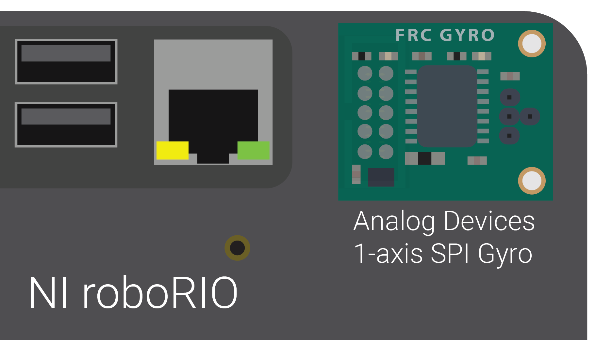
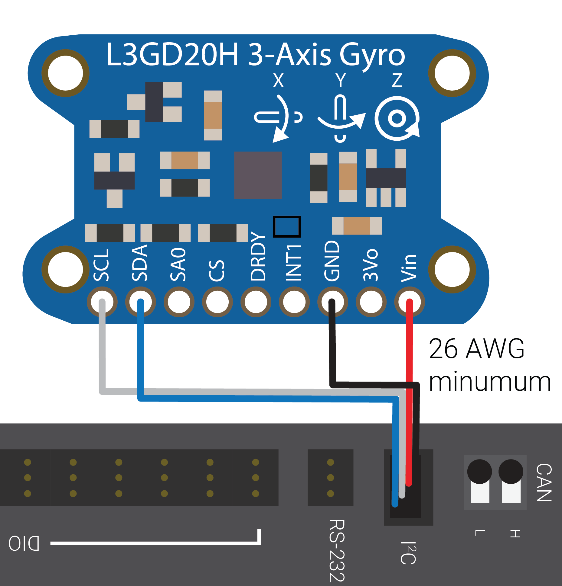
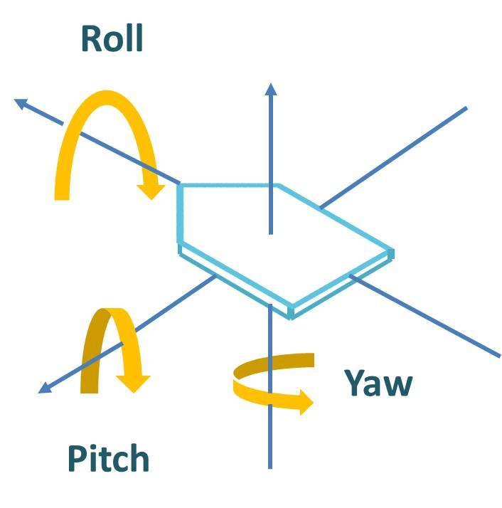

Gyroscopes - Hardware
=====================

.. note:: This section covers gyro hardware.  For a software guide to gyros, see :ref:`docs/software/sensors/gyros-software:Gyroscopes - Software`.

Gyroscopes (or "gyros", for short) are devices that measure rate-of-rotation.  These are particularly useful for stabilizing robot driving, or for measuring heading or tilt by integrating (adding-up) the rate measurements to get a measurement of total angular displacement.

Several popular FRC devices known as :ref:`IMUs <docs/hardware/sensors/accelerometers-hardware:IMUs (Inertial Measurement Units)>` (Inertial Measurement Units) combine 3-axis gyros, accelerometers and other position sensors into one device. Some  popular examples are:

  - `Analog Devices ADIS16448 and ADIS 16470 IMUs <https://www.analog.com/en/landing-pages/001/first.html>`__
  - `CTRE Pigeon IMU <https://www.ctr-electronics.com/gadgeteer-imu-module-pigeon.html>`__
  - `Kauai Labs NavX <https://pdocs.kauailabs.com/navx-mxp/>`__

Types of gyros
--------------

There are two types of Gyros commonly-used in FRC: single-axis gyros, three-axis gyros and IMUs, which often include a 3-axis gyro.

Single-axis gyros
^^^^^^^^^^^^^^^^^

As per their name, single-axis gyros measure rotation rate around a single axis.  This axis is generally specified on the physical device, and mounting the device in the proper orientation so that the desired axis is measured is highly important.  Single-axis gyros generally output an analog voltage corresponding to the measured rate of rotation, and so connect to the roboRIO's :doc:`analog input <analog-inputs-hardware>` ports.

The `Analog Devices ADXRS450 FRC Gyro Board <https://www.analog.com/en/landing-pages/001/first.html>`__ that has been in FIRST Choice in recent years is a commonly used single axis gyro.

Three-axis gyros
^^^^^^^^^^^^^^^^

Three-axis gyros measure rotation rate around all three spacial axes (typically labeled x, y, and z). The motion around these axis is called pitch, yaw and roll.

Peripheral three-axis gyros may simply output three analog voltages (and thus connect to the :ref:`analog input ports <docs/hardware/sensors/analog-inputs-hardware:Connecting a sensor to multiple analog input ports>`, or (more commonly) they may communicate with one of the roboRIO's :doc:`serial buses <serial-buses>`.
