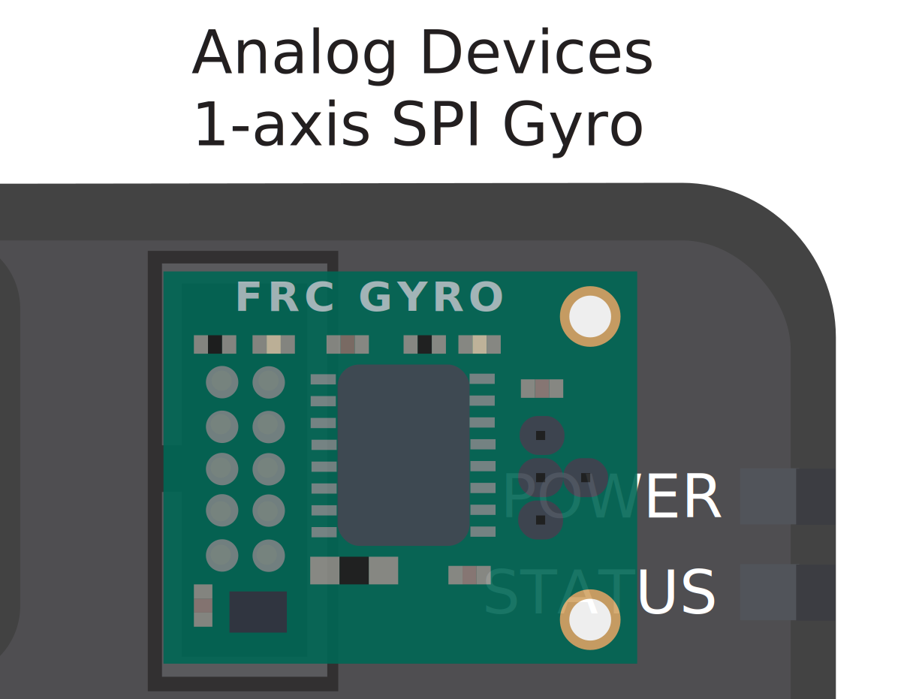
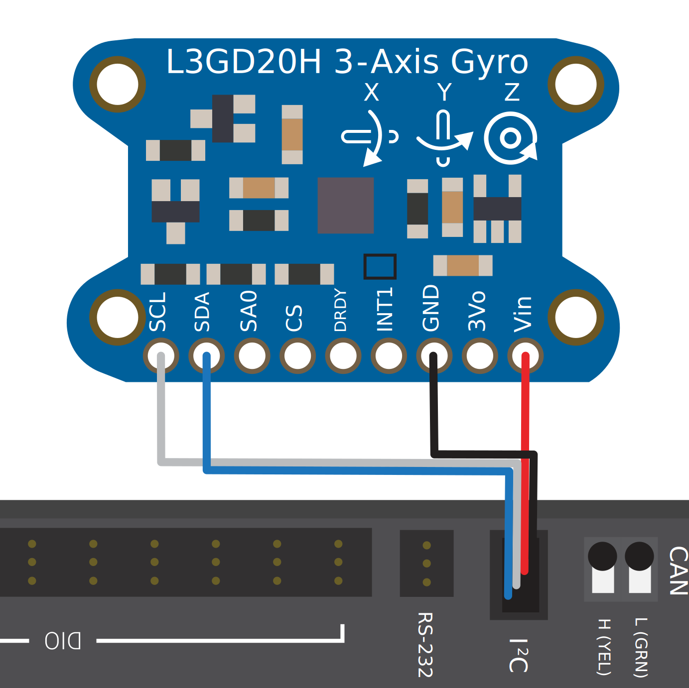

.. include:: <isonum.txt>

Gyroscopes - Hardware
=====================

.. note:: This section covers gyro hardware.  For a software guide to gyros, see :ref:`docs/software/hardware-apis/sensors/gyros-software:Gyroscopes - Software`.

Gyroscopes (or "gyros", for short) are devices that measure rate-of-rotation.  These are particularly useful for stabilizing robot driving, or for measuring heading or tilt by integrating (adding-up) the rate measurements to get a measurement of total angular displacement.

Several popular FRC\ |reg| devices known as :ref:`IMUs <docs/hardware/sensors/accelerometers-hardware:IMUs (Inertial Measurement Units)>` (Inertial Measurement Units) combine 3-axis gyros, accelerometers and other position sensors into one device. Some  popular examples are:

  - `Analog Devices ADIS16448 and ADIS 16470 IMUs <https://www.analog.com/en/landing-pages/001/first.html>`__
  - `CTRE Pigeon IMU <https://store.ctr-electronics.com/gadgeteer-pigeon-imu/>`__
  - `Kauai Labs NavX <https://pdocs.kauailabs.com/navx-mxp/>`__

Types of Gyros
--------------

There are two types of Gyros commonly-used in FRC: single-axis gyros, three-axis gyros and IMUs, which often include a 3-axis gyro.

Single-axis Gyros
^^^^^^^^^^^^^^^^^

As per their name, single-axis gyros measure rotation rate around a single axis.  This axis is generally specified on the physical device, and mounting the device in the proper orientation so that the desired axis is measured is highly important.  Some single-axis gyros can output an analog voltage corresponding to the measured rate of rotation, and so connect to the roboRIO's :doc:`analog input <analog-inputs-hardware>` ports. Other single-axis gyros, such as the `ADXRS450 <https://wiki.analog.com/first>`__ pictured above, use the :ref:`SPI port <docs/hardware/sensors/serial-buses:SPI>` on the roboRIO instead.

The `Analog Devices ADXRS450 FRC Gyro Board <https://www.analog.com/en/landing-pages/001/first.html>`__ that has been in FIRST Choice in recent years is a commonly used single axis gyro.

Three-axis Gyros
^^^^^^^^^^^^^^^^

Three-axis gyros measure rotation rate around all three spacial axes (typically labeled x, y, and z). The motion around these axis is called pitch, yaw, and roll.

.. image:: images/gyros-hardware/drive-yaw-pitch-roll.svg
  :alt: The 3 axis: yaw, pitch, and roll and how they relate to robot movement.
  :width: 400

.. note:: The coordinate system shown above is often used for three axis gyros, as it is a convention in avionics. Note that other coordinate systems are used in mathematics and referenced throughout WPILib. Please refer to the :ref:`Drive class axis diagram<docs/software/hardware-apis/motors/wpi-drive-classes:Axis Conventions>` for axis referenced in software.

Peripheral three-axis gyros may simply output three analog voltages (and thus connect to the :ref:`analog input ports <docs/hardware/sensors/analog-inputs-hardware:Connecting a sensor to multiple analog input ports>`, or (more commonly) they may communicate with one of the roboRIO's :doc:`serial buses <serial-buses>`.
