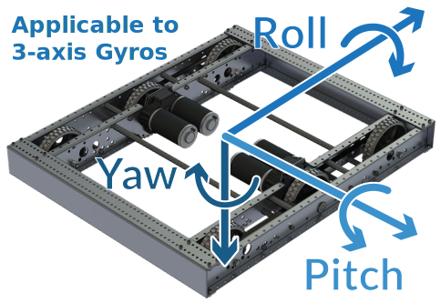

.. include:: <isonum.txt>

# Gyroscopes - Hardware

.. note:: This section covers gyro hardware.  For a software guide to gyros, see :ref:`docs/software/hardware-apis/sensors/gyros-software:Gyroscopes - Software`.

Gyroscopes (or "gyros", for short) are devices that measure rate-of-rotation.  These are particularly useful for stabilizing robot driving, or for measuring heading or tilt by integrating (adding-up) the rate measurements to get a measurement of total angular displacement.

Several popular FRC\ |reg| devices known as :ref:`IMUs <docs/hardware/sensors/accelerometers-hardware:IMUs (Inertial Measurement Units)>` (Inertial Measurement Units) combine 3-axis gyros, accelerometers, and other position sensors into one device. Some  popular examples are:

- [CTRE Pigeon 2.0 IMU](https://store.ctr-electronics.com/pigeon-2/)
- [Kauai Labs NavX](https://pdocs.kauailabs.com/navx-mxp/)

The most common type of Gyros used in FRC are three-axis gyros, commonly included in IMUs.

Three-axis gyros measure rotation rate around all three spatial axes (typically labeled x, y, and z). The motion around these axis is called pitch, yaw, and roll.

.. note:: The coordinate system shown above is often used for three axis gyros, as it is a convention in avionics. Note that other coordinate systems are used in mathematics and referenced throughout WPILib. Please refer to the :ref:`Drive class axis diagram<docs/software/hardware-apis/motors/wpi-drive-classes:Axis Conventions>` for axis referenced in software.

Peripheral three-axis gyros typically communicate over the :ref:`CAN Bus <docs/hardware/sensors/serial-buses:CAN Bus>` to send data.