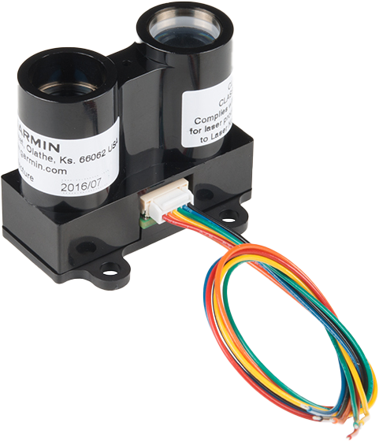
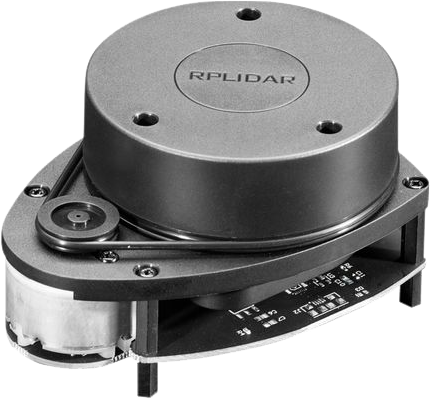

.. include:: <isonum.txt>

LIDAR - Hardware
================

LIDAR (light detection and ranging) sensors are a variety of rangefinder seeing increasing use in FRC\ |reg|.

LIDAR sensors work quite similarly to :doc:`ultrasonics <ultrasonics-hardware>`, but use light instead of sound.  A laser is pulsed, and the sensor measures the time until the pulse bounces back.

Types of LIDAR
--------------

There are two types of LIDAR sensors commonly used in current FRC: 1-dimensional LIDAR, and 2-dimensional LIDAR.

1-Dimensional LIDAR
^^^^^^^^^^^^^^^^^^^

A 1-dimensional (1D) LIDAR sensor works much like an ultrasonic sensor - it measures the distance to the nearest object more or less along a line in front of it.  1D LIDAR sensors can often be more-reliable than ultrasonics, as they have narrower "beam profiles" and are less susceptible to interference. Pictured above is the `Garmin LIDAR-Lite Optical Distance Sensor <https://www.andymark.com/products/lidar-lite-3>`__.

1D LIDAR sensors generally output an analog voltage proportional to the measured distance, and thus connect to the roboRIO's :doc:`analog input <analog-inputs-hardware>` ports or to one of the :doc:`roboRIO's serial buses <serial-buses>`.

2-Dimensional LIDAR
^^^^^^^^^^^^^^^^^^^

A 2-dimensional (2D) LIDAR sensor measures distance in all directions in a plane.  Generally, this is accomplished (more-or-less) by simply placing a 1D LIDAR sensor on a turntable that spins at a constant rate.

Since, by nature, 2D LIDAR sensors need to send a large amount of data back to the roboRIO, they almost always connect to one of the roboRIO's :doc:`serial buses <serial-buses>`.

Caveats
-------

LIDAR sensors do suffer from a few common drawbacks:

Like ultrasonics, LIDAR relies on the reflection of the emitted pulse back to the sensor.  Thus, LIDAR critically depends on the reflectivity of the material in the wavelength of the laser.  The FRC field wall is made of polycarbonate, which tends to be transparent in the infrared wavelength (which is what is generally legal for FRC use).  Thus, LIDAR tends to struggle to detect the field barrier.

2D LIDAR sensors (at the price range legal for FRC use) tend to be quite noisy, and processing their measured data (known as a "point cloud") can involve a lot of complex software.  Additionally, there are very few 2D LIDAR sensors made specifically for FRC, so software support tends to be scarce.

As 2D LIDAR sensors rely on a turntable to work, their update rate is limited by the rate at which the turntable spins.  For sensors in the price range legal for FRC, this often means that they do not update their values particularly quickly, which can be a limitation when the robot (or the targets) are moving.

Additionally, as 2D LIDAR sensors are limited in *angular* resolution, the *spatial* resolution of the point cloud is worse when targets are further away.
