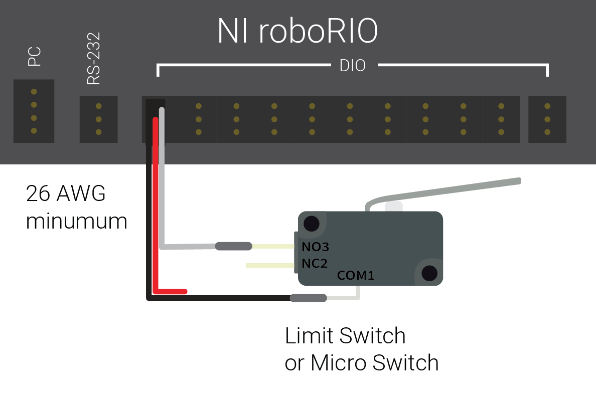
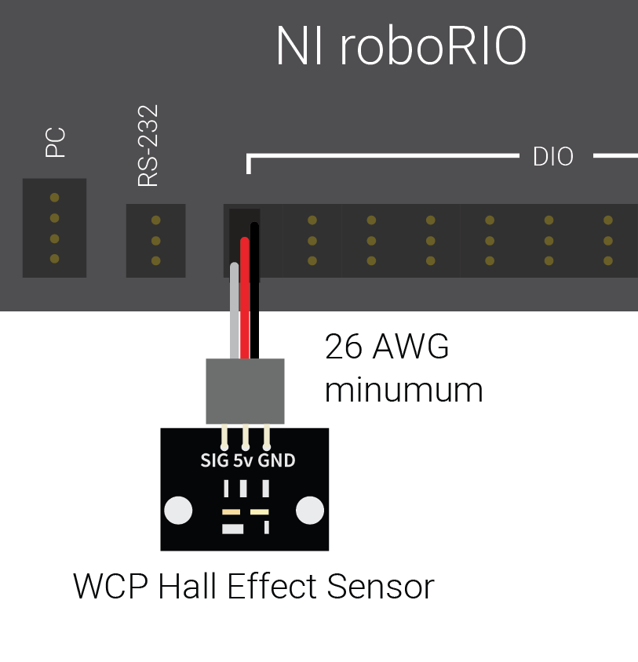

Proximity Switches - Hardware
=============================

.. note:: This section covers proximity switch hardware.  For a guide to using proximity switches in software, see :ref:`docs/software/sensors/digital-inputs-software:Digital Inputs - Software`.

One of the most common sensing tasks on a robot is detecting when an object (be it a mechanism, game piece, or field element) is within a certain distance of a known point on the robot.  This type of sensing is accomplished by a "proximity switch."

Proximity switch operation
--------------------------

Proximity switches are switches - they operate a circuit between an "open" state (in which there *is not* connectivity across the circuit) and a "closed" one (in which there *is*).  Thus, proximity switches generate a digital signal, and accordingly, they are almost always connected to the roboRIO's :doc:`digital input <digital-inputs-hardware>` ports.

Proximity switches can be either "normally-open," in which activating the switch closes the circuit, or "normally closed," in which activating the switch opens the circuit.  Some switches offer *both* a NO and a NC circuit connected to the same switch.  In practice, the effective difference between a NO and a NC switch is the behavior of the system in the case that the wiring to the switch fails, as a wiring failure will almost always result in an open circuit.  NO switches are often "safer," in that a wiring failure causes the system to behave as if the switch were pressed - as switches are often used to prevent a mechanism from damaging itself, this mitigates the chance of damage to the mechanism in the case of a wiring fault.

Types of proximity switches
---------------------------

There are several types of proximity switches that are commonly-used in FRC:

 - `Mechanical Proximity Switches ("limit switches")`_
 - `Magnetic Proximity Switches`_
 - `Inductive Proximity Switches`_
 - `Photoelectric Proximity Switches`_

Mechanical Proximity Switches ("limit switches")
^^^^^^^^^^^^^^^^^^^^^^^^^^^^^^^^^^^^^^^^^^^^^^^^

Mechanical proximity switches (more commonly known as "limit switches") are probably the most-commonly used proximity switch in FRC, due to their simplicity, ease-of-use, and low cost.  A limit switch is quite simply a switch attached to a mechanical arm.  The switch is activated when an object pushes against the switch arm, actuating the switch.

Limit switches vary in size, the geometry of the switch-arm, and in the amount of "throw" required to activate the switch.  While limit switches are quite cheap, their mechanical actuation is sometimes less-reliable than no-contact alternatives.  However, they are also extremely versatile, as they can be triggered by any physical object capable of moving the switch arm.

Magnetic Proximity Switches
^^^^^^^^^^^^^^^^^^^^^^^^^^^

Magnetic proximity switches are activated when a magnet comes within a certain range of the sensor.  Accordingly, they are "no-contact" switches - they do not require contact with the object being sensed.

There are two major types of magnetic proximity switches - reed switches and hall-effect sensors.  In a reed switch, the magnetic field causes a pair of flexible metal contacts (the "reeds") to touch each other, closing the circuit.  A hall-effect sensor, on the other hand, detects the induced voltage transversely across a current-carrying conductor.  Hall-effect sensors are generally the cheaper and more-reliable of the two. Pictured above is the `Hall effect sensor from West Coast Products <https://www.wcproducts.net/wcp-0971>`__

Magnetic proximity switches may be either "unipolar," "bipolar," or "omnipolar."  A unipolar switch activates and deactivates depending on the presence of a given pole of the magnet (either north or south, depending on the switch).  A bipolar switch activates from the proximity of one pole, and deactivates from the proximity of the opposite pole.  An omnipolar switch will activate in the presence of either pole, and deactivates when no magnet is present.

While magnetic proximity switches are often more reliable than their mechanical counterparts, they require the user to mount a magnet on the object to be sensed - thus, they are mostly used for sensing mechanism location.

Inductive Proximity Switches
~~~~~~~~~~~~~~~~~~~~~~~~~~~~

.. image:: images/proximity-switches-hardware/inductive-proximity-switch.jpg

Inductive proximity switches are activated when a conductor of any sort comes within a certain range of the sensor.  Like magnetic proximity switches, they are "no-contact" switches.

Inductive proximity switches are used for many of the same purposes as magnetic proximity switches.  Their more-general nature (activating in the presence of any conductor, rather than just a magnet) can be either a help or a hindrance, depending on the nature of the application.

Photoelectric Proximity Switches
~~~~~~~~~~~~~~~~~~~~~~~~~~~~~~~~

.. image:: images/proximity-switches-hardware/photoelectric-proximity-switch.jpg

.. image:: images/proximity-switches-hardware/ir-beam-break-sensor.jpg

Photoelectric proximity switches are the last type of no-contact proximity switch in widespread use in FRC.  Photoelectric proximity switches contain a light source (usually an IR laser) and a photoelectric sensor that activates the switch when the detected light (which bounces off of the sensor target) exceeds a given threshold.

Since photoelectric proximity switches rely on measuring the amount of reflected light, they are often inconsistent in their triggering range between different materials - accordingly, most photoelectric sensors have an adjustable activation point (typically controller by turning a screw somewhere on the sensor body).  On the other hand, photoelectric sensors are also extremely versatile, as they can detect a greater variety of objects than the other types of no-contact switches.

Photoelectric sensors are also often often used in a "beam break" configuration, in which the emitter is separate from the sensor.  These typically activate when an object is interposed between the emitter and the sensor. Pictured above is a `beam break sensor with an infrared LED and infrared sensor <https://www.adafruit.com/product/2167>`__
