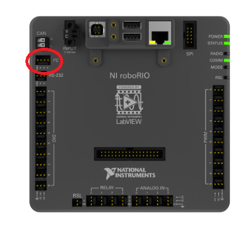
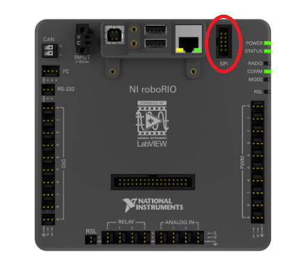
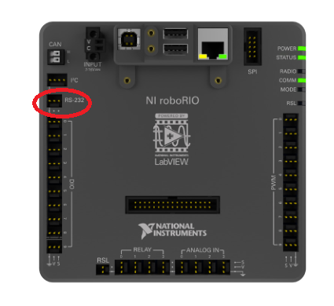
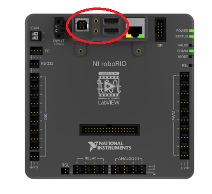
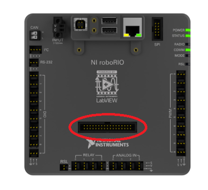

Serial Buses
============

In addition to the :doc:`digital <digital-inputs-hardware>` and :doc:`analog <analog-inputs-hardware>` inputs, the roboRIO also offers several methods of serial communication with peripheral devices.

Both the digital and analog inputs are highly limited in the amount of data that can be send over them.  Serial buses allow users to make use of far more-robust and higher-bandwidth communications protocols with sensors that collect large amounts of data, such as inertial measurement units (IMUs) or 2D LIDAR sensors.

Types of supported serial buses
-------------------------------

The roboRIO supports many basic types of serial communications.

I2C
^^^

.. image:: images/serial-buses/i2c-pinout.png

To communicate to peripheral devices over I2C, each pin should be wired to its corresponding pin on the device.  I2C allows users to wire a "chain" of slave devices to a single port, so long as those devices have separate IDs set.

The I2C bus can also be used through the MXP Expansion Port.

SPI
^^^

.. image:: images/serial-buses/spi-pinout.png

To communicate to peripheral devices over SPI, each pin should be wired to its corresponding pin on the device.  The SPI port supports communications to up to four devices (corresponding to the CS 0-3 pins on the diagram above).

The SPI bus can also be used through the MXP Expansion Port.

RS232
^^^^^

.. image:: images/serial-buses/rs232-pinout.png

To communicate to peripheral devices over RS232, each pin should be wired to its corresponding pin on the device.

The RS232 bus can also be used through the MXP Expansion Port.

USB
^^^

The roboRIO has three USB ports: 1x USB-B, and 2x USB-A.  These can be connected to devices with standard USB cables.

MXP Expansion Port
^^^^^^^^^^^^^^^^^^

.. image:: images/serial-buses/mxp-pinout.png

Several of the serial buses are also available for use through the roboRIO's MXP Expansion Port.  This port allows users to make use of many additional :doc:`digital <digital-inputs-hardware>` and :doc:`analog <analog-inputs-hardware>` inputs, as well as the various serial buses.

Many peripheral devices attach directly to the MXP port for convenience, requiring no wiring on the part of the user.

CAN Bus
^^^^^^^

.. image:: images/serial-buses/can-bus-talon-srx-chain.png

Additionally, the roboRIO supports communications with peripheral devices over the CAN bus.  However, as the FRC CAN protocol is quite idiosyncratic, relatively few peripheral sensors support it (though it is heavily used for motor controllers).

Several sensors primarily use the CAN bus, such as:

- `CAN Based Time-of-Flight Range/Distance Sensor from playingwithfusion.com <https://www.playingwithfusion.com/productview.php?pdid=96&catid=1009>`__
- TalonSRX-based sensors, such as the `Gadgeteer Pigeon IMU  <http://www.ctr-electronics.com/sensors/gadgeteer-imu-module-pigeon.html>`__ and the `SRX MAG Encoder <https://www.ctr-electronics.com/sensors/srx-magnetic-encoder.html>`__
- `CANifier <https://www.ctr-electronics.com/control-system/can-can-canifier-driver-led-driver-gpio.html>`__
- Power monitoring sensors built into the :ref:`Power Distribution Panel (PDP) <docs/hardware/getting-started/control-system-hardware:Power Distribution Panel>`

More information about using devices connected to the CAN bus can be found in the article about :ref:`using can devices <docs/software/can-devices/using-can-devices:Using CAN Devices>`
