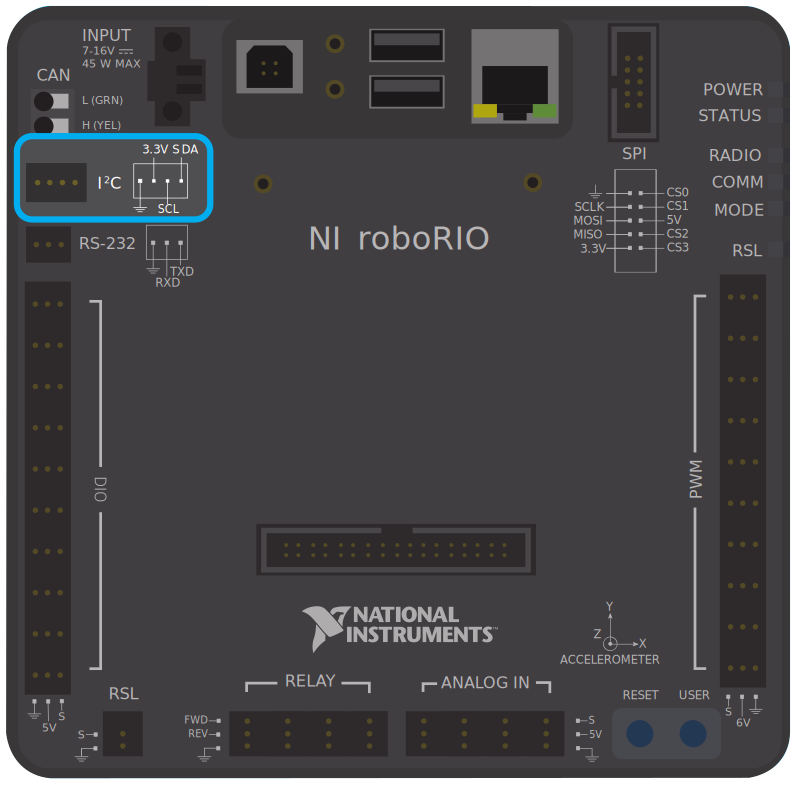
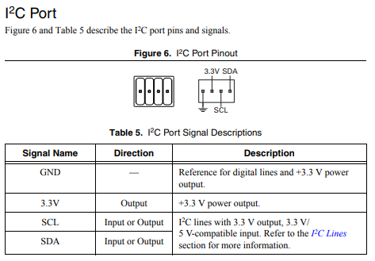
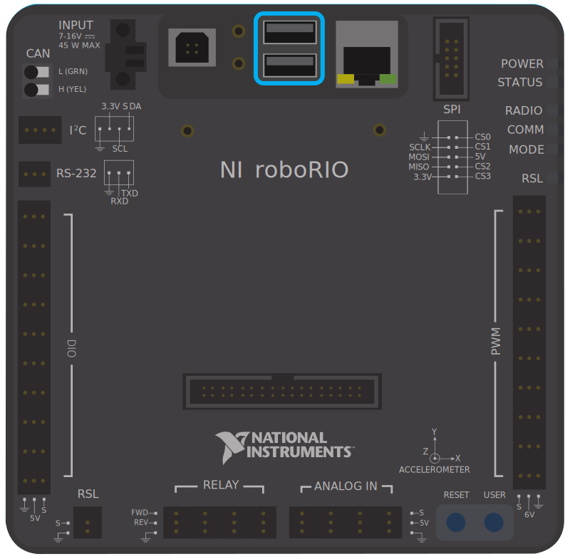
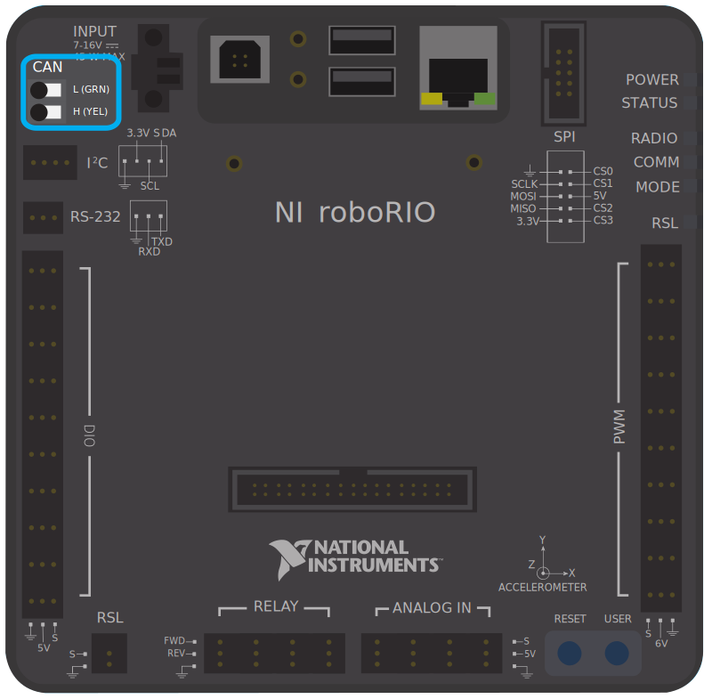
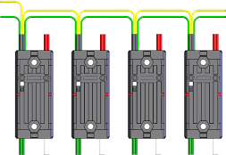

.. include:: <isonum.txt>

# Serial Buses

In addition to the :doc:`digital <digital-inputs-hardware>` and :doc:`analog <analog-inputs-hardware>` inputs, the roboRIO also offers several methods of serial communication with peripheral devices.

Both the digital and analog inputs are highly limited in the amount of data that can be sent over them.  Serial buses allow users to make use of far more-robust and higher-bandwidth communications protocols with sensors that collect large amounts of data, such as inertial measurement units (IMUs) or 2D LIDAR sensors.

## Types of supported serial buses

The roboRIO supports many basic types of serial communications:

- `I2C`_
- `USB Host`_
- `CAN Bus`_

## I2C

To communicate to peripheral devices over :term:`I2C`, each pin should be wired to its corresponding pin on the device.  I2C allows users to wire a "chain" of slave devices to a single port, so long as those devices have separate IDs set.

## USB Client

One of the USB ports on the roboRIO is a USB-B, or USB client port.  This can be connected to devices, such as a Driver Station computer, with a standard USB cable.

## USB Host

Two of the USB ports on the roboRIO is a USB-A, or USB host port.  These can be connected to devices, such as cameras or sensors, with a standard USB cable.

## CAN Bus

One of the advantages of using the CAN bus protocol is that devices can be daisy-chained, as shown below. If power is removed from any device in the chain, data signals will still be able to reach all devices in the chain.

Several sensors primarily use the CAN bus. Some examples include:

- [CAN Based Time-of-Flight Range/Distance Sensor from playingwithfusion.com](https://www.playingwithfusion.com/productview.php?pdid=96&catid=1009)
- TalonSRX-based sensors, such as the [Gadgeteer Pigeon IMU ](https://store.ctr-electronics.com/gadgeteer-pigeon-imu/) and the [SRX MAG Encoder](https://store.ctr-electronics.com/srx-mag-encoder/)
- [CANifier](https://store.ctr-electronics.com/canifier/)
- Power monitoring sensors built into the :ref:`CTRE Power Distribution Panel (PDP) <docs/controls-overviews/control-system-hardware:CTRE Power Distribution Panel>` and the :ref:`REV Power Distribution Hub (PDH) <docs/controls-overviews/control-system-hardware:REV Power Distribution Hub>`

More information about using devices connected to the CAN bus can be found in the article about :ref:`using can devices <docs/software/can-devices/using-can-devices:Using CAN Devices>`.
