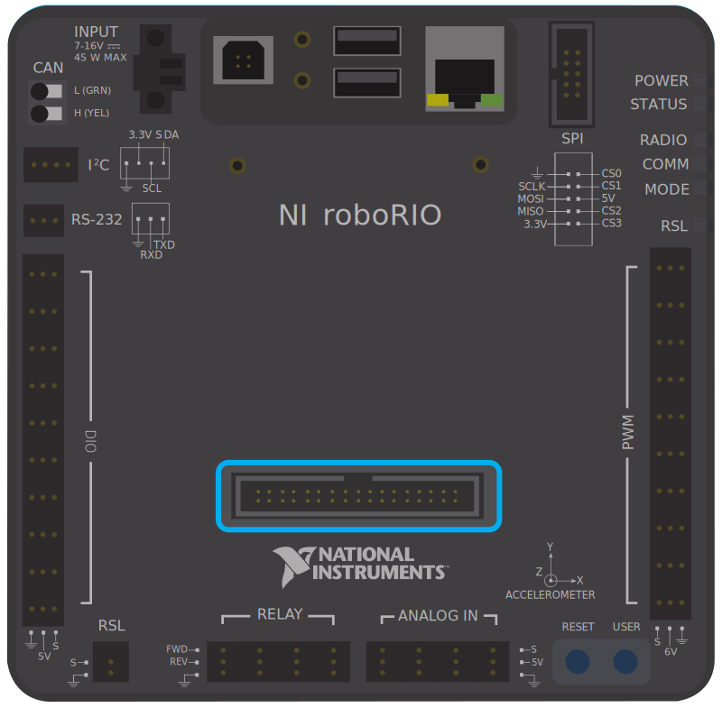
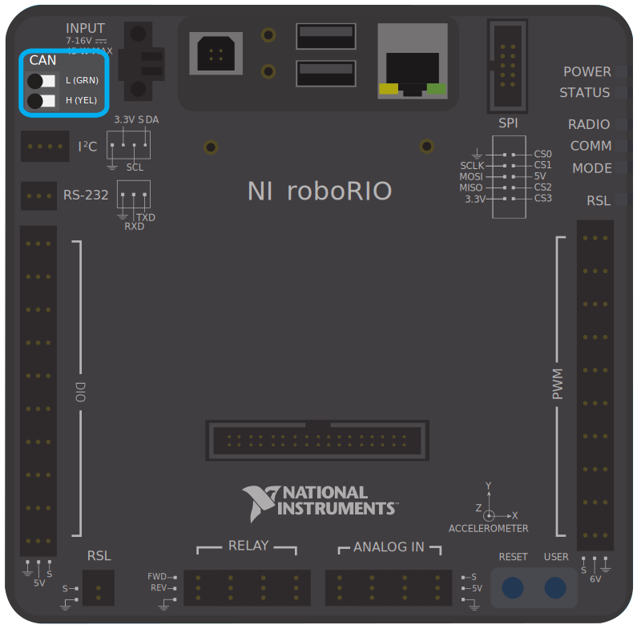

.. include:: <isonum.txt>

Serial Buses
============

In addition to the :doc:`digital <digital-inputs-hardware>` and :doc:`analog <analog-inputs-hardware>` inputs, the roboRIO also offers several methods of serial communication with peripheral devices.

Both the digital and analog inputs are highly limited in the amount of data that can be send over them.  Serial buses allow users to make use of far more-robust and higher-bandwidth communications protocols with sensors that collect large amounts of data, such as inertial measurement units (IMUs) or 2D LIDAR sensors.

Types of supported serial buses
-------------------------------

The roboRIO supports many basic types of serial communications:

- `I2C`_
- `SPI`_
- `RS-232`_
- `USB Host`_
- `CAN Bus`_

Additionally, the roboRIO supports communications with peripheral devices over the CAN bus.  However, as the FRC\ |reg| CAN protocol is quite idiosyncratic, relatively few peripheral sensors support it (though it is heavily used for motor controllers).

I2C
---

.. image:: images/roborio/roborio-i2c.svg
   :alt: The I2C port on the roboRIO.

.. image:: images/serial-buses/i2c-pinout.png
   :alt: I2C roboRIO port pin specifcations.

To communicate to peripheral devices over I2C, each pin should be wired to its corresponding pin on the device.  I2C allows users to wire a "chain" of slave devices to a single port, so long as those devices have separate IDs set.

The I2C bus can also be used through the `MXP expansion port`_. The I2C bus on the MXP is independent. For example, a device on the main bus can have the same ID as a device on the MXP bus.

.. warning:: Be sure to familiarize yourself on the following known issue before using the onboard I2C port: :ref:`docs/yearly-overview/known-issues:Onboard I2C Causing System Lockups`

SPI
---

.. image:: images/roborio/roborio-spi.svg
   :alt: Show the SPI port on the roboRIO.

.. image:: images/serial-buses/spi-pinout.png
   :alt: SPI roboRIO port pin specifcations.

To communicate to peripheral devices over SPI, each pin should be wired to its corresponding pin on the device.  The SPI port supports communications to up to four devices (corresponding to the Chip Select (CS) 0-3 pins on the diagram above).

The SPI bus can also be used through the `MXP expansion port`_. The MXP port provides independent clock, and input/output lines and an additional CS.

RS-232
------

.. image:: images/roborio/roborio-rs-232.svg
   :alt: Location of the RS-232 port on the roboRIO.

.. image:: images/serial-buses/rs232-pinout.png
   :alt: roboRIO RS-232 port pin specifcations.

To communicate to peripheral devices over RS-232, each pin should be wired to its corresponding pin on the device.

The RS-232 bus can also be used through the `MXP expansion port`_.

The roboRIO RS-232 serial port uses RS-232 signaling levels (+/- 15v). The MXP serial port uses CMOS signaling levels (+/- 3.3v).

.. note:: By default, the onboard RS-232 port is utilized by the roboRIO's serial console. In order to use it for an external device, the serial console must be disabled using the :ref:`Imaging Tool <docs/zero-to-robot/step-3/imaging-your-roborio:Imaging your roboRIO>` or :ref:`docs/software/roborio-info/roborio-web-dashboard:roboRIO Web Dashboard`.

USB Client
----------

One of the USB ports on the roboRIO is a USB-B, or USB client port.  This can be connected to devices, such as a Driver Station computer, with a standard USB cable.

USB Host
--------

.. image:: images/roborio/roborio-usb-host.svg
   :alt: Location of the two USB ports on the roboRIO at top center.

Two of the USB ports on the roboRIO is a USB-A, or USB host port.  These can be connected to devices, such as cameras or sensors, with a standard USB cable.

MXP Expansion Port
------------------

.. image:: images/serial-buses/mxp-pinout.png
   :alt: MXP pinout.

Several of the serial buses are also available for use through the roboRIO's MXP Expansion Port.  This port allows users to make use of many additional :doc:`digital <digital-inputs-hardware>` and :doc:`analog <analog-inputs-hardware>` inputs, as well as the various serial buses.

Many peripheral devices attach directly to the MXP port for convenience, requiring no wiring on the part of the user.

CAN Bus
-------

Additionally, the roboRIO supports communications with peripheral devices over the CAN bus.  However, as the FRC CAN protocol is quite idiosyncratic, relatively few peripheral sensors support it (though it is heavily used for motor controllers). One of the advantages of using the CAN bus protocol is that devices can be daisy-chained, as shown below. If power is removed from any device in the chain, data signals will still be able to reach all devices in the chain.

.. image:: images/serial-buses/can-bus-talon-srx-chain.png
   :alt: A CAN bus topology between motor controllers.

Several sensors primarily use the CAN bus. Some examples include:

- `CAN Based Time-of-Flight Range/Distance Sensor from playingwithfusion.com <https://www.playingwithfusion.com/productview.php?pdid=96&catid=1009>`__
- TalonSRX-based sensors, such as the `Gadgeteer Pigeon IMU  <https://store.ctr-electronics.com/gadgeteer-pigeon-imu/>`__ and the `SRX MAG Encoder <https://store.ctr-electronics.com/srx-mag-encoder/>`__
- `CANifier <https://store.ctr-electronics.com/canifier/>`__
- Power monitoring sensors built into the :ref:`CTRE Power Distribution Panel (PDP) <docs/controls-overviews/control-system-hardware:CTRE Power Distribution Panel>` and the :ref:`REV Power Distribution Hub (PDH) <docs/controls-overviews/control-system-hardware:REV Power Distribution Hub>`

More information about using devices connected to the CAN bus can be found in the article about :ref:`using can devices <docs/software/can-devices/using-can-devices:Using CAN Devices>`.
