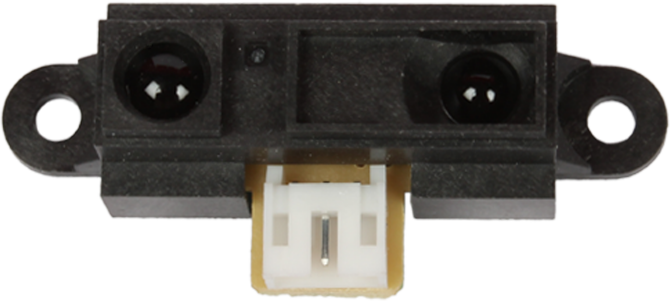
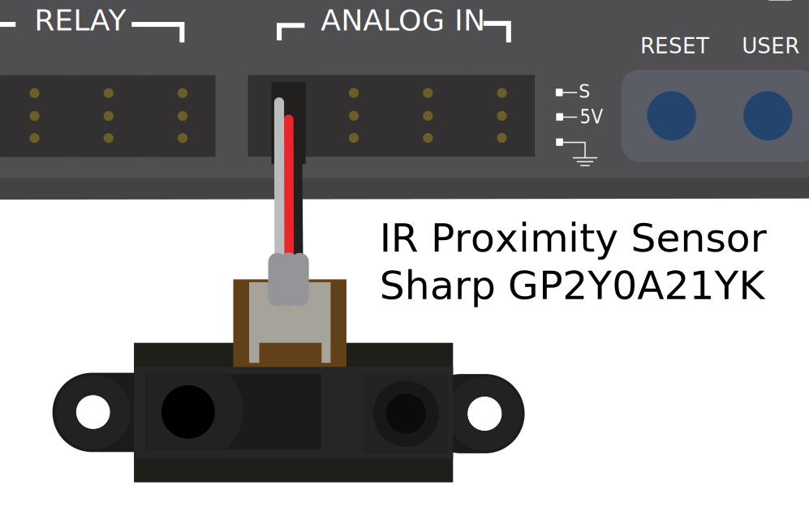

.. include:: <isonum.txt>

Triangulating Rangefinders
==========================

Triangulating rangefinders (often called "IR rangefinders," as they commonly function in the infrared wavelength band) are another common type of rangefinder used in FRC\ |reg|. The sensor shown above is a `common Sharp-brand sensor <https://www.sparkfun.com/products/242>`__

Unlike :doc:`LIDAR <lidar>`, triangulating rangefinders do not measure the time between the emission of a pulse and the receiving of a reflection.  Rather, most IR rangefinders work by emitting a constant beam at a slight angle, and measuring the position of the reflected beam.  The closer the point of contact of the reflected beam to the emitter, the closer the object to the sensor.

Using IR rangefinders
---------------------

IR Rangefinders generally output an analog voltage proportional to the distance to the target, and thus connect to the :doc:`analog input <analog-inputs-hardware>` ports on the RIO.

Caveats
-------

IR rangefinders suffer similar drawbacks to 1D LIDAR sensors - they are very sensitive to the reflectivity of the target in the wavelength of the emitted laser.

Additionally, while IR rangefinders tend to offer better resolution than LIDAR sensors when measuring at short distances, they are also usually more sensitive to differences in orientation of the target, *especially* if the target is highly-reflective (such as a mirror).
