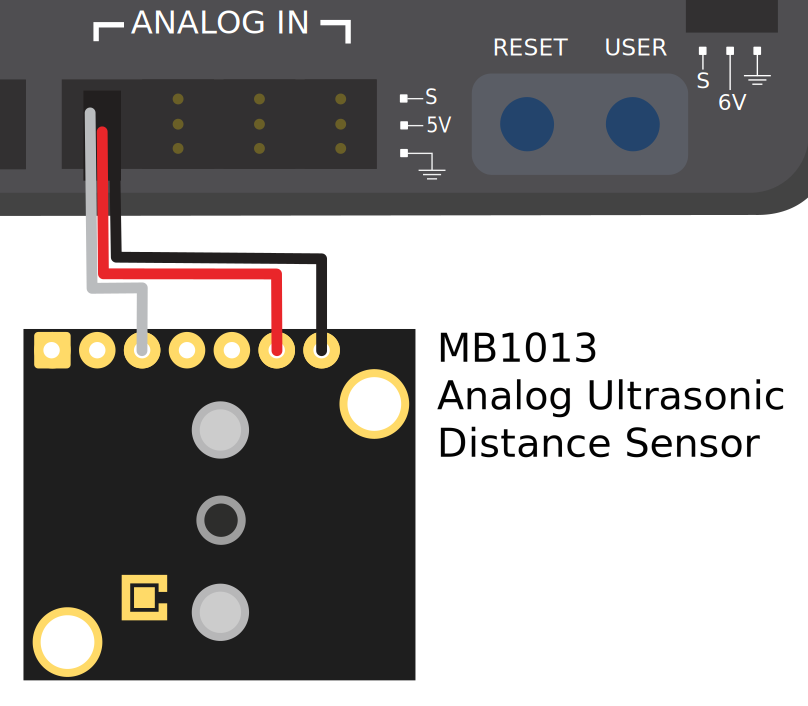
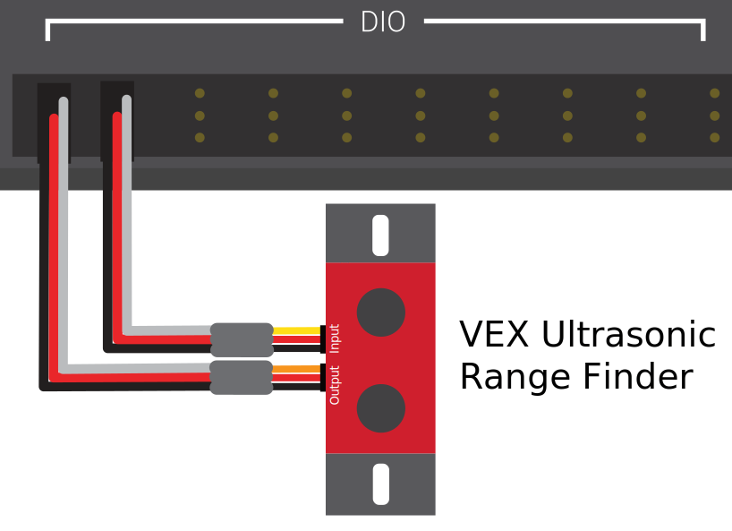
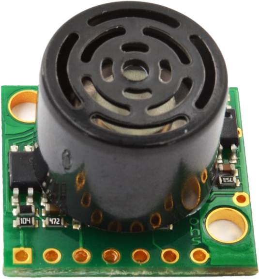

.. include:: <isonum.txt>

Ultrasonics - Hardware
======================

.. note:: This section covers ultrasonic sensor hardware.  For a software guide to ultrasonics, see :ref:`docs/software/hardware-apis/sensors/ultrasonics-software:Ultrasonics - Software`.

Ultrasonic rangefinders are some of the most common rangefinders used in FRC\ |reg|.  They are cheap, easy-to-use, and fairly reliable.  Ultrasonic rangefinders work by emitting a pulse of high-frequency sound, and then measuring how long it takes the echo to reach the sensor after bouncing off the target.  From the measured time and the speed of sound in air, it is possible to calculate the distance to the target.

Types of ultrasonics
--------------------

While all ultrasonic rangefinders operate on the "ping-response" principle outlined above, they may vary in the way they communicate with the roboRIO.

Analog ultrasonics
^^^^^^^^^^^^^^^^^^

Analog ultrasonics output a simple analog voltage corresponding to the distance to the target, and thus connect to an :doc:`analog input <analog-inputs-hardware>` port.  The user will need to calibrate the voltage-to-distance conversion in :ref:`software <docs/software/hardware-apis/sensors/ultrasonics-software:Ultrasonics - Software>`.

Ping-response ultrasonics
^^^^^^^^^^^^^^^^^^^^^^^^^

While, as mentioned, all ultrasonics are functionally ping-response devices, a "ping response" ultrasonic is one configured to connect to :ref:`both a digital input and a digital output <docs/hardware/sensors/digital-inputs-hardware:Connecting a sensor that uses multiple DIO ports>`.  The digital output is used to send the ping, while the input is used to read the response.

Serial ultrasonics
^^^^^^^^^^^^^^^^^^

Some more-complicated ultrasonic sensors may communicate with the RIO over one of the :doc:`serial buses <serial-buses>`, such as RS-232.

Caveats
-------

Ultrasonic sensors are generally quite easy to use, however there are a few caveats.  As ultrasonics work by measuring the time between the pulse and its echo, they generally measure distance only to the *closest* target in their range.  Thus, it is extremely important to pick the right sensor for the job.  The documentation for ultrasonic sensors will generally include a picture of the "beam pattern" that shows the shape of the "window" in which the ultrasonic will detect a target - pay close attention to this when selecting your sensor.

Ultrasonic sensors are also susceptible to interference from other ultrasonic sensors.  In order to minimize this, the roboRIO can run ping-response ultrasonics in a "round-robin" fashion - however, in competition, there is no sure way to ensure that interference from sensors mounted on other robots does not occur.

Finally, ultrasonics may not be able to detect objects that absorb sound waves, or that redirect them in strange ways.  Thus, they work best for detecting hard, flat objects.
