Status Light Quick Reference
====================================

Many of the components of the FRC Control System have indicator lights that can be used to quickly diagnose problems with your robot. This guide shows each of the hardware components and describes the meaning of the indicators. Photos and information from Innovation FIRST and Cross the Road Electronics.

Robot Signal Light (RSL)
---------------------------------------

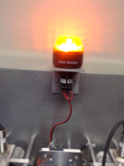

- Solid ON - Robot On and Disabled
- Blinking - Robot On and Enabled
- Off - Robot Off, roboRIO not powered or RSL not wired properly.

RoboRIO
---------

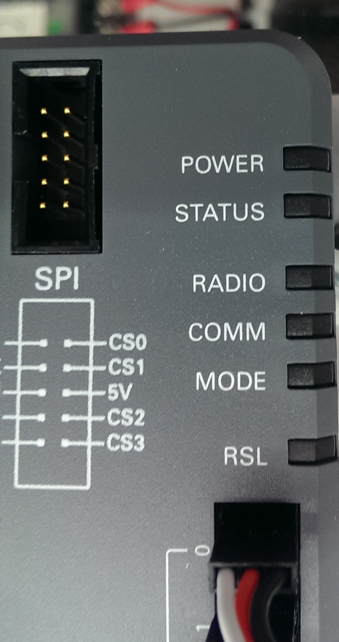

Power
~~~~~~~~~~

- Green - Power is good
- Amber - Brownout protection tripped, outputs disabled
- Red - Power fault, check user rails for short circuit

Status
~~~~~~~~~~

- On while the controller is booting, then should turn off
- 2 blinks - Software error, reimage roboRIO
- 3 blinks - Safe Mode, restart roboRIO, reimage if not resolved
- 4 blinks - Software crashed twice without rebooting, reboot roboRIO, reimage if not resolved
- Constant flash or stays solid on - Unrecoverable error

Radio
~~~~~~~~~~

- Not currently implemented

Comm
~~~~~~~~~~

- Off - No Communication
- Red Solid - Communication with DS, but no user code
- Red Blinking - E-stop
- Green Solid - Good communication with DS

Mode
~~~~~~~~~~

- Off - Outputs disabled (robot in Disabled, brown-out, etc.)
- Amber/Orange - Autonomous Enabled
- Green - Teleop Enabled
- Red - Test Enabled

RSL
~~~~~~~~~~

- See above

OpenMesh Radio
---------------------------

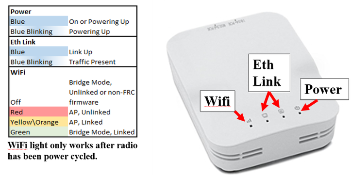

Power
~~~~~~~~~~

- Blue - On or Powering Up
- Blue Blinking - Powering Up

Eth Link
~~~~~~~~~~

- Blue - Link Up
- Blue Blinking - Link Up + Traffic Present

WiFi
~~~~~~~~~~

- Off - Bridge Mode Unlinked or Non-FRC Firmware
- Red - AP Mode Unlinked
- Yellow\Orange - AP Mode Linked
- Green - Bridge Mode Linked

Power Distribution Panel
------------------------------------

.. image:: images/pdpLight.png
    :width: 300

Voltage Regulator Module
---------------------------

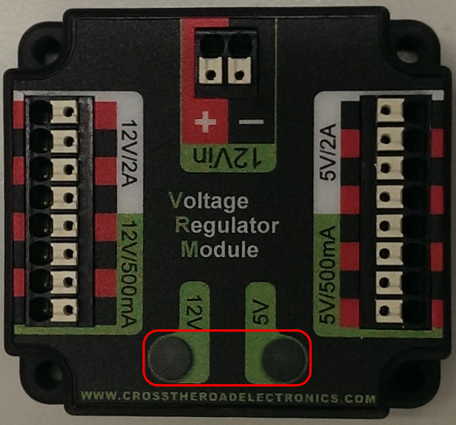

The status LEDs on the VRM indicate the state of the two power supplies. If the supply is functioning properly the LED should be lit bright green. If the LED is not lit or is dim, the output may be shorted or drawing too much current.

Pneumatics Control Module
---------------------------

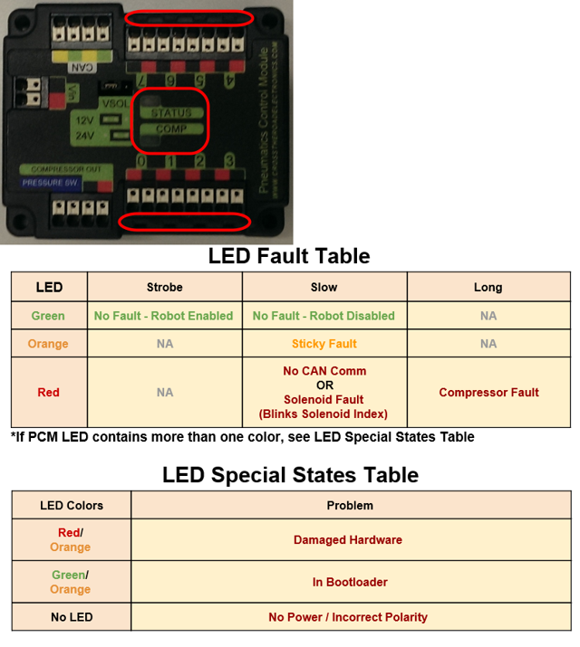

Solenoid Channel LEDs - These LEDs are lit red if the Solenoid channel is enabled and not lit if it is disabled.

Comp 
~~~~~~~~~~

This is the Compressor LED. This LED is green when the compressor output is active (compressor is currently on) and off when the compressor output is not active.

Status
~~~~~~~~~~

The status LED indicates device status as indicated by the two tables above. For more information on resolving PCM faults see the PCM User Manual. Note that the No CAN Comm fault will not occur only if the device cannot see communicate with any other device, if the PCM and PDP can communicate with each other, but not the roboRIO you will NOT see a No Can Comm fault.

Digilent DMC-60
---------------------------

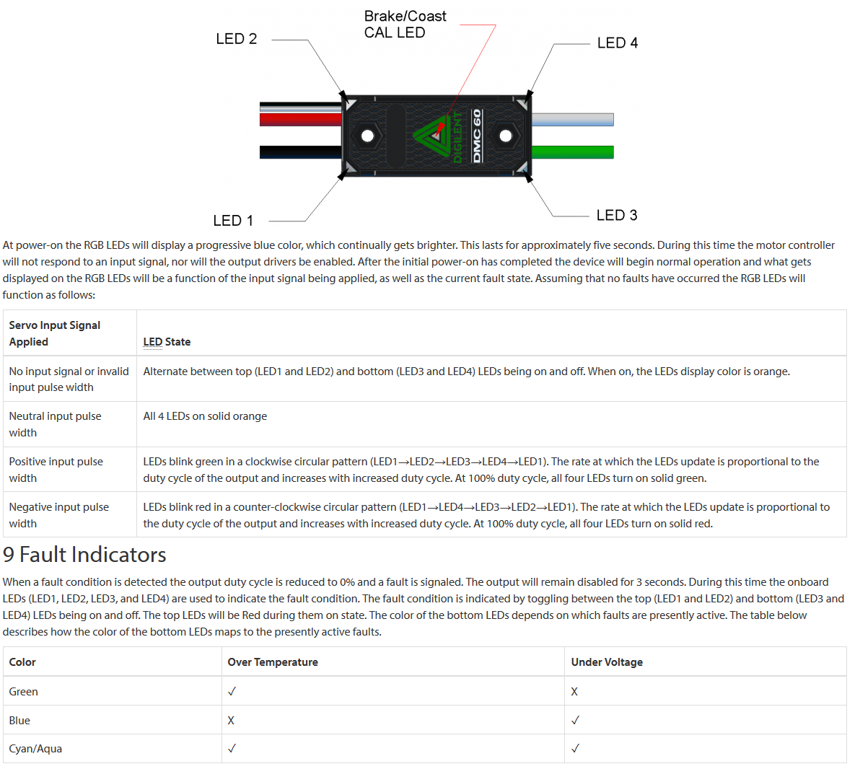

When the center LED is off the device is operating in coast mode. When the center LED is illuminated the device is operating in brake mode. The Brake/Coast mode can be toggled by pressing down on the center of the triangle and then releasing the button.

Jaguar speed controllers
---------------------------

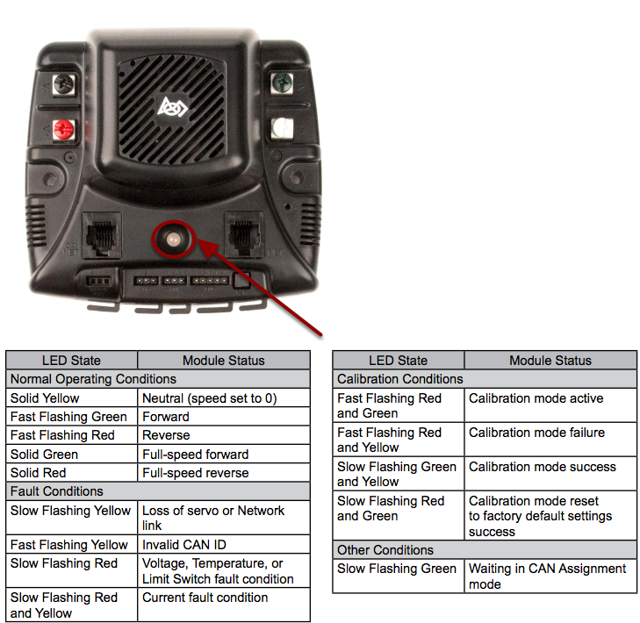

image here

Mindsensors SD 540
------------------

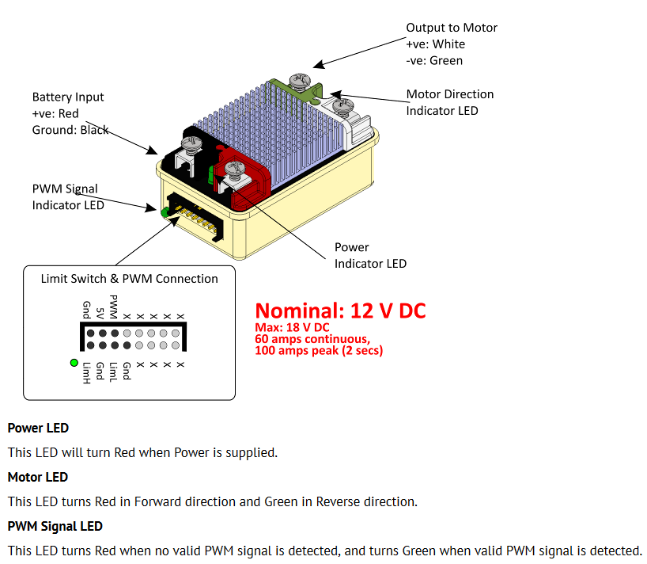

REV Robotics Servo Power Module
------------------------------------

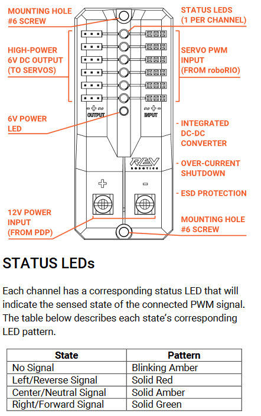

- 6V Power LED off, dim or flickering with power applied = Over-current shutdown

REV Robotics SPARK
---------------------------------

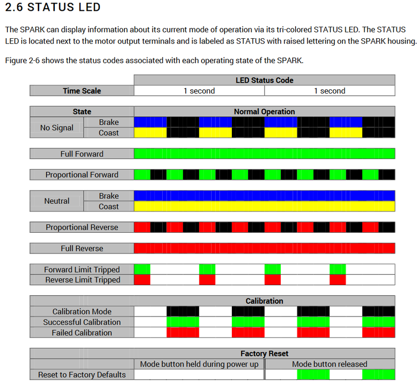

Talon speed controllers
---------------------------------

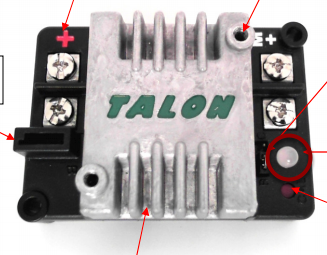

The LED is used to indicate the direction and percentage of throttle and state of calibration. The LED may be one of three colors; red, orange or green. A solid green LED indicates positive output voltage equal to the input voltage of the Talon. A solid Red LED indicates an output voltage that is equal to the input voltage multiplied by -1(input voltage = 12 volts, output equals -12 volts). The LED will blink it’s corresponding color for any throttle less than 100% (red indicates negative polarity, green indicates positive). The rate at which the led blinks is proportional to the percent throttle. The faster the LED blinks the closer the output is to 100% in either polarity.

The LED will blink orange any time the Talon is in the disabled state. This will happen if the PWM input signal is lost, or in FRC, when the robot is disabled. If the Talon is in the enabled state and the throttle is within the 4% dead band, the LED will remain solid orange.

Flashing Red/Green indicate ready for calibration. Several green flashes indicates successful calibration, and red several times indicates unsuccessful calibration.

Victor speed controllers
---------------------------

LED Indicator Status:
~~~~~~~~~~~~~~~~~~~~~~~~~~~~~~

- Green - full forward
- Orange - neutral / brake
- Red - full reverse
- Flashing orange - no PWM signal
- Flashing red/green - calibration mode
- Flashing green - successful calibration
- Flashing red - unsuccessful calibration

Victor-SP speed controllers
---------------------------------

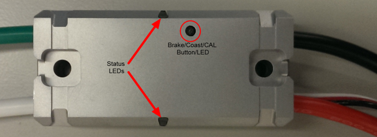

Brake/Coast/Cal Button/LED - Red if the controller is in brake mode, off if the controller is in coast mode

Status
~~~~~~~~~~

The Status LEDs are used to indicate the direction and percentage of throttle and state of calibration. The LEDs may be one of three colors; red, orange or green. Solid green LEDs indicate positive output voltage equal to the input voltage of the Victor-SP. Solid Red LEDs indicate an output voltage that is equal to the input voltage multiplied by -1(input voltage = 12 volts, output equals -12 volts). The LEDs will blink in the corresponding color for any throttle less than 100% (red indicates negative polarity, green indicates positive). The rate at which the LEDs blink is proportional to the percent throttle. The faster the LEDs blink the closer the output is to 100% in either polarity.

The LEDs will blink orange any time the Victor-SP is in the disabled state. This will happen if the PWM input signal is lost, or in FRC, when the robot is disabled. If the Victor-SP is in the enabled state and the throttle is within the 4% dead band, the LED will remain solid orange.

Flashing Red/Green indicate ready for calibration. Several green flashes indicates successful calibration, and red several times indicates unsuccessful calibration.

Talon-SRX speed controllers
------------------------------------

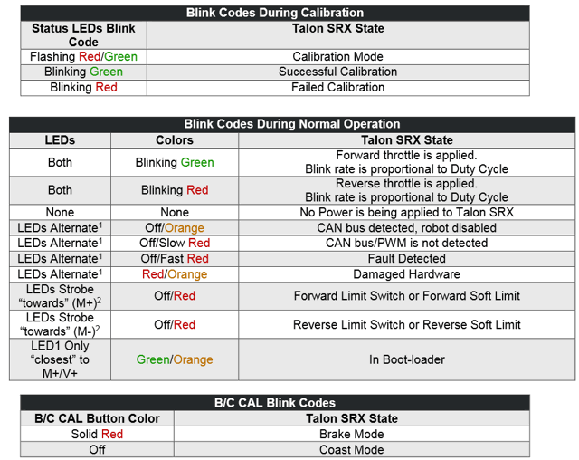

Spike relay configured as a motor, light, or solenoid switch
---------------------------------------------------------------

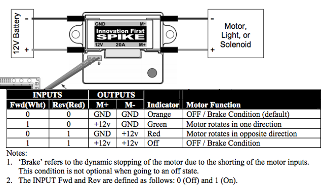

Spike relay configured as for one or two solenoids
------------------------------------------------------

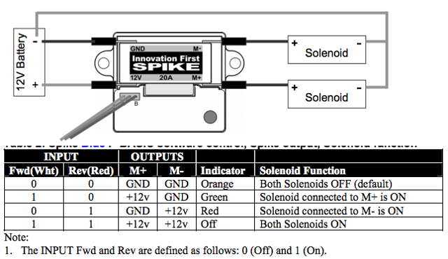
