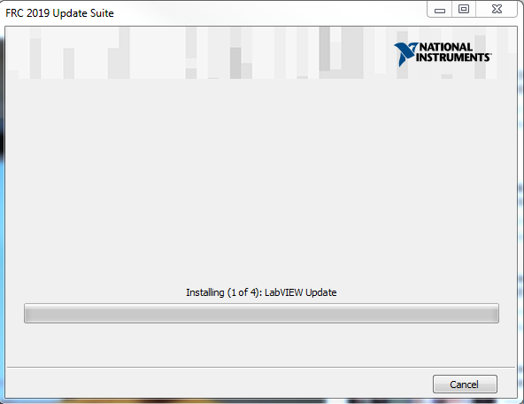
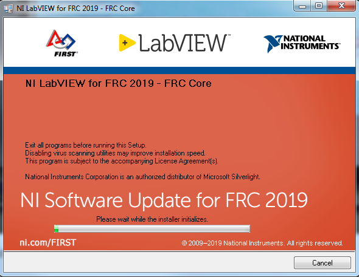
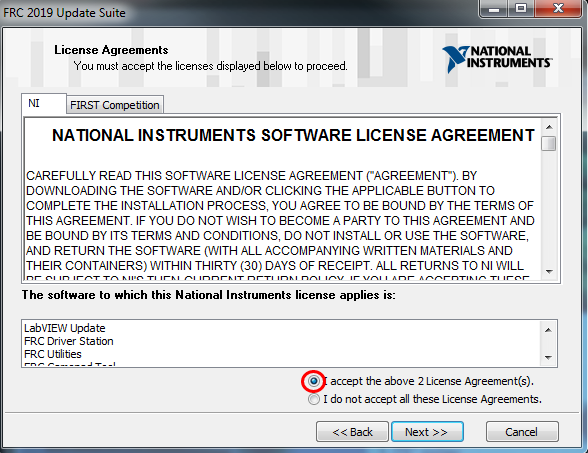
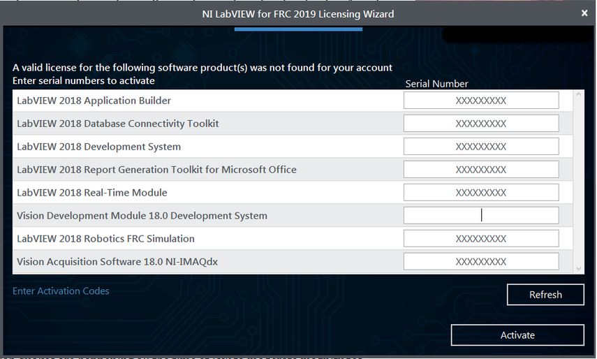
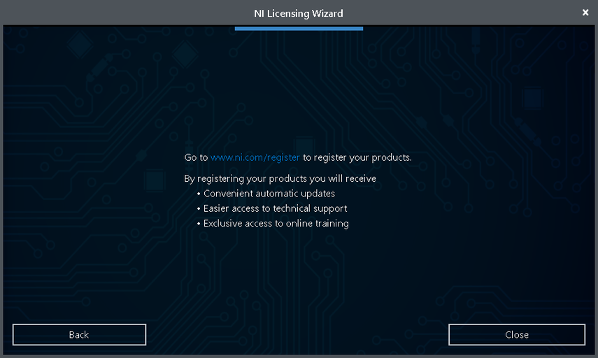

Installing the FRC Update Suite (All Languages)
===============================================

    The FRC Update Suite contains the following software components:
    LabVIEW Update, FRC Driver Station, and FRC Utilities. If an FRC
    LabVIEW installation is found, the LabVIEW Update will be installed
    or updated, otherwise this step will be skipped. The FRC Driver
    Station and FRC Utilities will always be installed or updated. The
    LabVIEW runtime components required for the driver station and
    utilities is included in this package. **No components from the
    LabVIEW Merged Suite are required for running either the Driver
    Station or Utilities.**

..

.. note:: Note: The Driver Station will only work on Windows 7, Windows 8,\
 Windows 8.1, and Windows 10. It will not work on Windows XP.

Uninstall Old Versions (Recommended)
------------------------------------

|Uninstaller| 

**LabVIEW teams have already completed this step, do not
repeat it.** Before installing the new version of the NI Update it is
recommended to remove any old versions. The new version will likely
properly overwrite the old version, but all testing has been done with
FRC 2019 only. Make sure to back up any team code located in the
``User:\LabVIEW\Data`` directory before un-installing. Then
click **Start >> Control Panel >> Uninstall a Program.** Locate the
entry labeled “**National Instruments Software**”, right-click on it and
select **Uninstall/Change**. 

Select Components to Uninstall
~~~~~~~~~~~~~~~~~~~~~~~~~~~~~~

|Remove All| 

Click **Remove All** and follow any prompts to remove all
previous NI products.

Downloading the Update
----------------------

Download the update from
http://www.ni.com/download/first-robotics-software-2017/7904/en/

.. note:: Note: This download will require the decryption key from the Kickoff broadcast.

.NET Framework 4.6.2
--------------------

The Update installer may prompt that .NET Framework 4.6.2 needs to be
updated or installed. Follow prompts on-screen to complete the
installation, including rebooting if requested. Then resume the
installation of the NI FRC Update, restarting the installer if
necessary.

Welcome
-------

|Welcome| 

Right click on the downloaded zip file and select Extract All.
If you downloaded the encrypted zip file, you will be prompted for the
encryption key which will be released at Kickoff. Open the extracted
folder and any subfolders until you reach the folder containing “setup”
(may say “setup.exe” on some machines). Double click on the setup icon
to launch the installer. Click “Yes” if a Windows Security prompt
appears. Click “Next” on the splash screen that appears.

Product List
------------

|Product List| 

Click “Next”. There is no need to de-select “LabVIEW
Update” for C++ or Java teams, if you do not have the base LabVIEW
installation (because you are not programming in LabVIEW) this
installation will be skipped automatically.

Product Information
-------------------

|Product Information| 

Un-check the box, then Click “Next”.

User Information
----------------

|User Information| 

Enter name and organization and the serial number
from the Team Registration System (in the Password/Voucher code section)
then click **Next**

License Agreements
------------------

|License Agreements| 

Select “I accept…” then click “Next”

License Agreements Page 2
-------------------------

|License Agreements Page 2| 

Select “I accept…” then click “Next” If you
see a screen asking to disable Windows Fast Startup, leave it at the
recommended option (disable Fast Startup) and click Next. If you see a
screen talking about Windows Firewall, click Next.

Summary Progress
----------------

   Summary Progress

Detail Progress
---------------

   Detail Progress

Installation Summary
--------------------

|Installation Summary| 

Make sure the box is checked to Run License
Manager… then click Next or Finish

NI Activation Wizard
--------------------

|NI Activation Wizard| 

Log into your ni.com account. If you don’t have
an account, select ‘Create account’ to create a free account.

NI Activation Wizard (2)
------------------------

|NI Activation Wizard 2| 

The serial number you entered at the “User
Information” screen should appear in all of the text boxes, if it
doesn’t, enter it now. Click “Activate”. Note: If this is the first time
activating the 2019 software on this account, you will see the message
shown above about a valid license not being found. You can ignore this.

NI Activation Wizard (3)
------------------------

|NI Activation Wizard 3| 

If your products activate successfully, an
“Activation Successful” message will appear. If the serial number was
incorrect, it will give you a text box and you can re-enter the number
and select “Try Again”. If everything activated successfully, click
“Next”.

NI Activation Wizard (4)
------------------------

|NI Activation Wizard 4| 

Click “Close”.

NI Update Service
-----------------

|NI Update Service| 

On occasion you may see alerts from the NI Update
Service about patches to LabVIEW. It is not recommended to install these
patches. **FRC will communicate any recommended updates through our
usual channels** (Frank’s Blog, Team Updates or E-mail Blasts).

.. |Uninstaller| image:: images/update-suite/uninstall.png
.. |Remove All| image:: images/update-suite/remove-all.jpg
.. |Welcome| image:: images/update-suite/welcome.png
.. |Product List| image:: images/update-suite/product-list.png
.. |Product Information| image:: images/update-suite/product-information.png
.. |User Information| image:: images/update-suite/user-information.png

.. |License Agreements Page 2| image:: images/update-suite/license-agreements-2.png
.. |Installation Summary| image:: images/update-suite/installation-summary.png
.. |NI Activation Wizard| image:: images/update-suite/ni-activation-wizard.png

.. |NI Activation Wizard 3| image:: images/update-suite/ni-activation-wizard-3.png

.. |NI Update Service| image:: images/update-suite/ni-update-service.png
