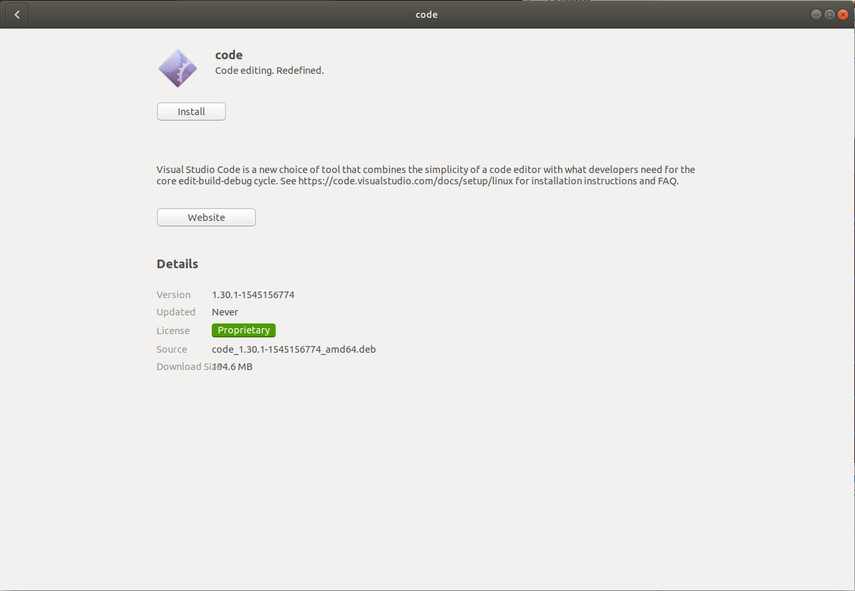
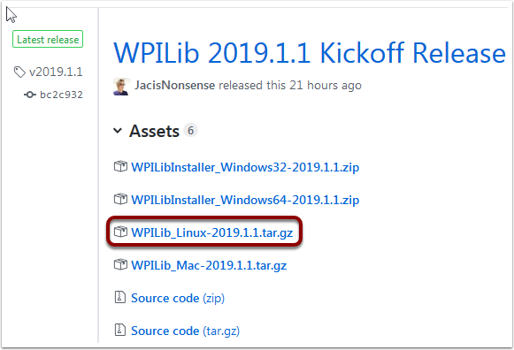
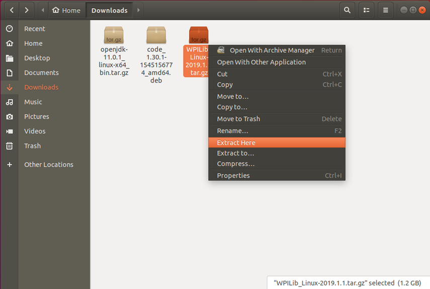
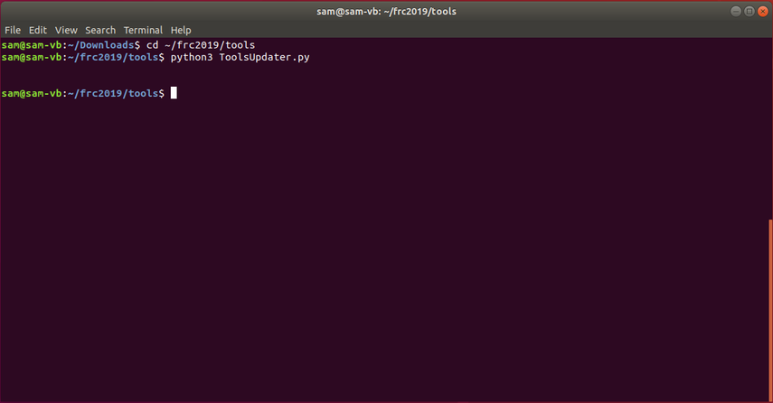
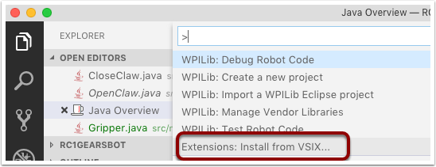
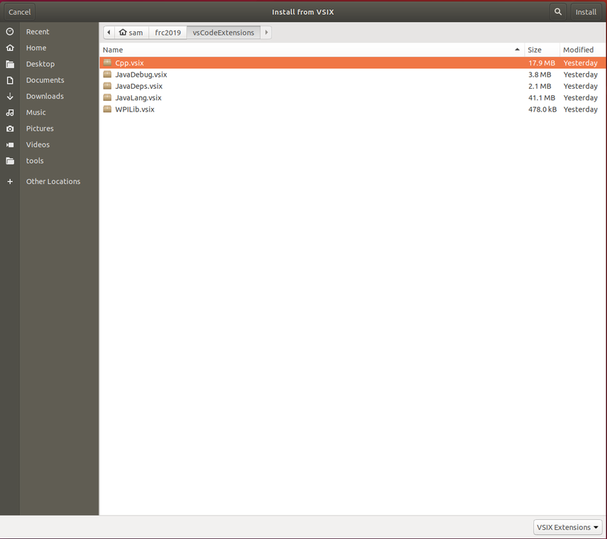
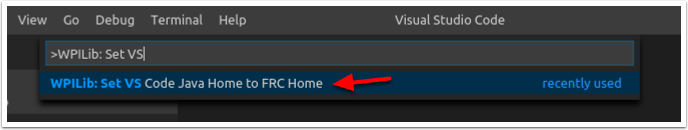

Linux Offline Install Guide
===========================

Installing VS Code
^^^^^^^^^^^^^^^^^^

1. Download the Linux .deb file from `code.visualstudio.com <https://code.visualstudio.com/>`__
2. Double-click on the .deb file in the file explorer
3. Click the "Install" button to install VSCode

Download the WPILib release
^^^^^^^^^^^^^^^^^^^^^^^^^^^

Download the latest Linux release from https://github.com/wpilibsuite/allwpilib/releases Right-click on the downloaded archive, click "Extract Here"

Moving to FRC2019
^^^^^^^^^^^^^^^^^

1. Create a directory in your home directory called frc2019 - either from the file manager or with ``$ mkdir ~/frc2019``
2. Drag the contents of WPILIB\_Linux-2019.1.1 directory to ~/frc2019 or run ``$ mv -v WPILib_Linux-2019.1.1/* ~/frc2019``

Running Tools Updater
^^^^^^^^^^^^^^^^^^^^^

To extract the WPILib tools (Dashboards, Robot Builder, etc.), run: \* ``$ cd ~/frc2019/tools`` \* ``$ python3 ToolsUpdater.py``

Installing the extensions for WPILib VS Code
^^^^^^^^^^^^^^^^^^^^^^^^^^^^^^^^^^^^^^^^^^^^

1. Start VSCODE ($ code or search "Visual Studio Code" in your aplication launcher)
2. **Control-Shift-P** to bring up the command palette, type "Install from VSIX"
3. Select "Extensions: Install from VSIX"
4. Navigate to ``~/frc2019/vsCodeExtensions`` and select Cpp.vsix
5. Repeat for JavaLang.vsix, JavaDeps.vsix, JavaDebug.vsix, and WPILib.vsix in that order

Setting up VSCode to use Java 11
^^^^^^^^^^^^^^^^^^^^^^^^^^^^^^^^

The WPILib installation includes a JDK, however you need to point VS Code at where it is. To do this: 1. Open VS Code 2. Press **Ctrl-Shift-P** and type **WPILib** or click on the WPILib icon in the top right to open the WPILib Command Palette 3. Begin typing **Set VS Code Java Home to FRC Home** and select that item from the dropdown.

