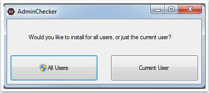
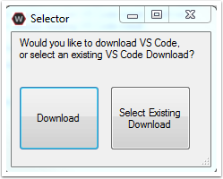
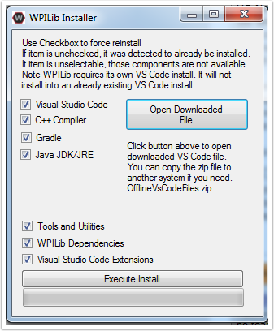
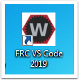

Windows Offline Install Guide
=============================

Offline Installer
^^^^^^^^^^^^^^^^^

*Windows 7: You must install the NI Update or .NET Version 4.62 (or
later) before proceeding with the install of VSCode for FRC. The NI
Update installer will automatically install the proper version of .NET.
The stand alone .NET installer is here:
https://support.microsoft.com/en-us/help/3151800/the-net-framework-4-6-2-offline-installer-for-windows*

Download the appropriate installer for your Windows installation (32 bit
or 64 bit) `from
GitHub <https://github.com/wpilibsuite/allwpilib/releases>`__. If you're
not sure, open the Control Panel -> System to check.

Double click on the installer to run it. If you see any Security
warnings, click Run (Windows 7) or More Info->Run Anyway (Windows 8+).

Choose whether to install for All Users on the machine or the Current
User. The All Users option requires Admin privileges, but installs in a
way that is accessible to all user accounts, the Current User install is
only accessible from the account it is installed from.

If you select All Users, you will need to accept the security prompt
that appears.

Download VSCode
^^^^^^^^^^^^^^^

For licensing reasons, the installer cannot contain the VSCode installer
bundled in. Click Select/Download VSCode to either Download the VSCode
installer or select a pre-downloaded copy. If you intend to install on
other machines without internet connections, after the download
completes, you can click Open Downloaded File to be taken to the zip
file on the file system to copy along with the Offline Installer.

Execute Install
^^^^^^^^^^^^^^^

Make sure all checkboxes are checked (unless you have already installed
2019 WPILib software on this machine and the software unchecked them
automatically), then click Execute Install.

Finished
^^^^^^^^

When the installer completes, you will now be able to open and use the
WPILib version of VSCode. If you are using any 3rd party libraries, you
will still need to install those separately before using them in robot
code.

.. figure:: images/windows/Finished.png
   :alt: 

What's installed?
^^^^^^^^^^^^^^^^^

The Offline Installer installs the following components:

-  Visual Studio Code - The supported IDE for 2019 robot code
   development. The offline installer sets up a separate copy of VSCode
   for WPILib development, even if you already have VSCode on your
   machine. This is done because some of the settings that make the
   WPILib setup work may break existing workflows if you use VSCode for
   other projects.
-  C++ Compiler - The toolchains for building C++ code for the roboRIO
-  Gradle - The specific version of Gradle used for building/deploying
   C++ or Java robot code
-  Java JDK/JRE - A specific version of the Java JDK/JRE that is used to
   build Java robot code and to run any of the Java based Tools
   (Dashboards, etc.). This exists side by side with any existing JDK
   installs and does not overwrite the JAVA\_HOME variable
-  WPILib Tools - SmartDashboard, Shuffleboard, Robot Builder, Outline
   Viewer, Pathweaver
-  WPILib Dependencies - OpenCV, etc.
-  VSCode Extensions - WPILib extensions for robot code development in
   VSCode

What's Installed - Continued
^^^^^^^^^^^^^^^^^^^^^^^^^^^^

The Offline Installer also installs a Desktop Shortcut to the WPILib
copy of VSCode and sets up a command shortcut so this copy of VSCode can
be opened from the command line using the command "frccode2019"

Both of these reference the specific year as the WPIlib C++tools will
now support side-by-side installs of multiple environments from
different seasons.
