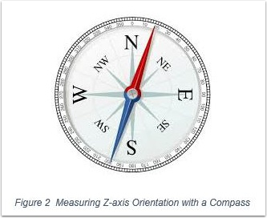
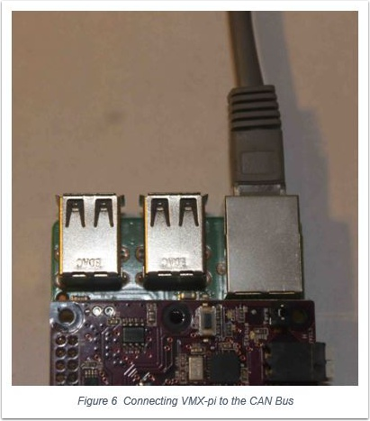
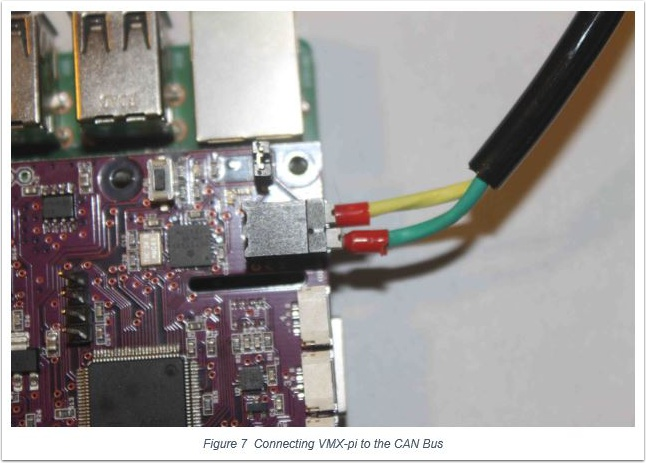

.. _vmx-pi:

VMX-pi Vision/Motion Processor & Robotics Controller
====================================================

.. image:: images/vmx-pi/kauai-labs-logo.png
   :align: center

When combined with a Raspberry Pi (purchased separately), the VMX-pi
Vision/Motion Processor & Robotics Controller provides an accurate,
easy-to-use way **measure motion**, to **process video**, **interface to
external sensors** and **monitor your RoboRIO** – using libraries
designed and tested to operate on a RoboRIO-based robot.

.. note:: VMX-pi is also capable for use as a Robot controller including control of actuators (e.g., servos, motors, relays pneumatics) via Digital Output and Digital Communication protocols like CAN.  However, VMX-pi’s control functionality is not historically legal for use with actuators used in FRC competitions (please consult the “Robot” section of the FRC Game Manual for details) – but it’s great for building an off-season robot! For more information on VMX-pi robot control features, please visit `VMX-pi online <http://pdocs.kauailabs.com/vmx-pi/>`_.

Features
--------

Power Supply and Management
^^^^^^^^^^^^^^^^^^^^^^^^^^^

VMX-pi provides power to your Raspberry Pi, and comes with cables with secure, locking connectors so you can easily connect them to the Power Distribution Panel on your robot, or to a standard “wall-wart” when developing software.  VMX-pi’s power management will keep your Raspberry Pi running even when the robot battery voltage gets low.

Motion Processing
^^^^^^^^^^^^^^^^^

VMX-pi includes a navX-Technology self-calibrating Inertial Measurement Unit (IMU) and an Attitude/Heading Reference System (AHRS). Motion-processing capabilities enable you to improve your autonomous and teleoperated programs by adding intelligent features including:

- Driving in a straight line
- Rotating automatically to a specific angle
- Field-oriented drive
- Automatic Balancing
- Motion Detection
- Collision Detection

Vision Processing
^^^^^^^^^^^^^^^^^

The Raspberry Pi (especially when combined the `VMX-rtk Robotics Toolkit <http://pdocs.kauailabs.com/vmx-rtk/>`_) provides an inexpensive, powerful platform for processing, recording to disk and streaming video to the FRC Driver station. Vision-processing capabilities enable you to improve your autonomous programs by performing target detection and calculations of distance and angle target.  VMX-pi provides an integrated power supply for your Raspberry Pi, making it simple to add a Raspberry Pi to your robot. And the Raspberry Pi SD Card makes a great place to store competition video recorded by the robot.

Real-time Clock
^^^^^^^^^^^^^^^

VMX-pi’s onboard battery-backed Real Time Clock keeps track of current date and time – even when not connected to an external power source. This allows logging on your robot with useful timestamps, and can also be used to synchronize streams of data from multiple robots.

Interface to Sensors
^^^^^^^^^^^^^^^^^^^^

VMX-pi provides I/O capabilities very similar to the RoboRIO – making it useful for interfacing to external sensors (e.g., the Sparkfun `QWIIC Connect <https://www.sparkfun.com/qwiic>`_ family of I2C sensors), as well as the RoboRIO CAN bus. On a FRC robot, these features can be integrated into your robot application (by sending information from VMX-pi to the RoboRIO over the network via NetworkTables).  VMX-pi can also be used to unobtrusively monitor the behavior of a FRC robot for debugging and analyzing robot performance.

Motion Processing Overview
^^^^^^^^^^^^^^^^^^^^^^^^^^

VMX-pi includes a navX-Technology Inertial Measurement Unit (IMU), and includes 6 sensors which measure inertial motion:  3 accelerometers measuring acceleration (in units of `Standard Gravity <https://en.wikipedia.org/wiki/Standard_gravity>`_ [g]) and 3 gyroscopes measuring `Rotational Speed <https://en.wikipedia.org/wiki/Rotational_speed>`_ (in units of degrees per second).

Additionally, through a process called “Motion Processing”, VMX-pi intelligently combines the 6-axis inertial sensing data to create a measurement of relative 3D orientation.

.. image:: images/vmx-pi/yaw-pitch-roll.jpg

IMUs are typically used to measure aircraft orientation, but are also very useful for controlling a robot.  IMUs measure rotation of an object around the Z-axis (known as “Yaw”), the X-axis (known as “Pitch”) and the Y-axis (known as “Roll”). 

Pitch and Roll angles are absolute (tied to the earth’s surface); 0 degrees means “flat” with respect to the earth.

However, IMU Yaw angles are **relative** - not tied to any direction (like North on a Compass).  Therefore, your robot application must decide where 0 degrees is.  Usually, FRC robots treat the “head” of the field (the direction driver’s face) as 0 degrees.

For more information, please visit the `VMX-pi Terminology page <http://pdocs.kauailabs.com/vmx-pi/support/terminology/>`_.

Digital Compass and Attitude/Heading Reference System (AHRS)
^^^^^^^^^^^^^^^^^^^^^^^^^^^^^^^^^^^^^^^^^^^^^^^^^^^^^^^^^^^^

VMX-pi’s navX-Technology also includes 3 magnetometer sensors, which measure magnetic fields (in units of Tesla).  By measuring the earth’s magnetic field, VMX-pi provides a digital compass – which is a different way of measuring the Z (“Yaw”) axis. 

And by intelligently fusing the digital compass with the gyroscope/accelerometer data, VMX-pi can create a measurement of absolute 3D orientation.

.. note:: Earth’s magnetic field is actually very weak when compared to the magnetic field generated by a nearby motor; for this reason it can be difficult to get accurate digital compass readings on a FRC robot.  For this reason, using the VMX-pi AHRS is an advanced feature best suited for teams who have the time to learn about `how to calibrate the VMX-pi digital compass <http://vmx-pi.kauailabs.com/guidance/magnetometer-calibration/>`_ and also how to deal with magnetic disturbances.

Vision Software Overview
^^^^^^^^^^^^^^^^^^^^^^^^

Useful Vision software for FRC robots is comprised of multiple features:

=========== ===================================================================================================================
Feature     Description
=========== ===================================================================================================================
Acquisition	Retrieves camera images so they can be processed by software
Processing	Detects objects of interest in camera images, and calculates metrics (e.g., distance and angle) about those objects
Streaming	Allows drivers to see what the robot sees, in real-time and during a match
Recording	Stores video of a match recorded by the robot for later viewing
Overlays	   Textual information display on video useful to Streaming viewers and debugging of Processing algorithms
=========== ===================================================================================================================

VMX-pi’s VMX Robotics Toolkit contains OpenCV and the WPI cscore and ntcore libraries - and enables your Raspberry pi to integrate your vision processing algorithm (e.g., as generated from the WPI GRIP tool) into your robot application.  The VMX Robotics toolkit includes source code demonstrating each of the features and how to incorporate them into your robot’s Vision software.

.. image:: images/vmx-pi/vision-software-architecture.jpg

The Vision software architecture diagram depicts how the various vision components work together.  The dotted lines represent the activities that occur during development & debugging; the remaining components are used during practice matches and competition.

Please visit the `VMX-rtk Online examples <https://pdocs.kauailabs.com/vmx-rtk/examples/>`_, which includes examples of these features and how to combine them into FRC vision co-processing application running on the Raspberry Pi connected to VMX-pi.

CAN Bus Monitoring overview
^^^^^^^^^^^^^^^^^^^^^^^^^^^

VMX-pi’s integrated CAN bus interface allows you to monitor the robot CAN Bus from the Raspberry Pi.  If you are interested in writing applications to monitor the can bus, please see the `can_bus_monitor <https://pdocs.kauailabs.com/vmx-pi/examples/raspberry-pi/vmx-pi-hal/can-bus-monitor/>`_ examples which demonstrate how to write software that access some of the CAN bus devices typically found on a FRC robot.

.. note:: In addition to monitoring a CAN bus, VMX-pi is also capable of transmitting CAN bus control commands.  However, VMX-pi’s control functionality is not historically legal for use to control CAN actuators used in FRC competitions (please consult the “Robot” section of the FRC Game Manual for details).

Assembly with Raspberry Pi
--------------------------

The first step is to assemble your Raspberry Pi 3 and VMX-pi, as shown `at VMX-pi online <http://pdocs.kauailabs.com/vmx-pi/installation/assembly-with-raspberry-pi/>`_.

Kauai Labs has created the VMX Robotics Toolkit, available for purchase at the `Kauai Labs Store <https://www.kauailabs.com/store>`_. This is a high-quality SD Card for your Raspberry Pi with many pre-installed software tools for FRC robotics, and also has approximately 16GB of extra space for storing videos taken on your robot during practice or competition. Instructions are also available at `VMX-pi online`_ to build your own SD card image, however Kauai Labs recommends the VMX Robotics Toolkit SD card – which was created to save you the time and trouble of creating your own SD card.

VMX-pi comes with a battery cable for connecting to the Power Distribution Panel; VMX-pi also comes with a “Wall-Wart” cable for powering VMX-pi and your Raspberry Pi when not on a FRC robot.  You will need to purchase a standard Wall-wart (between 6-16 VDC output, up to 3 Amps, with a center-positive connector with an inner diameterof 2.1mm and an outer diameter of 5.5mm.  These are available online at many stores for under $10.

FRC Robot Installation Overview
-------------------------------

.. image:: images/vmx-pi/vmxpi-wiring.jpg

VMX-pi can be easily connected to a robot, connecting power from the Power Distribution Panel (PDP), Ethernet and/or USB from the RoboRIO, and (if vision processing is used), connecting cameras to the Raspberry Pi USB Ports (or to the Raspberry Pi camera connector if using the Raspberry Pi Camera).  This only takes a few minutes.

If using the Standoffs to mount VMX-pi, connect the Standoffs to the chassis or other large surface of the robot; if using the VMX-pi enclosure, mount the enclosure to the robot chassis via the mounting holes at the four corners.  In either case, if using IMU data, it is important to mount VMX-pi firmly so that it moves as a unit with your robot chassis.

.. note:: When connecting VMX-pi to your FRC robot for use in competition, be sure to disable the Raspberry Pi Wifi, to avoid Wifi interference.

USB (if accessing IMU data directly from the RoboRIO)
^^^^^^^^^^^^^^^^^^^^^^^^^^^^^^^^^^^^^^^^^^^^^^^^^^^^^

If connecting VMX-pi to the RoboRIO to acquire IMU data – or to a Windows computer to run the navXUI and other tools on Windows - use a USB micro cable. The USB Micro cable is connected to the usb connector near the power connector, as shown below.

.. image:: images/vmx-pi/vmxpi-usb.jpg

Ethernet (if accessing Vision processing or other data via NetworkTables)
^^^^^^^^^^^^^^^^^^^^^^^^^^^^^^^^^^^^^^^^^^^^^^^^^^^^^^^^^^^^^^^^^^^^^^^^^

If connecting VMX-pi to the RoboRIO to communicate data over Ethernet, connect an Ethernet cable to the RJ45 (Ethernet) connector on your Raspberry Pi connected to the VMX-pi.  Connect the other end to the Robot network, either on the Wifi radio (e.g.,OpenMesh) or a separate ethernet switch connected to the radio.

CAN (if accessing CAN bus data)
^^^^^^^^^^^^^^^^^^^^^^^^^^^^^^^

If connecting VMX-pi to the RoboRIO to acquire CAN data, connect a CAN cable (as supplied in the Kit of Parts) to the Weidmuller connector on the VMX-pi.  The use of ferrules (the red plastic portion of these connectors is visible in the photo above) is highly recommended to ensure a secure electrical connection.

Enclosure
^^^^^^^^^

.. image:: images/vmx-pi/vmxpi-enclosure.jpg

An enclosure is recommended to protect the VMX-pi and Raspberry Pi circuit boards from excessive handling, `"swarf" <https://en.wikipedia.org/wiki/Swarf>`_, `electrostatic discharge (ESD) <https://en.wikipedia.org/wiki/Electrostatic_discharge>`_ and other elements that can potentially damage them.

Visit the `VMX-pi Enclosure page <http://vmx-pi.kauailabs.com/installation/creating-an-enclosure/>`_ to either purchase an enclosure for VMX-pi or to download a 3D-printable design file.

RoboRIO Software Installation
^^^^^^^^^^^^^^^^^^^^^^^^^^^^^

To access VMX-pi IMU data from your RoboRIO robot application, install the `VMX-pi Libraries for RoboRIO <http://pdocs.kauailabs.com/vmx-pi/software/libraries/>`_.

If using NetworkTables to exchange data between VMX-pi and RoboRIO, Network Tables support on the RoboRIO is already installed with the FRC software releases; on the Raspberry Pi, NetworkTables is available (for C++, Java and Python) on the VMX-rtk SD Card Image.

Using VMX-pi
------------

Example RoboRIO robot examples for accessing the VMX-pi’s navX-technology IMU data are available in C++, Java and Python.

Example programs for developing vision processing for Raspberry Pi will be available online at the KauaiLabs website soon after kickoff in the “Raspberry Pi” example section.

Visit the `VMX-pi Examples page <http://navx-mxp.kauailabs.com/examples/>`_ for a description of each example and details on how to use it with your chosen programming language.  This page also includes other examples of how to develop robot applications when using VMX-pi as a robot controller.

Learning More
-------------

.. image:: images/vmx-pi/navx-ui.jpg

To learn more about how the VMX-pi navX-technology IMU works, you can use `navXUI <https://pdocs.kauailabs.com/vmx-pi/software/tools/navx-ui/>`_, which runs on a Windows PC connected via USB to the VMX-pi and demonstrates all of the VMX-pi features.  navXUI also provides a way to save VMX-pi data to a file so you can analyze it.  navXUI can even run simultaneously with your RoboRIO robot application.

Best Practices
--------------

If you want to get the most out of your VMX-pi and achieve results similar to those of the top FRC teams, the VMX-pi `Best Practices <http://vmx-pi.kauailabs.com/guidance/best-practices/>`_ is just for you.  These guidelines will help you avoid common pitfalls and achieve the highest possible accuracy.

Getting Help
------------

If you have trouble with VMX-pi, please visit the `VMX-pi support page <http://vmx-pi.kauailabs.com/support/>`_; you can join the VMX-pi newsgroup or contact technical support for help.

