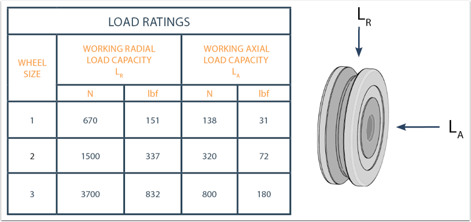
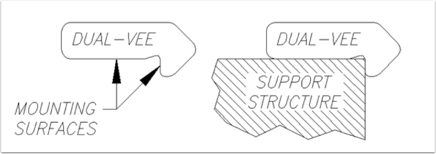
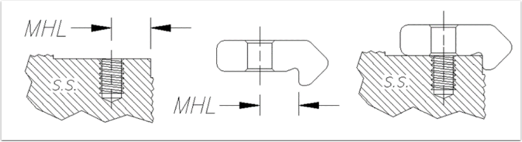

.. _linear-motion:

Linear Motion 101: Guide Wheels and Track
=========================================

So you’ve entered the FIRST® Robotics Competition, congrats!! But now the real work begins, but don’t worry we are here to help. One of the biggest challenges that you may be facing is designing. Designing your robot and laying out the processes and tools that you will need to build it.

Linear motion is likely something you’ve heard of, but is also likely something you aren’t too familiar with. To make a long story short, linear motion and its components are what makes machines move. Whether your robot needs to lift something off the ground or move something from one place to another it all falls into the realm of linear motion.

Basic Components of Linear Motion
---------------------------------

Think of components as the ingredients of linear motion!

- Guide Wheel
- Track

This guide is focused on the basics of MadeWell guide wheels and DualVee track so you know everything you need to in order to start building your robot.

Questions and Answers: MadeWell Radial Guide Wheel Edition
----------------------------------------------------------

So, what are MadeWell Radial Wheels?
^^^^^^^^^^^^^^^^^^^^^^^^^^^^^^^^^^^^

Quick answer, they are ball bearing guide wheels that can make just about anything move in just about any environment, quickly.

Longer answer, they are industrial, precision ground guide wheels with 90° vee running surfaces that were designed for linear motion applications.  They are made of high quality carbon or stainless steel and were engineered to move heavy loads at high speeds (up to 5.5m/s or about 12mph).

They can move stuff, so what? Why should I care?
^^^^^^^^^^^^^^^^^^^^^^^^^^^^^^^^^^^^^^^^^^^^^^^^

Touché! Guide wheels are made to move stuff, but not all guide wheels are created equal. MadeWell wheels are special.  Not a unicorn eating rainbow ice cream kind of special, but the kind of special where you can use them in your robot and the tools you use to make your robot.

Need some ideas on where we recommend you throw your MadeWell wheels?

- Robot work stand
- Robot sliding electronics board
- Workshop
- YOUR ROBOT
- Moving element for sliding robot into loading crate for transport
- A bearing guide for cables or wires

Is it hard to attach these MadeWell wheels? I have kind of limited resources and time.
^^^^^^^^^^^^^^^^^^^^^^^^^^^^^^^^^^^^^^^^^^^^^^^^^^^^^^^^^^^^^^^^^^^^^^^^^^^^^^^^^^^^^^

You are in luck my friend, MadeWell wheels are super easy to attach to things. All you need is a simple screw, a washer and a MadeWell wheel.

.. image:: images/linear-motion/madewell-attachment.png

Recommended hardware
^^^^^^^^^^^^^^^^^^^^

.. image:: images/linear-motion/recommended-hardware.png

Tech Specs
^^^^^^^^^^

.. image:: images/linear-motion/tech-specs.png

Load Ratings
^^^^^^^^^^^^

Well, I really like the wheels. Now what?
^^^^^^^^^^^^^^^^^^^^^^^^^^^^^^^^^^^^^^^^^

You can get MadeWell wheels through the Bishop Wisecarver website using your FIRST voucher. MadeWell wheels come in either carbon steel or stainless steel and must be purchased in sets of four. Click `here <https://www.bwc.com/catalog/product/view/id/12/s/madewell2-759c1880f1de77238da6f3a5d2fb6ef2/category/3/>`_ to navigate to the website!

Okay, so now that you have a better understanding of how you can use guide wheels in your build let’s get you better acquainted with the 1,2, 3s of DualVee track.

Questions and Answers: DualVee Track Edition
--------------------------------------------

What is DualVee track made of?
^^^^^^^^^^^^^^^^^^^^^^^^^^^^^^

DualVee track is made of either AISI 1045 carbon steel of AISI 420 stainless steel and you can get it hardened or unhardened.

How can you use DualVee track with MadeWell guide wheels?
^^^^^^^^^^^^^^^^^^^^^^^^^^^^^^^^^^^^^^^^^^^^^^^^^^^^^^^^^

Although DualVee track was designed to work with DualVee wheels it actually is able to be used with any 90° vee guide wheel, which includes MadeWell wheels.

.. image:: images/linear-motion/madewell-with-dualvee.png

Why do I want DualVee Track so much?
^^^^^^^^^^^^^^^^^^^^^^^^^^^^^^^^^^^^

First, DualVee track is induction hardened which is something you really will care about if you are relying on your machine to move accurately and smoothly every time you use it.

Second, DualVee track’s design gives it two super flat and super accurate running surfaces. This means that you could have two different wheels running at the same time on the same piece of track!!

Thirdly, DualVee track arrives treated, milled, polished and ready to be cut, drilled and mounted however you need to. Minimal effort for maximum usability!

How do I cut DualVee track?
^^^^^^^^^^^^^^^^^^^^^^^^^^^

The best way to cut DualVee track is to use an abrasive chop saw. I know, there are so many types but to make your life easier an abrasive disk saw will cut right through steel.

If you don’t happen to have an abrasive chop saw handy and you also don’t have to make too many cuts, a simple hand hack saw will do the job too!

Another way to cut DualVee track would be to use a milling machine and a carbide end mill. Milling machines are really useful for trimming the ends of track to precise measurements.

How do I drill DualVee track?
^^^^^^^^^^^^^^^^^^^^^^^^^^^^^

The heat treatment that is used on the vee surfaces of track often goes a little past the vee onto what we call the “track heal.” This is the longer surface where you can find the embossed lettering. Most of this area is unhardened.  You can drill your mounting holes into this section very easily using HSS (high speed steel) drill bits or just about anything harder like cobalt or carbide.

To safely drill the rest of the DualVee track, make sure that the track materials are securely clamped in a vise and use a drill press or a milling machine. You can drill through holes in the track and use bolts to attach it to a base or you can drill tap threads into the track and attach it to a base with through holes. 

Keep in mind that when drilling, some of the material may be somewhat harder than the soft treated area. Also, **DO NOT USE A HAND DRILL**. Safety first, always.  Here are some drilling recommendations for your track.

.. image:: images/linear-motion/dualvee-dimensions.png

Recommendations
^^^^^^^^^^^^^^^

When it comes to mounting DualVee track it truly is dealer’s choice. There are number of options including everything from the kind of screw you’d prefer to the mounting orientation of the track. Just in case your drawing a blank on the specifics of how you want to mount your track, here a couple of recommendations to get you warmed up.

.. image:: images/linear-motion/typical-mounting.png

DualVee track is designed with an integrated shoulder and mounting surface. These surfaces are to be utilized when mounting DualVee track to your support structure or in your case, robot frame.

Pay special attention to the track mounting surface because small variations in things like flatness, parallelism and even perpendicularity may result in your wheel not running the way you want it to. Our recommendation is to use a machined register on the support structure (robot frame) in the track mounting locations.

.. image:: images/linear-motion/machined-unmachined.png

Machining for the track mounting fasteners can also be completed during support member machining. Through hole locations have been standardized on all sizes of DualVee track with dimensions originating from the locating soldier. The catalog dimension “MHL” can be referenced for support structure design.

Custom fasteners and hole locations other the ones specified in the catalog “MHL” can be accommodated for a variety of fastening methods. Common DualVee track hole and fastener combinations include clearance holes for screws, through holes with countersinks, and through threads.

.. image:: images/linear-motion/screw-types.png
