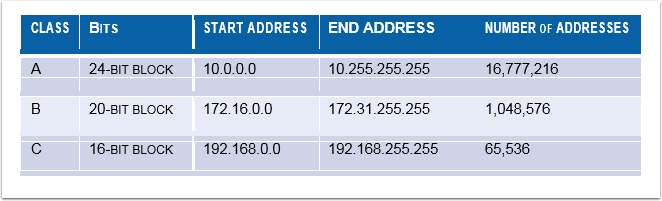
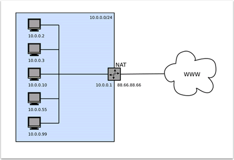
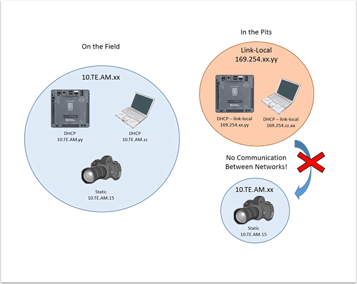

.. _networking-basics:

Networking Basics
=================

.. contents::
   :local:
   :depth: 4

IP Addressing Background
------------------------

What is an IP Address?
^^^^^^^^^^^^^^^^^^^^^^

An IP address is a unique string of numbers, separated by periods that
identifies each device on a network. Each IP address is divided up
into 4 sections (octets) ranging from 0-255.

.. images/networking-basics/ip-address-parts.png

As shown above, this means that each IP address is a 32-bit address
meaning there are 232 addresses, or just over 4,000,000,00 addresses
possible. However, most of these are used publicly for things like web
servers. This brings up our first key point of IP Addressing: Each
device on the network must have a unique IP address. No two devices
can have the same IP address, otherwise collisions will occur.

Since there are only 4-billion addresses, and there are more than
4-billion computers connected to the internet, we need to be as
efficient as possible with giving out IP addresses. This brings us to
public vs. private addresses.

Public vs Private IP Addresses
^^^^^^^^^^^^^^^^^^^^^^^^^^^^^^

To be efficient with using IP Addresses, the idea of “Reserved IP
Ranges” was implemented. In short, this means that there are ranges of
IP Addresses that will never be assigned to web servers, and will only
be used for local networks, such as those in your house. Key point #2:
Unless you a directly connecting to your internet provider’s basic
modem (no router function), your device will have an IP Address in one
of these ranges. This means that at any local network, such as: your
school, work office, home, etc., your device will 99% of the time have
an IP address in a range listed below:

These reserved ranges let us assign one “unreserved IP Address” to an
entire house, and then use multiple addresses in a reserved range to
connect more than one computer to the internet. A process on the
home’s internet router known as NAT (Network Address Translation),
handles the process of keeping track which private IP is requesting
data, using the public IP to request that data from the internet, and
then passing the returned data back to the private IP that requested
it. This allows us to use the same reserved IP addresses for many
local networks, without causing any conflicts. An image of this
process is presented below.

.. note:: For the FRC networks, we will use the 10.0.0.0 range. This range allows us to use the 10.TE.AM.xx
   format for IP addresses, whereas using the Class B or C networks
   would only allow a subset of teams to follow the format. An example
   of this formatting would be 10.17.50.1 for FRC Team 1750.

How are these addresses assigned?
^^^^^^^^^^^^^^^^^^^^^^^^^^^^^^^^^

We’ve covered the basics of what IP addresses are, and which IP
addresses we will use for the FRC competition,so now we need to
discuss how these addresses will get assigned to the devices on our
network. We already stated above that we can’t have two devices on the
same network with the same IP Address, so we need a way to be sure
that every device receives an address without overlapping. This can be
done Dynamically (automatic), or Statically (manual).

Dynamically
~~~~~~~~~~~

Dynamically assigning IP addresses means that we are letting a device
on the network manage the IP address assignments. This is done through
the Dynamic Host Configuration Protocol (DHCP). DHCP has many
components to it, but for the scope of this document, we will think of
it as a service that automatically manages the network. Whenever you
plug in a new device to the network, the DHCP service sees the new
device, then provides it with an available IP address and the other
network settings required for the device to communicate. This can mean
that there are times we do not know the exact IP address of each
device.

What is a DHCP server?
""""""""""""""""""""""

A DHCP server is a device that runs the DHCP service to monitor the
network for new devices to configure. In larger businesses, this could
be a dedicated computer running the DHCP service and that computer
would be the DHCP server. For home networks, FRC networks, and other
smaller networks, the DHCP service is usually running on the router;
in this case, the router is the DHCP server.

This means that if you ever run into a situation where you need to
have a DHCP server assigning IP addresses to your network devices,
it’s as simple as finding the closest home router, and plugging it in.

Statically
~~~~~~~~~~

Dynamically assigning IP addresses means that we are manually telling
each device on the network which IP address we want it to have. This
configuration happens through a setting on each device. By disabling
DHCP on the network and assigning the addresses manually, we get the
benefit of knowing the exact IP address of each device on the network,
but because we set each one manually and there is no service keeping
track of the used IP addresses, we have to keep track of this
ourselves. While statically setting IP addresses, we must be careful
not to assign duplicate addresses, and must be sure we are setting the
other network settings (such as subnet mask and default gateway)
correctly on each device.

What is link-local?
~~~~~~~~~~~~~~~~~~~

If a device does not have an IP address, then it cannot communicate on
a network. This can become an issue if we have a device that is set to
dynamically acquire its address from a DHCP server, but there is no
DHCP server on the network. An example of this would be when you have
a laptop directly connected to a roboRIO and both are set to
dynamically acquire an IP address. Neither device is a DHCP server,
and since they are the only two devices on the network, they will not
be assigned IP addresses automatically.

Link-local addresses give us a standard set of addresses that we can
“fall-back” to if a device set to acquire dynamically is not able to
acquire an address. If this happens, the device will assign itself an
IP address in the 169.254.xx.yy address range; this is a link-local
address. In our roboRIO and computer example above, both devices will
realize they haven’t been assigned an IP address and assign themselves
a link-local address. Once they are both assigned addresses in the
169.254.xx.yy range, they will be in the same network and will be able
to communicate, even though they were set to dynamic and a DHCP server
did not assign addresses.

IP Addressing for FRC
---------------------

For the FRC devices, the recommendation is to use dynamic addressing.
As an alternate, static addressing can be used if there is additional
software or hardware that does not support mDNS (explained below). If
static addressing is used, take care to not set any IP addresses in
the range potentially used by the field.

In either configuration, the wireless radio will be statically set to
10.TE.AM.1 by the radio configuration utility. This should not change.

On the Field
^^^^^^^^^^^^

Dynamic Addressing (recommended)
~~~~~~~~~~~~~~~~~~~~~~~~~~~~~~~~

The field network will be running the DHCP service to assign IP
addresses for the team devices. These addresses will be assigned in
the ranges of 10.TE.AM.20  10.TE.AM.255. A more complete description
is listed below

-	Robot Radio Static 10.TE.AM.1 assigned by radio configuration utility
-	roboRIO DHCP in the 10.TE.AM.20  10.TE.AM.255 range
-	Driver Station DHCP in the 10.TE.AM.20  10.TE.AM.255 range
-	IP Camera DHCP in the 10.TE.AM.20  10.TE.AM.255 range
-	Other devices DHCP in the 10.TE.AM.20  10.TE.AM.255 range

.. note:: It is not required to know the specific address assigned to
   each device due to the mDNS protocol described in a later section

Static Addressing
~~~~~~~~~~~~~~~~~

It is also an option statically assign IP addresses to accommodate
devices or software which do not support mDNS. When doing so you want
to make sure to avoid addresses that will be in use when the robot is
on the field network.

Addresses to avoid:

The addresses listed below should not be used in order to prevent
conflict with the field wireless.

- Robot Radio Static 10.TE.AM.1 assigned by radio configuration utility
- Field Access Point Static 10.TE.AM.4 assigned by FRC
- Field DHCP Range 10.TE.AM.20  10.TE.AM.255

Acceptable addresses:

The addresses listed below are recommendations of acceptable addresses
for a static setup.

- roboRIO Static 10.TE.AM.2	Subnet Mask of 255.255.255.0
- Driver Station Static 10.TE.AM.5	Subnet Mask of 255.0.0.0
- IP Camera/Other Static 10.TE.AM.6  10.TE.AM.19  Subnet Mask of 255.255.255.0

In the Pits
^^^^^^^^^^^

Dynamic Addressing (recommended)
~~~~~~~~~~~~~~~~~~~~~~~~~~~~~~~~

Since the robot will not be connected to the field, there will not be
a DHCP server present by default in the pits. Most devices should fall
back to a link-local address if they are set to DHCP and there is no
server present.

If there are still connection issues in the link-local configuration,
a team can simulate the field DHCP server by using another router to
assign the addresses. The router should be configured with an IP
address of 10.TE.AM.4 and assign IP addresses in the range of
10.TE.AM.20  10.TE.AM.255.

.. caution:: If a team is going to use a wireless router in the pits
   as a DHCP server, the wireless functionality must be disabled.

Static Addressing
~~~~~~~~~~~~~~~~~

In a static addressing configuration, the configuration should be the
same in the pits as it is on the field. Any programming computers will
need to have an IP Address set in the 10.TE.AM.xx range with a subnet
of 255.255.255.0

Mixing Dynamic and Static Configurations
^^^^^^^^^^^^^^^^^^^^^^^^^^^^^^^^^^^^^^^^

While on the field, the team should not notice any issues with having
devices set statically in the 10.TE.AM.xx range, and having the field
assign DHCP addresses as long as there are no IP address conflicts as
referred to in the section above.

In the pits, a team may encounter issues with mixing Static and DHCP
devices for the following reason. As mentioned above, DHCP devices
will fall back to a link-local address (169.254.xx.yy) if a server
isn’t present. For static devices, the IP address will always be the
same. If the DHCP server is not present and the roboRIO, driver
station, and laptop fall back to link-local addresses, the statically
set devices in the 10.TE.AM.xx range will be in a different network
and not visible to those with link-local addresses. A visual
description of this is provided below:

mDNS
----

mDNS, or multicast Domain Name System is a protocol that allows us to
benefit from the features of DNS, without having a DNS server on the
network. To make this clearer, let’s take a step back and talk about
what DNS is.

What is DNS?
^^^^^^^^^^^^

DNS (Domain Name System) can become a complex topic, but for the scope
of this paper, we are going to just look at the high level overview of
DNS. In the most basic explanation, DNS is what allows us to relate
human-friendly names for network devices to IP Addresses, and keep
track of those IP addresses if they change.

Example 1: Let’s look at the site `www.google.com`_. The IP address
for this site is 172.217.164.132, however that is not very user
friendly to remember!

Whenever a user types `www.google.com`_ into their computer, the
computer contacts the DNS server (a setting provided by DHCP!) and
asks what is the IP address on file for `www.google.com`_. The DNS
server returns the IP address and then the computer is able to use
that to connect to the Google web site.

Example 2: On your home network, you have a server named “MYCOMPUTER”
that you want to connect to from your laptop. Your network uses DHCP
so you don’t know the IP Address of MYCOMPUTER, but DNS allows you to
connect just by using the MYCOMPUTER name. Additionally, whenever the
DHCP assignments refresh, MYCOMPUTER may end up with a different
address, but because you’re connecting by using the MYCOMPUTER name
instead of a specific IP address, the DNS record was updated and
you’re still able to connect.

This is the second benefit to DNS, and the most relevant for FRC. With
DNS, if we reference devices by their friendly name instead of IP
Address, we don’t have to change anything in our program if the IP
Address changes. DNS will keep track of the changes and return the new
address if it ever changes.

.. _www.google.com: https://www.google.com

DNS for FRC
^^^^^^^^^^^

On the field and in the pits, there is no DNS server that allows us to
perform the lookups like we do for the Google web site, but we’d still
like to have the benefits of not remembering every IP Address, and not
having to guess at every device’s address if DHCP assigns a different
address than we expect. This is where mDNS comes into the picture.

mDNS provides us the same benefits as traditional DNS, but is just
implemented in a way that does not require a server. Whenever a user
asks to connect to a device using a friendly name, mDNS sends out a
message asking the device with that name to identify itself. The
device with the name then sends a return message including its IP
address so all devices on the network can update their information.
mDNS is what allows us to refer to our roboRIO as
roboRIO-TEAM-FRC.local and have it connect on a DHCP network.

.. note:: If a device used for FRC does not support mDNS, then it will
   be assigned an IP Address in the 10.TE.AM.20 - 10.TE.AM.255 range,
   but we won’t know the exact address to connect and we won’t be able
   to use the friendly name like before. In this case, the device
   would need to have a static IP Address.

Summary
-------

IP Addresses are what allow us to communicate with devices on a
network. For FRC, these addresses are going to be in the 10.TE.AM.xx
range if we are connected to a DHCP server or if they are assigned
statically, or in the link-local 169.254.xx.yy range if the devices
are set to DHCP, but there is no server present.

If all devices on the network support mDNS, then all devices can be
set to DHCP and referred to using their friendly names (ex.
roboRIO-TEAM-FRC.local). If some devices do not support mDNS, they
will need to be set to use static addresses.

If all devices are set to use DHCP or Static IP assignments (with
correct static settings), the communication should work in both the
pit and on the field without any changes needed. If there are a mix of
some Static and some DHCP devices, then the Static devices will
connect on the field, but will not connect in the pit. This can be
resolved by either setting all devices to static settings, or leaving
the current settings and providing a DHCP server in the pit as
referenced on page 6.