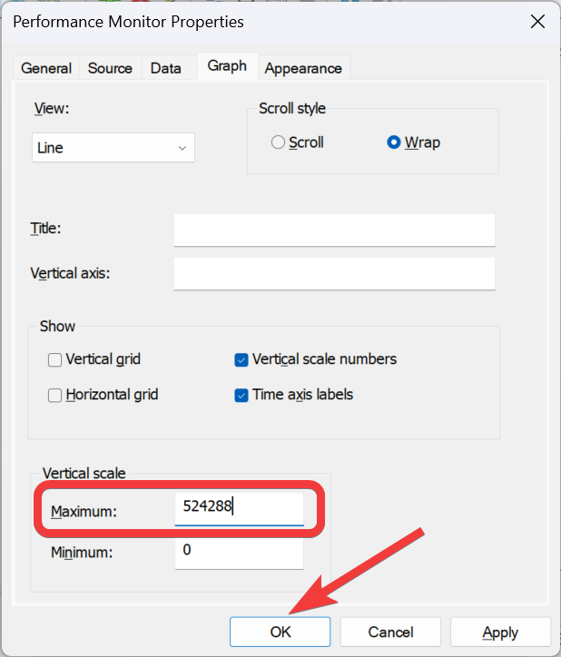

.. include:: <isonum.txt>

Measuring Bandwidth Usage
=========================

On the FRC\ |reg| Field each team is allocated limited network bandwidth (see R704 in the 2023 manual). The `FMS Whitepaper <https://fms-manual.readthedocs.io/en/latest/fms-whitepaper/fms-whitepaper.html>`__ provides more information on determining the bandwidth usage of the Axis camera, but some teams may wish to measure their overall bandwidth consumption. This document details how to make that measurement.

.. note:: Teams can simulate the bandwidth throttling at home using the FRC Bridge Configuration Utility with the bandwidth checkbox checked.

Measuring Bandwidth Using the Performance Monitor (Win 7/10)
--------------------------------------------------------------

Windows contains a built-in tool called the Performance Monitor that can be used to monitor the bandwidth usage over a network interface.

Launching the Performance Monitor
^^^^^^^^^^^^^^^^^^^^^^^^^^^^^^^^^

Click ``Start`` and in the search box, type ``perfmon.msc`` and press Enter.

Open Real-Time Monitor
^^^^^^^^^^^^^^^^^^^^^^

In the left pane, click ``Performance Monitor`` to display the real-time monitor.

Add Network Counter
^^^^^^^^^^^^^^^^^^^

#. Click the green plus near the top of the screen to add a counter
#. In the top left pane, locate and click on ``Network Interface`` to select it
#. In the bottom left pane, locate the desired network interface (or use All instances to monitor all interfaces)
#. Click ``Add>>`` to add the counter to the right pane.
#. Click ``OK`` to add the counters to the graph.

Remove Extra Counters
^^^^^^^^^^^^^^^^^^^^^

In the bottom pane, select each counter other than ``Bytes Total/sec`` and press the ``Delete`` key. The ``Bytes Total/sec`` entry should be the only entry remaining in the pane.

Configure Data Properties
^^^^^^^^^^^^^^^^^^^^^^^^^

Press :kbd:`Ctrl+Q` to bring up the Properties window. Click on the dropdown next to ``Scale`` and select ``1.0``. Then click on the ``Graph`` tab.

Configure Graph Properties
^^^^^^^^^^^^^^^^^^^^^^^^^^

In the ``Maximum Box`` under ``Vertical Scale`` enter 917504 (this is 7 Megabits converted to Bytes). If desired, turn on the horizontal grid by checking the box. Then click ``OK`` to close the dialog.

Viewing Bandwidth Usage
^^^^^^^^^^^^^^^^^^^^^^^

You may now connect to your robot as normal over the selected interface (if you haven't done so already). The graph will show the total bandwidth usage of the connection, with the bandwidth cap at the top of the graph. The Last, Average, Min and Max values are also displayed at the bottom of the graph. Note that these values are in Bytes/Second meaning the cap is 917,504. With just the Driver Station open you should see a flat line at ~100000 Bytes/Second.

Measuring Bandwidth Usage using Wireshark
-----------------------------------------

If you can not use performance monitor, you will need to install a 3rd party program to monitor bandwidth usage. One program that can be used for this purpose is Wireshark. Download and install the latest version of Wireshark for your version of Windows. After installation is complete, locate and open Wireshark. Connect your computer to your robot, open the Driver Station and any Dashboard or custom programs you may be using.

Select the interface and Start capture
^^^^^^^^^^^^^^^^^^^^^^^^^^^^^^^^^^^^^^

.. image:: images/measuring-bandwidth-usage/start-capture.png
   :alt: Selecting the Start button and choosing the NIC in Wireshark.

In the Wireshark program on the left side, select the interface you are using to connect to the robot and click ``Start``.

Open Statistics Summary
^^^^^^^^^^^^^^^^^^^^^^^

.. image:: images/measuring-bandwidth-usage/summary.png
   :alt: In the menu bar at the top choosing "Statistics" then "Summary"

Let the capture run for at least 1 minute, then click ``Statistics`` then ``Summary``.

View Bandwidth Usage
^^^^^^^^^^^^^^^^^^^^

Average bandwidth usage, in Megabits/Second is displayed near the bottom of the summary window.
