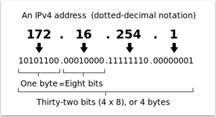
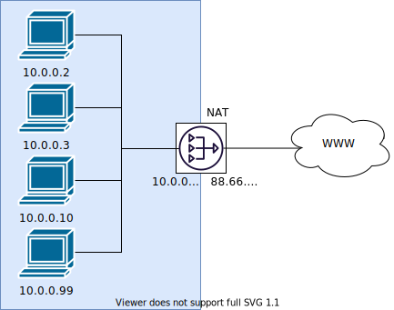

.. include:: <isonum.txt>

Networking Basics
=================

What is an IP Address?
----------------------

An IP address is a unique string of numbers, separated by periods that identifies each device on a network. Each IP address is divided up into 4 sections (octets) ranging from 0-255.

As shown above, this means that each IP address is a 32-bit address meaning there are 2\ :sup:`32` addresses, or nearly 4,300,000,000 addresses possible. However, most of these are used publicly for things like web servers.

This brings up our **first key point** of IP Addressing: Each device on the network must have a unique IP address. No two devices can have the same IP address, otherwise collisions will occur.

Since there are only 4 billion addresses, and there are more than 4 billion computers connected to the internet, we need to be as efficient as possible with giving out IP addresses. This brings us to public vs. private addresses.

Public vs Private IP Addresses
------------------------------

To be efficient with using IP Addresses, the idea of "Reserved IP Ranges" was implemented. In short, this means that there are ranges of IP Addresses that will never be assigned to web servers, and will only be used for local networks, such as those in your house.

**Key point #2**: Unless you a directly connecting to your internet provider’s basic modem (no router function), your device will have an IP Address in one of these ranges. This means that at any local network, such as: your school, work office, home, etc., your device will 99% of the time have an IP address in a range listed below:

+-------+------+---------------+-----------------+---------------------+
| Class | Bits | Start Address | End Address     | Number of Addresses |
+=======+======+===============+=================+=====================+
| A     | 24   | 10.0.0.0      | 10.255.255.255  | 16,777,216          |
+-------+------+---------------+-----------------+---------------------+
| B     | 20   | 172.16.0.0    | 172.31.255.255  | 1,048,576           |
+-------+------+---------------+-----------------+---------------------+
| C     | 16   | 192.168.0.0   | 192.168.255.255 | 65,536              |
+-------+------+---------------+-----------------+---------------------+

These reserved ranges let us assign one "unreserved IP Address" to an entire house, and then use multiple addresses in a reserved range to connect more than one computer to the internet. A process on the home’s internet router known as **NAT** (Network Address Translation), handles the process of keeping track which private IP is requesting data, using the public IP to request that data from the internet, and
then passing the returned data back to the private IP that requested it. This allows us to use the same reserved IP addresses for many local networks, without causing any conflicts. An image of this process is presented below.

.. note::
   For the FRC\ |reg| networks, we will use the ``10.0.0.0`` range. This range allows us to use the ``10.TE.AM.xx`` format for IP addresses, whereas using the Class B or C networks would only allow a subset of teams to follow the format. An example of this formatting would be ``10.17.50.1`` for FRC Team 1750.

How are these addresses assigned?
---------------------------------

We’ve covered the basics of what IP addresses are, and which IP addresses we will use for the FRC competition, so now we need to discuss how these addresses will get assigned to the devices on our network. We already stated above that we can’t have two devices on the same network with the same IP Address, so we need a way to be sure that every device receives an address without overlapping. This can be done Dynamically (automatic), or Statically (manual).

Dynamically
^^^^^^^^^^^

Dynamically assigning IP addresses means that we are letting a device on the network manage the IP address assignments. This is done through the Dynamic Host Configuration Protocol (DHCP). DHCP has many components to it, but for the scope of this document, we will think of it as a service that automatically manages the network. Whenever you plug in a new device to the network, the DHCP service sees the new device, then provides it with an available IP address and the other network settings required for the device to communicate. This can mean that there are times we do not know the exact IP address of each device.

What is a DHCP server?
~~~~~~~~~~~~~~~~~~~~~~

A DHCP server is a device that runs the DHCP service to monitor the network for new devices to configure. In larger businesses, this could be a dedicated computer running the DHCP service and that computer would be the DHCP server. For home networks, FRC networks, and other smaller networks, the DHCP service is usually running on the router; in this case, the router is the DHCP server.

This means that if you ever run into a situation where you need to have a DHCP server assigning IP addresses to your network devices, it’s as simple as finding the closest home router, and plugging it in.

Statically
^^^^^^^^^^

Statically assigning IP addresses means that we are manually telling each device on the network which IP address we want it to have. This configuration happens through a setting on each device. By disabling DHCP on the network and assigning the addresses manually, we get the benefit of knowing the exact IP address of each device on the network, but because we set each one manually and there is no service keeping track of the used IP addresses, we have to keep track of this ourselves. While statically setting IP addresses, we must be careful not to assign duplicate addresses, and must be sure we are setting the other network settings (such as subnet mask and default gateway) correctly on each device.

What is link-local?
-------------------

If a device does not have an IP address, then it cannot communicate on a network. This can become an issue if we have a device that is set to dynamically acquire its address from a DHCP server, but there is no DHCP server on the network. An example of this would be when you have a laptop directly connected to a roboRIO and both are set to dynamically acquire an IP address. Neither device is a DHCP server, and since they are the only two devices on the network, they will not be assigned IP addresses automatically.

Link-local addresses give us a standard set of addresses that we can "fall-back" to if a device set to acquire dynamically is not able to acquire an address. If this happens, the device will assign itself an IP address in the ``169.254.xx.yy`` address range; this is a link-local address. In our roboRIO and computer example above, both devices will realize they haven’t been assigned an IP address and assign themselves a link-local address. Once they are both assigned addresses in the ``169.254.xx.yy`` range, they will be in the same network and will be able to communicate, even though they were set to dynamic and a DHCP server did not assign addresses.

IP Addressing for FRC
---------------------

See the :doc:`IP Networking Article <ip-configurations>` for more information.

Mixing Dynamic and Static Configurations
^^^^^^^^^^^^^^^^^^^^^^^^^^^^^^^^^^^^^^^^

While on the field, the team should not notice any issues with having devices set statically in the ``10.TE.AM.xx`` range, and having the field assign DHCP addresses as long as there are no IP address conflicts as referred to in the section above.

In the pits, a team may encounter issues with mixing Static and DHCP devices for the following reason. As mentioned above, DHCP devices will fall back to a link-local address (``169.254.xx.yy``) if a server isn’t present. For static devices, the IP address will always be the same. If the DHCP server is not present and the roboRIO, driver station, and laptop fall back to link-local addresses, the statically set devices in the 10.TE.AM.xx range will be in a different network and not visible to those with link-local addresses. A visual description of this is provided below:

.. image:: diagrams/mixing-static-dynamic.drawio.svg
   :alt: How you can't mix link-local and static IP configurations.

.. warning:: When connected via USB to the roboRIO, a :ref:`docs/networking/networking-utilities/portforwarding:Port Forwarding` configuration is required to access devices connected to the OpenMesh radio (on the green network shown above).

Available Network Ports
^^^^^^^^^^^^^^^^^^^^^^^

Please see R704 of the 2022 Game Manual for information regarding available network ports.

mDNS
----

mDNS, or multicast Domain Name System is a protocol that allows us to benefit from the features of DNS, without having a DNS server on the network. To make this clearer, let’s take a step back and talk about what DNS is.

What is DNS?
^^^^^^^^^^^^

DNS (Domain Name System) can become a complex topic, but for the scope of this paper, we are going to just look at the high-level overview of DNS. In the most basic explanation, DNS is what allows us to relate human-friendly names for network devices to IP Addresses, and keep track of those IP addresses if they change.

Example 1: Let’s look at the site ``www.google.com``. The IP address for this site is ``172.217.164.132``, however that is not very user-friendly to remember!

Whenever a user types ``www.google.com`` into their computer, the computer contacts the DNS server (a setting provided by DHCP!) and asks what is the IP address on file for ``www.google.com``. The DNS server returns the IP address and then the computer is able to use that to connect to the Google website.

Example 2: On your home network, you have a server named ``MYCOMPUTER`` that you want to connect to from your laptop. Your network uses DHCP so you don’t know the IP Address of ``MYCOMPUTER``, but DNS allows you to connect just by using the ``MYCOMPUTER`` name. Additionally, whenever the DHCP assignments refresh, ``MYCOMPUTER`` may end up with a different address, but because you’re connecting by using the ``MYCOMPUTER`` name instead of a specific IP address, the DNS record was updated and you’re still able to connect.

This is the second benefit to DNS and the most relevant for FRC. With DNS, if we reference devices by their friendly name instead of IP Address, we don’t have to change anything in our program if the IP Address changes. DNS will keep track of the changes and return the new address if it ever changes.

DNS for FRC
^^^^^^^^^^^

On the field and in the pits, there is no DNS server that allows us to perform the lookups like we do for the Google website, but we’d still like to have the benefits of not remembering every IP Address, and not having to guess at every device’s address if DHCP assigns a different address than we expect. This is where mDNS comes into the picture.

mDNS provides us the same benefits as traditional DNS, but is just implemented in a way that does not require a server. Whenever a user asks to connect to a device using a friendly name, mDNS sends out a message asking the device with that name to identify itself. The device with the name then sends a return message including its IP address so all devices on the network can update their information. mDNS is what allows us to refer to our roboRIO as ``roboRIO-TEAM-FRC.local`` and have it connect on a DHCP network.

.. note::
   If a device used for FRC does not support mDNS, then it will be assigned an IP Address in the 10.TE.AM.20 - 10.TE.AM.255 range, but we won’t know the exact address to connect and we won’t be able to use the friendly name like before. In this case, the device would need to have a static IP Address.

mDNS - Principles
^^^^^^^^^^^^^^^^^

Multicast Domain Name System (mDNS) is a system which allows for resolution of hostnames to IP addresses on small networks with no dedicated name server. To resolve a hostname a device sends out a multicast message to the network querying for the device. The device then responds with a multicast message containing its IP. Devices on the network can store this information in a cache so subsequent requests for this address can be resolved from the cache without repeating the network query.

mDNS - Providers
^^^^^^^^^^^^^^^^

To use mDNS, an mDNS implementation is required to be installed on your PC. Here are some common mDNS implementations for each major platform:

Windows:

- **NI mDNS Responder:** Installed with the NI FRC Game Tools
- **Apple Bonjour:** Installed with iTunes

OSX:

- **Apple Bonjour:** Installed by default

Linux:

- **nss-mDNS/Avahi/Zeroconf:** Installed and enabled by default on some Linux variants (such as Ubuntu or Mint). May need to be installed or enabled on others (such as Arch)

mDNS - Firewalls
^^^^^^^^^^^^^^^^

.. note:: Depending on your PC configuration, no changes may be required, this section is provided to assist with troubleshooting.

To work properly mDNS must be allowed to pass through your firewall. Because the network traffic comes from the mDNS implementation and not directly from the Driver Station or IDE, allowing those applications through may not be sufficient. There are two main ways to resolve mDNS firewall issues:

- Add an application/service exception for the mDNS implementation (NI mDNS Responder is ``C:\Program Files\National Instruments\Shared\mDNS Responder\nimdnsResponder.exe``)
- Add a port exception for traffic to/from UDP 5353. IP Ranges:

  - ``10.0.0.0 - 10.255.255.255``
  - ``172.16.0.0 - 172.31.255.255``
  - ``192.168.0.0 - 192.168.255.255``
  - ``169.254.0.0 - 169.254.255.255``
  - ``224.0.0.251``

mDNS - Browser support
^^^^^^^^^^^^^^^^^^^^^^

Most web-browsers should be able to utilize the mDNS address to access the roboRIO web server as long as an mDNS provider is installed. These browsers include Microsoft Edge, Firefox, and Google Chrome.

USB
---

If using the USB interface, no network setup is required (you do need the :ref:`docs/zero-to-robot/step-2/frc-game-tools:Installing the FRC Game Tools` installed to provide the roboRIO USB Driver). The roboRIO driver will automatically configure the IP address of the host (your computer) and roboRIO and the software listed above should be able to locate and utilize your roboRIO.

Ethernet/Wireless
-----------------

The :ref:`docs/zero-to-robot/step-3/radio-programming:Programming your Radio` will enable the DHCP server on the OpenMesh radio in the home use case (AP mode), if you are putting the OpenMesh in bridge mode and using a router, you can enable DHCP addressing on the router. The bridge is set to the same team-based IP address as before (``10.TE.AM.1``) and will hand out DHCP address from ``10.TE.AM.20`` to ``10.TE.AM.199``. When connected to the field, FMS will also hand out addresses in the same IP range.

Summary
-------

IP Addresses are what allow us to communicate with devices on a network. For FRC, these addresses are going to be in the 10.TE.AM.xx range if we are connected to a DHCP server or if they are assigned statically, or in the link-local ``169.254.xx.yy`` range if the devices are set to DHCP, but there is no server present. For more information on how IP Addresses work, see `this <https://support.microsoft.com/en-us/help/164015/understanding-tcp-ip-addressing-and-subnetting-basics>`__ article by Microsoft.

If all devices on the network support mDNS, then all devices can be set to DHCP and referred to using their friendly names (ex. ``roboRIO-TEAM-FRC.local``). If some devices do not support mDNS, they will need to be set to use static addresses.

If all devices are set to use DHCP or Static IP assignments (with correct static settings), the communication should work in both the pit and on the field without any changes needed. If there are a mix of some Static and some DHCP devices, then the Static devices will connect on the field, but will not connect in the pit. This can be resolved by either setting all devices to static settings, or leaving the current settings and providing a DHCP server in the pit.
