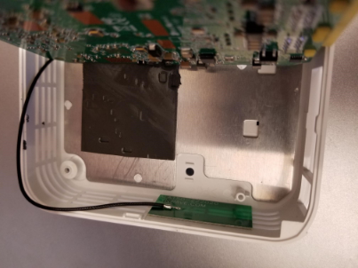

.. include:: <isonum.txt>

OM5P-AC Radio Modification
==========================

The intended use case for the OM5P-AC radio does not subject it to the same shocks and forces as it sees in the FRC\ |reg| environment. If the radio is subjected to significant pressure on the bottom of the case, it is possible to cause a radio reboot by shorting a metal shield at the bottom of the radio to some exposed metal leads on the bottom of the board. This article details a modification to the radio to prevent this scenario.

.. warning:: It takes significant pressure applied to the bottom of the case to cause a reboot in this manner. Most FRC radio reboot issues can be traced to the power path in some form. We recommend mitigating this risk via strategic mounting of the radio rather than opening and modifying the radio (and risk damaging delicate internal components):

- Avoid using the "mounting tab" features on the bottom of the radio.
- You may wish to mount the radio to allow for some shock absorption. A little can go a long way, mounting the radio using hook and loop fastener or to a robot surface with a small amount of flex (plastic or sheet metal sheet, etc.) can significantly reduce the forces experienced by the radio.

Opening the Radio
-----------------

.. note:: The OpenMesh OM5P-AC is not designed to be a user serviceable device. Users perform this modification at their own risk. Make sure to work slowly and carefully to avoid damaging internal components such as radio antenna cables.

Case Screws
^^^^^^^^^^^

Locate the two rubber feet on the front side of the radio then pry them off the radio using fingernails, small flat screwdriver, etc. Using a small Phillips screwdriver, remove the two screws under the feet.

Side Latches
^^^^^^^^^^^^

There is a small latch on the lid of the radio near the middle of each long edge (you can see these latches more clearly in the next picture). Using a fingernail or very thin tool, slide along the gap between the lid and case from front to back towards the middle of the radio, you should hear a small pop as you near the middle of radio. Repeat on the other side (note: it's not hard to accidentally re-latch the first side while doing this, make sure both sides are unlatched before proceeding). The radio lid should now be slightly open on the front side as shown in the image above.

Remove Lid
^^^^^^^^^^

.. warning:: The board may stick to the lid as you remove it due to the heatsink pads. Look through the vents of the radio as you remove the lid to see if the board is coming with it, if it is you may need to insert a small tool to hold the board down to separate it from the lid. We recommend a small screwdriver or similar tool that fits through the vents, applied through the front corner on the barrel jack side, right above the screw hole. You can scroll down to the picture with the lid removed to see what the board looks like in this area.

To begin removing the lid, slide it forward (lifting slightly) until the screw holders hit the case front (you may need to apply pressure on the latch areas while doing this.

Next, begin rotating the lid slightly away from the barrel jack side, as shown while continuing to lift. This will unhook the lid from the small triangle visible in the top right corner. Continue to rotate slightly in this direction while pushing the top left corner towards the barrel jack (don't try to lift further in this step) to unhook a similar feature in the top left corner. Then lift the lid completely away from the body.

Remove Board
^^^^^^^^^^^^

.. warning:: Note the antenna wires shown in the image above. These wires, and their connectors, are fragile, take care not to damage them while performing the next steps.

To remove the board, we recommend grasping one or both network ports with your fingers (as shown) and pushing inward (toward the front of the radio) and upward until the network ports and barrel jack are free from the case.

Tilt the board up (towards the short grey antenna cable) to expose the metal shield underneath.

.. note:: When you perform this step, you may notice that there is a small reset button on the underside of the board that is larger than the hole in the case. Note that pressing the reset button with the FRC firmware installed has no effect and that drilling the case of the radio is not a permitted modification.

Apply Tape
----------

Apply a piece of electrical tape to the metal shield in the area just inside of the network port/barrel jack openings. This will prevent the exposed leads on the underside of the board from short circuiting on this plate.

Re-assemble Radio
-----------------

Re-assemble the radio by reversing the instructions to open it:

- Lay the board back down, making sure it aligns with the screw holes near the front and seats securely
- Slide the lid onto the back left retaining feature by moving it in from right to left. Take care of the capacitor in this area
- Rotate the lid, press downwards and slide the back right retaining feature in
- Press down firmly on the front/middle of the lid to seat the latches
- Replace 2 screws in front feet
- Replace front feet
