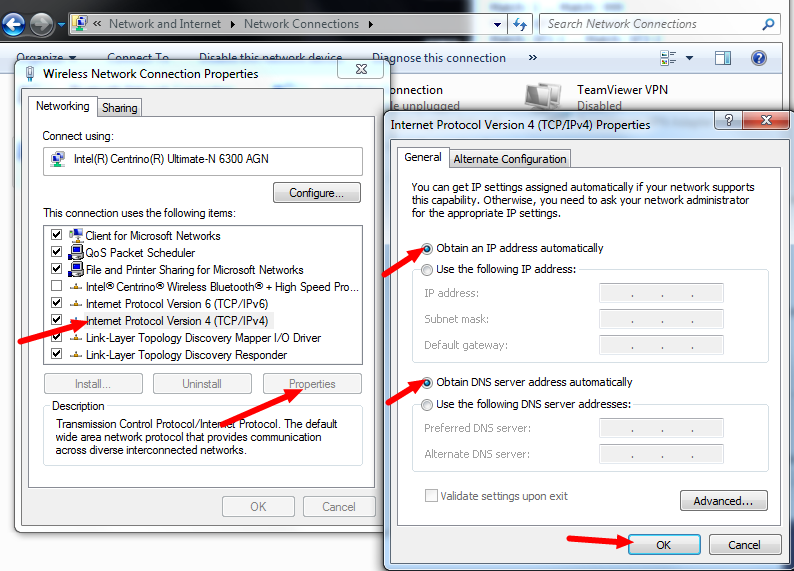

roboRIO Network Troubleshooting
===============================

The roboRIO and the 2015 FRC tools use dynamic IP addresses (DHCP) for network connectivity. This article describes steps for troubleshooting networking connectivity between your PC and your roboRIO

Ping roboRIO
------------

The first step to identifying roboRIO networking issues is to isolate if it is an application issue or a general network issue. To do this, click **Start -> type cmd -> press Enter** to open the command prompt. Type ``ping roboRIO-####-FRC.local`` where #### is your team number (with no leading zeroes) and press enter. If the ping succeeds, the issue is likely with the specific application, verify your team number configuration in the application, and check your firewall configuration.

USB Connection Troubleshooting
------------------------------

If you are attempting to troubleshoot the USB connection, try pinging the roboRIO's IP address. As long as there is only one roboRIO connected to the PC, it should be configured as 172.22.11.2. If this ping fails, make sure you have the roboRIO connected and powered, and that you have installed the NI FRC Game Tools. The game tools installs the roboRIO drivers needed for the USB connection.

If this ping succeeds, but the .local ping fails, it is likely that either the roboRIO hostname is configured incorrectly, or you are connected to a DNS server which is attempting to resolve the .local address.

- Verify that your roboRIO has been :ref:`imaged for your team number <docs/getting-started/getting-started-frc-control-system/imaging-your-roborio:Imaging your roboRIO>`. This sets the hostname used by mDNS.
- Disconnect your computer from all other networks including Ethernet and WiFi. It is possible that one of these networks contains a DNS server that is attempting to resolve the .local address.

Ethernet Connection
-------------------

.. image:: images/roborio-troubleshooting/roborio-ip-address.png

If you are troubleshooting an Ethernet connection, it may be helpful to first make sure that you can connect to the roboRIO using the USB connection. Using the USB connection, open the :ref:`roboRIO webdashboard <docs/software/roborio-info/roborio-web-dashboard:roboRIO Web Dashboard>` and verify that the roboRIO has an IP address on the ethernet interface. If you are tethering to the roboRIO directly this should be a self-assigned ``169.*.*.*`` address, if you are connected to the OM5P-AN radio, it should be an address of the form ``10.TE.AM.XX`` where TEAM is your four digit FRC team number. If the only IP address here is the USB address, verify the physical roboRIO ethernet connection.

Ping the roboRIO IP address
^^^^^^^^^^^^^^^^^^^^^^^^^^^

If there is an IP address in the step above, try pinging this IP address using the command prompt as described above. If this works, you have an issue resolving the mDNS address on your PC. The two most common causes are not having an mDNS resolver installed on the system and a DNS server on the network that is trying to resolve the .local address using regular DNS.

- Verify that you have an mDNS resolver installed on your system. On Windows, this is typically fulfilled by the NI FRC Game Tools. For more information on mDNS resolvers, see the :doc:`roboRIO Networking article <networking-basics>`.
- Disconnect your computer from any other networks and make sure you have the OM5P-AN configured as an access point, using the :ref:`FRC Radio Configuration Utility <docs/getting-started/getting-started-frc-control-system/radio-programming:Programming your Radio>`. Removing any other routers from the system will help verify that there is not a DNS server causing the issue.

Ping fails
^^^^^^^^^^

If pinging the IP address directly fails, you may have an issue with the network configuration of the PC. The PC should be configured to **Obtain an Address Automatically** (also known as DHCP). To check this, click **Start -> Control Panel -> Network Connections -> Change adapter settings**, then right click on the appropriate interface (usually Local Area Connection for Ethernet or Wireless Network Connection for wireless) and select **Properties**. Click **Internet Protocol Version 4**, then click **Properties**. Make sure both radio buttons are set to **Obtain automatically**.

Other things to check
---------------------

Other possibilities that may cause issues include:

- Proxies. Having a proxy enabled may cause issues with the roboRIO networking.

