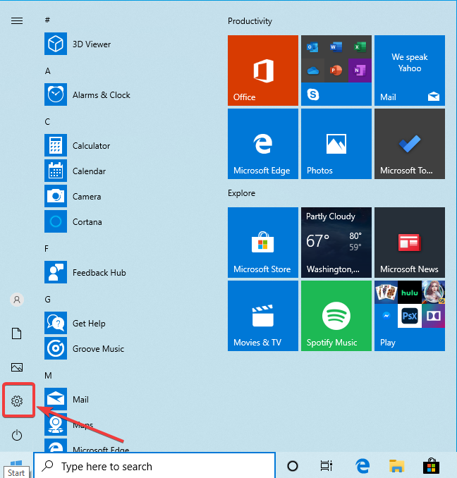
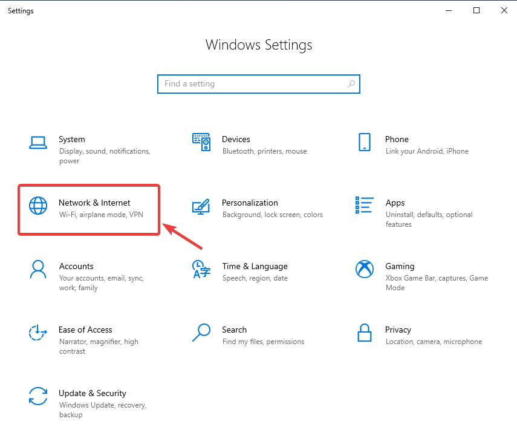
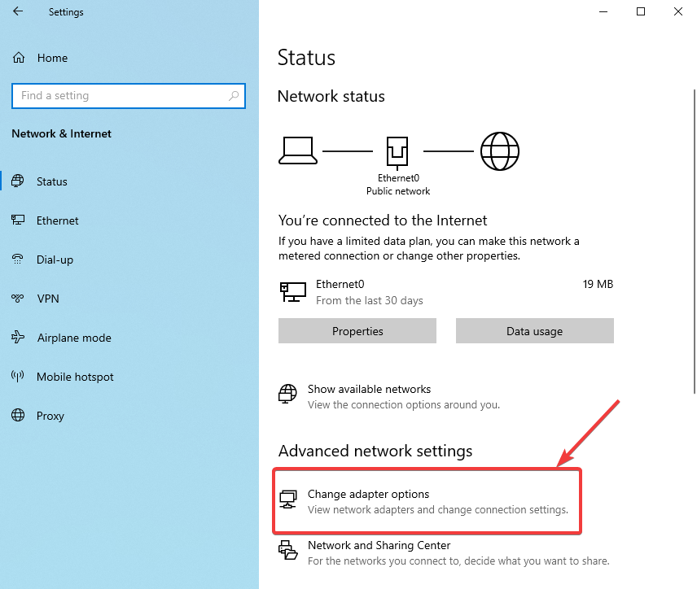
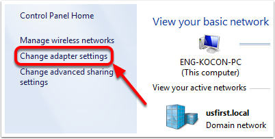
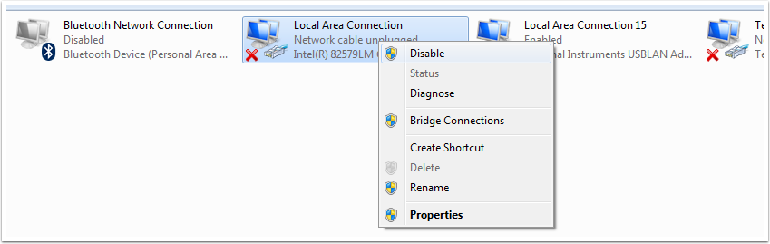

.. include:: <isonum.txt>

roboRIO Network Troubleshooting
===============================

The roboRIO and FRC\ |reg| tools use dynamic IP addresses (DHCP) for network connectivity. This article describes steps for troubleshooting networking connectivity between your PC and your roboRIO

Ping the roboRIO using mDNS
---------------------------

The first step to identifying roboRIO networking issues is to isolate if it is an application issue or a general network issue. To do this, click **Start -> type cmd -> press Enter** to open the command prompt. Type ``ping roboRIO-####-FRC.local`` where #### is your team number (with no leading zeroes) and press enter. If the ping succeeds, the issue is likely with the specific application, verify your team number configuration in the application, and check your firewall configuration.

Ping the roboRIO IP Address
---------------------------

If there is no response, try pinging ``10.TE.AM.2`` (:ref:`TE.AM IP Notation <docs/networking/networking-introduction/ip-configurations:TE.AM IP Notation>`) using the command prompt as described above. If this works, you have an issue resolving the mDNS address on your PC. The two most common causes are not having an mDNS resolver installed on the system and a DNS server on the network that is trying to resolve the .local address using regular DNS.

- Verify that you have an mDNS resolver installed on your system. On Windows, this is typically fulfilled by the NI FRC Game Tools. For more information on mDNS resolvers, see the :ref:`Network Basics article <docs/networking/networking-introduction/networking-basics:mDNS>`.
- Disconnect your computer from any other networks and make sure you have the OM5P-AN configured as an access point, using the :ref:`FRC Radio Configuration Utility <docs/zero-to-robot/step-3/radio-programming:Programming your Radio>`. Removing any other routers from the system will help verify that there is not a DNS server causing the issue.

Ping Fails
----------

   .. image:: images/roborio-troubleshooting/win10-dhcp.png
      :alt: Windows 10+ image of the adapter setting

   If pinging the IP address directly fails, you may have an issue with the network configuration of the PC. The PC should be configured to **Automatic**. To check this, click :guilabel:`Start` -> :guilabel:`Settings` -> :guilabel:`Network & Internet`. Depending on your network, select :guilabel:`Wifi` or :guilabel:`Ethernet`. Then click on your connected network. Scroll down to **IP settings** and click :guilabel:`Edit` and ensure the :guilabel:`Automatic (DHCP)` option is selected.

USB Connection Troubleshooting
------------------------------

If you are attempting to troubleshoot the USB connection, try pinging the roboRIO's IP address. As long as there is only one roboRIO connected to the PC, it should be configured as 172.22.11.2. If this ping fails, make sure you have the roboRIO connected and powered, and that you have installed the NI FRC Game Tools. The game tools installs the roboRIO drivers needed for the USB connection.

If this ping succeeds, but the .local ping fails, it is likely that either the roboRIO hostname is configured incorrectly, or you are connected to a DNS server which is attempting to resolve the .local address.

- Verify that your roboRIO has been :ref:`imaged for your team number <docs/zero-to-robot/step-3/imaging-your-roborio:Imaging your roboRIO>`. This sets the hostname used by mDNS.
- :ref:`Disable all other network adapters <docs/networking/networking-introduction/roborio-network-troubleshooting:Disabling Network Adapters>`

Ethernet Connection
-------------------

.. image:: images/roborio-troubleshooting/roborio-ip-address.png
   :alt: The IP address from the roboRIO webdashboard.

If you are troubleshooting an Ethernet connection, it may be helpful to first make sure that you can connect to the roboRIO using the USB connection. Using the USB connection, open the :ref:`roboRIO webdashboard <docs/software/roborio-info/roborio-web-dashboard:roboRIO Web Dashboard>` and verify that the roboRIO has an IP address on the ethernet interface. If you are tethering to the roboRIO directly this should be a self-assigned ``169.*.*.*`` address, if you are connected to the OM5P-AN radio, it should be an address of the form ``10.TE.AM.XX`` where TEAM is your four digit FRC team number. If the only IP address here is the USB address, verify the physical roboRIO ethernet connection.

Disabling Network Adapters
--------------------------

This is not always the same as turning the adapters off with a physical button or putting the PC into airplane mode. The following steps provide more detail on how to disable adapters.

Open the Settings application by clicking on the settings icon.

Choose the :guilabel:`Network & Internet` category.

Click on :guilabel:`Change adapter options`.

On the left pane, click :guilabel:`Change Adapter Settings`.

For each adapter other than the one connected to the radio, right click on the adapter and select :guilabel:`Disable` from the menu.

Proxies
-------

- Proxies. Having a proxy enabled may cause issues with the roboRIO networking.
