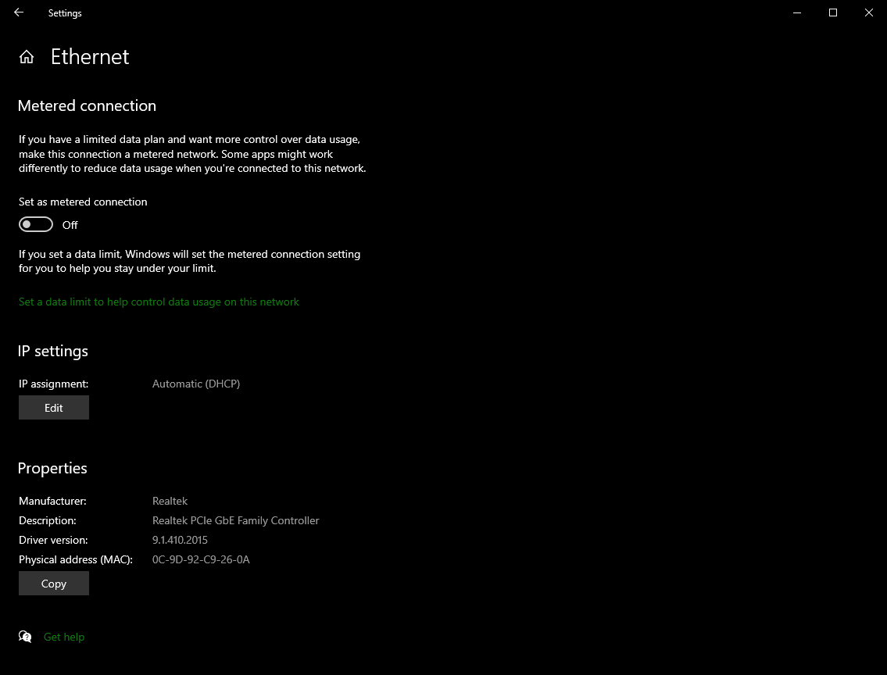
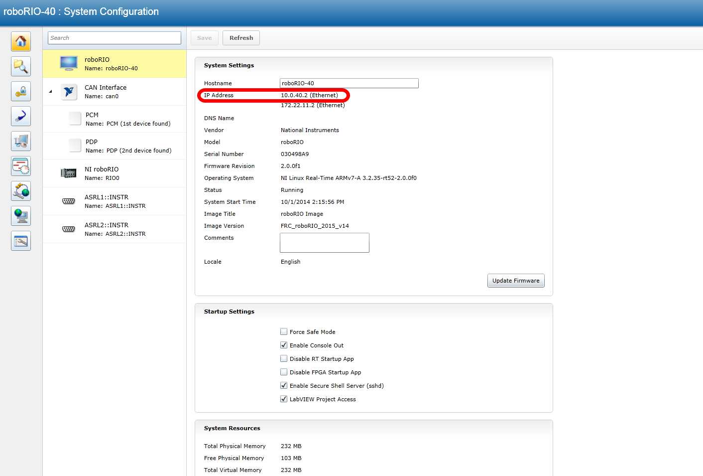
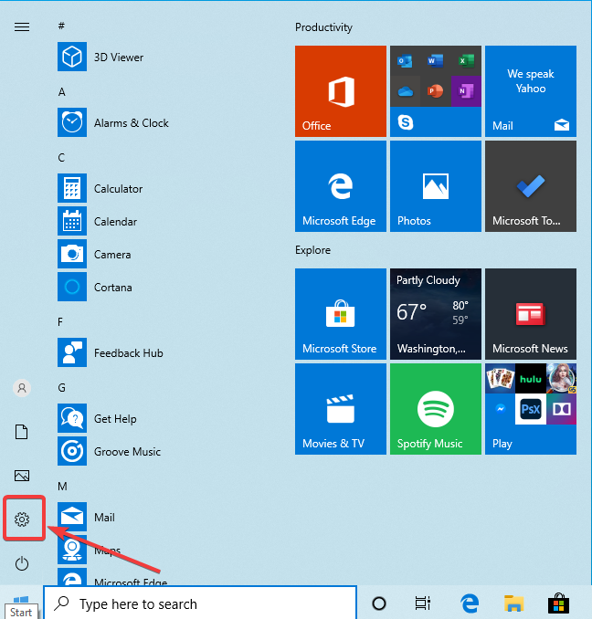
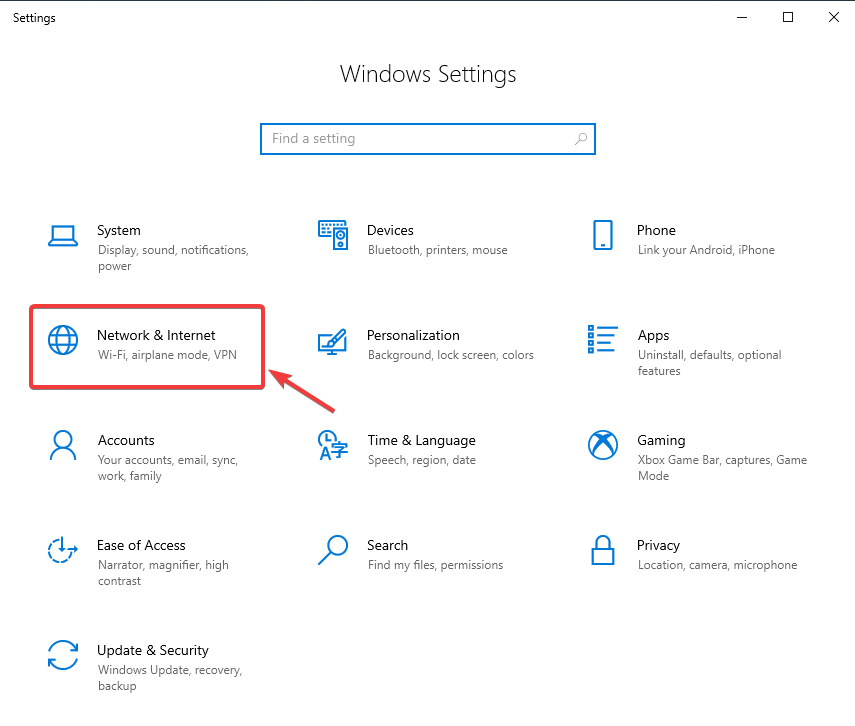
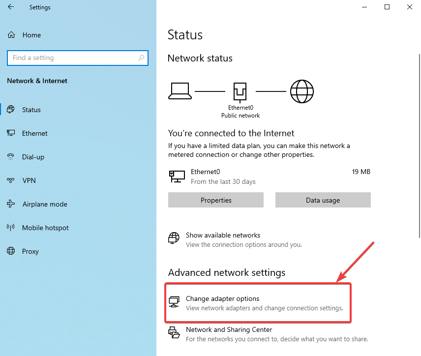
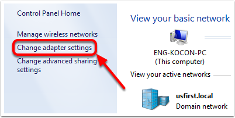
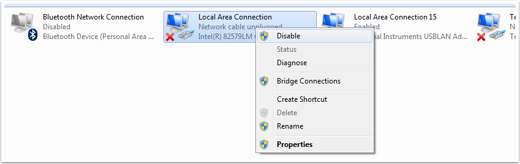

.. include:: <isonum.txt>

# Systemcore Network Troubleshooting

Systemcore uses dynamic IP addresses (:term:`DHCP`) for network connectivity. This article describes steps for troubleshooting networking connectivity between your PC and your Systemcore

.. todo:: Update images for Systemcore

## Ping Systemcore using mDNS

The first step to identifying Systemcore networking issues is to isolate if it is an application issue or a general network issue. To do this, click **Start -> type cmd -> press Enter** to open the command prompt. Type ``ping robot.local`` and press enter. If the ping succeeds, the issue is likely with the specific application, verify your connection configuration in the application, and check your firewall configuration.

## Ping the Systemcore IP Address

If there is no response, try pinging ``10.TE.AM.2`` (:ref:`TE.AM IP Notation <docs/networking/networking-introduction/ip-configurations:TE.AM IP Address Notation>`) using the command prompt as described above. If this works, you have an issue resolving the mDNS address on your PC. The two most common causes are not having an mDNS resolver installed on the system and a DNS server on the network that is trying to resolve the .local address using regular DNS.

- Verify that you have an mDNS resolver installed on your system. On Windows, this functionality is built-in. For more information on mDNS resolvers, see the :ref:`Network Basics article <docs/networking/networking-introduction/networking-basics:mDNS>`.
- Disconnect your computer from any other networks. Removing any other routers from the system will help verify that there is not a DNS server causing the issue.

## Ping Fails

If pinging the IP address directly fails, you may have an issue with the network configuration of the PC. The PC should be configured to **Automatic**. To check this, click :guilabel:`Start` -> :guilabel:`Settings` -> :guilabel:`Network & Internet`. Depending on your network, select :guilabel:`Wifi` or :guilabel:`Ethernet`. Then click on your connected network. Scroll down to **IP settings** and click :guilabel:`Edit` and ensure the :guilabel:`Automatic (DHCP)` option is selected.

## USB Connection Troubleshooting

If you are attempting to troubleshoot the USB connection, try pinging Systemcore's IP address. As long as there is only one Systemcore connected to the PC, it should be configured as 172.28.0.1 on Windows and 172.29.0.1 on Linux/Mac. If this ping fails, make sure you have the Systemcore connected and powered.

If this ping succeeds, but the .local ping fails, it is likely that either the Systemcore hostname is configured incorrectly, or you are connected to a DNS server which is attempting to resolve the .local address.

- Try :ref:`disabling all other network adapters <docs/networking/networking-introduction/systemcore-network-troubleshooting:Disabling Network Adapters>`

## Ethernet Connection

If you are troubleshooting an Ethernet connection, it may be helpful to first make sure that you can connect to Systemcore using the USB connection. Using the USB connection, open the :ref:`Systemcore web dashboard <docs/software/systemcore-info/systemcore-web-dashboard:Systemcore Web Dashboard>` and verify that Systemcore has an IP address on the Ethernet interface. If you are tethering to Systemcore directly this should be a self-assigned ``169.*.*.*`` address, if you are connected to the VH-109 radio, it should be ``10.TE.AM.2`` where TEAM is your five digit FRC team number(:ref:`TE.AM IP Notation <docs/networking/networking-introduction/ip-configurations:TE.AM IP Address Notation>`). If the only IP address here is the USB address, verify the physical Systemcore ethernet connection.

## Disabling Network Adapters

This is not always the same as turning the adapters off with a physical button or putting the PC into airplane mode. The following steps provide more detail on how to disable adapters.

Open the Settings application by clicking on the settings icon.

Choose the :guilabel:`Network & Internet` category.

Click on :guilabel:`Change adapter options`.

On the left pane, click :guilabel:`Change Adapter Settings`.

For each adapter other than the one connected to the radio, right click on the adapter and select :guilabel:`Disable` from the menu.

## Proxies

- Proxies. Having a proxy enabled may cause issues with Systemcore networking.
