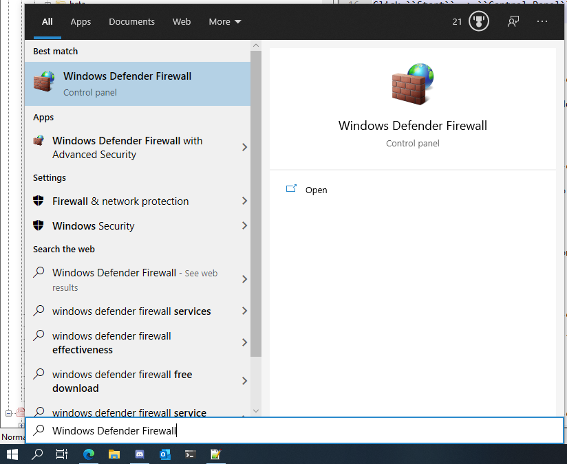
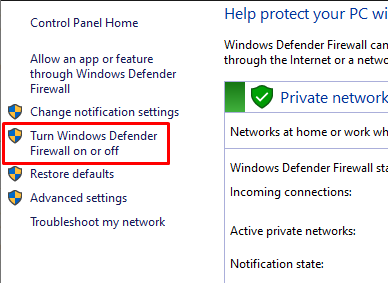
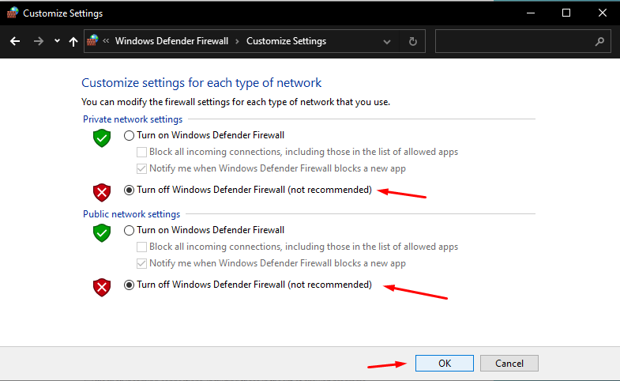
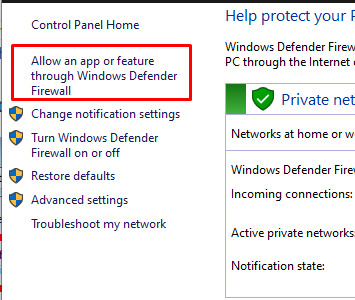
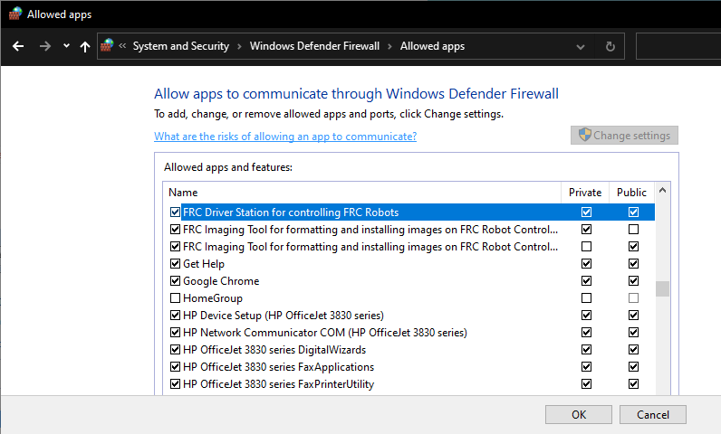

Windows Firewall Configuration
==============================

Many of the programming tools used in FRC need network access for various reasons. Depending on the exact configuration, the Windows Firewall may potentially interfere with this access for one or more of these programs. This document describes procedures for Windows 10.

Disabling Windows Firewall
--------------------------

The easiest solution is to disable the Windows Firewall. Teams should beware that this does make the PC potentially more vulnerable to malware attacks if connecting to the internet.

Windows Search
^^^^^^^^^^^^^^

Open the Start Menu and type ``Windows Defender Firewall`` and click on the first item.

Turn Windows Firewall on or off
^^^^^^^^^^^^^^^^^^^^^^^^^^^^^^^

In the left pane, click ``Turn Windows Defender Firewall on or off``, and click yes. Enter your Administrator password if a dialog appears.

Disable the Firewall
^^^^^^^^^^^^^^^^^^^^

For each category, select the radio button to ``Turn off Windows Defender Firewall``. Then click OK.

Configure the firewall
----------------------

Alternatively, you can add exceptions to the Firewall for any FRC programs you are having issues with.

Windows Search
^^^^^^^^^^^^^^

Open the Start Menu and type ``Windows Defender Firewall`` and click on the first item.

Allow a program...
^^^^^^^^^^^^^^^^^^

In the left pane, click ``Allow a program or feature through Windows Defender Firewall``

Allowed Programs
^^^^^^^^^^^^^^^^

For each FRC program you are having an issue with, make sure that it appears in the list and that it has a check in each column. If you need to change a setting, you made need to click the ``Change settings`` button in the top right before changing the settings. If the program is not in the list at all, click the ``Allow another program...`` button and browse to the location of the program to add it.
