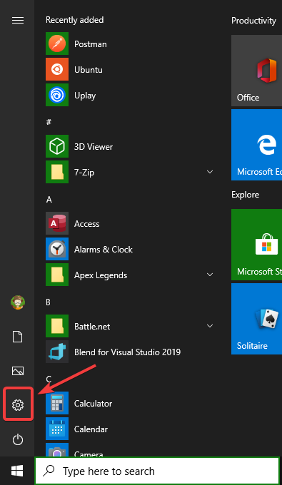
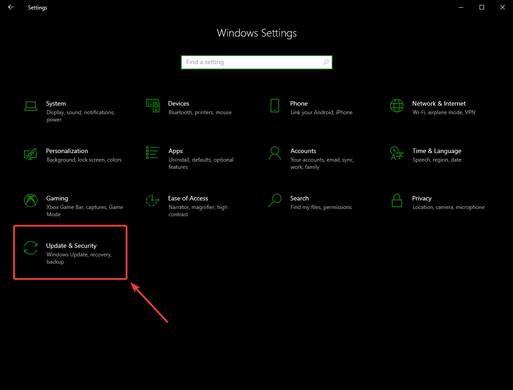
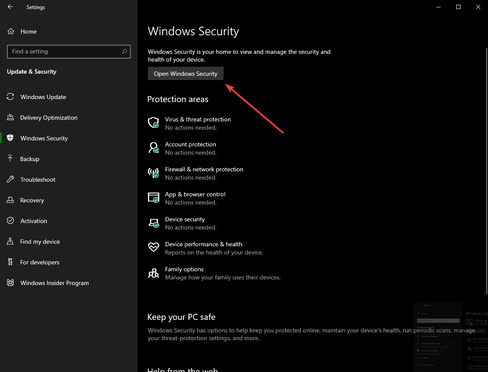
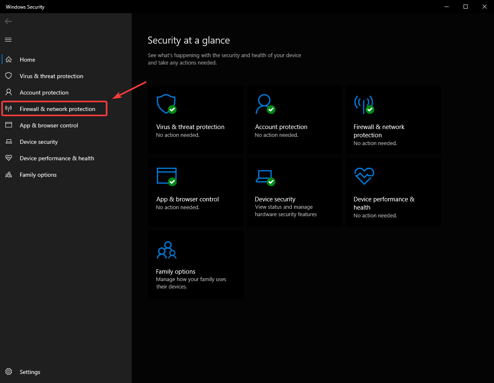
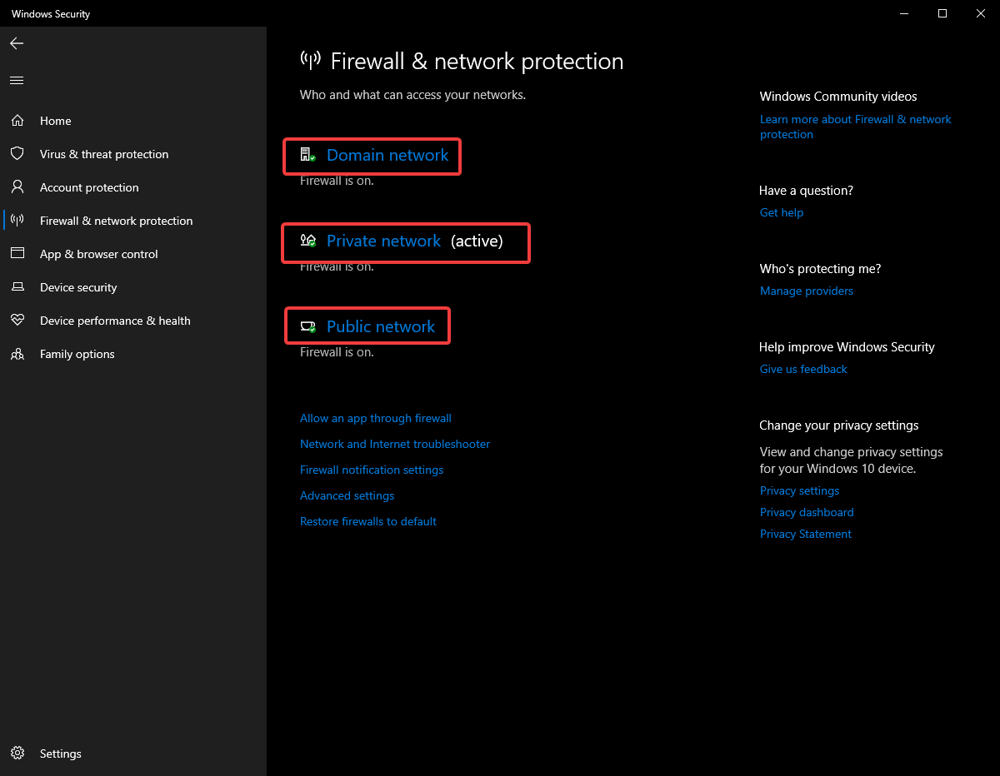
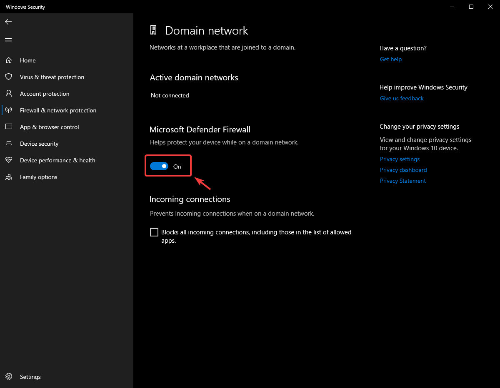
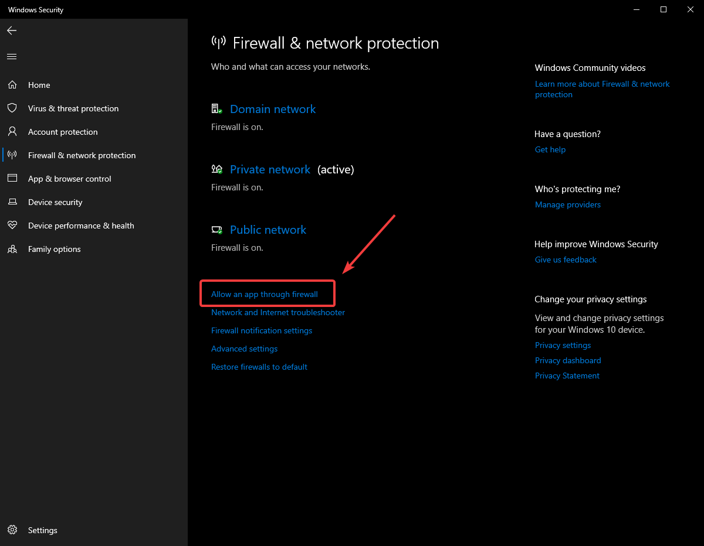
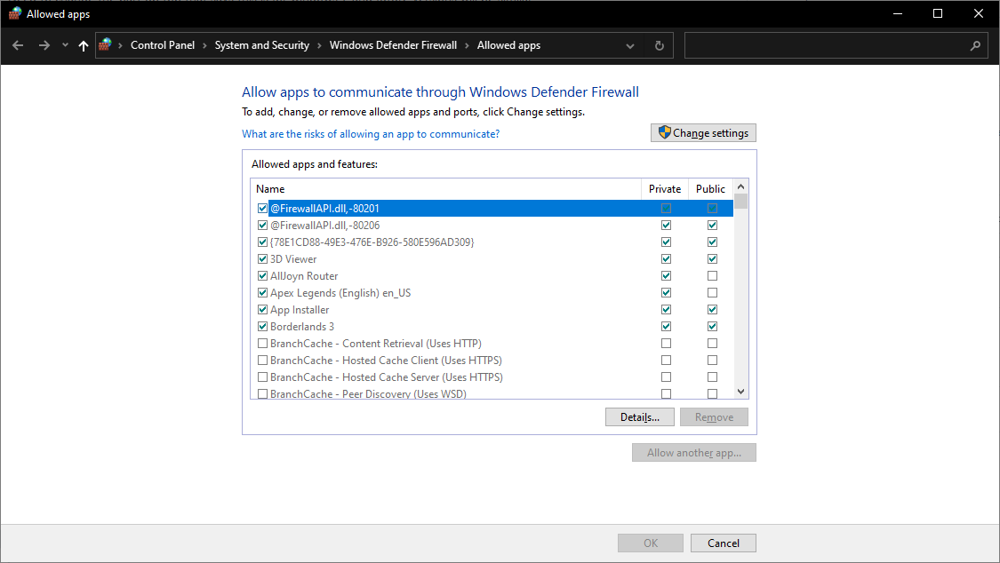

.. include:: <isonum.txt>

Windows Firewall Configuration
==============================

Many of the programming tools used in FRC\ |reg| need network access for various reasons. Depending on the exact configuration, the Windows Firewall may potentially interfere with this access for one or more of these programs.

Disabling Windows Firewall
--------------------------

.. important:: Disabling your firewall requires administrator privileges to the PC. Additionally note that disabling the firewall is not recommended for computers that connect to the internet.

The easiest solution is to disable the Windows Firewall. Teams should beware that this does make the PC potentially more vulnerable to malware attacks if connecting to the internet.

Click :guilabel:`Start` -> :guilabel:`Settings`

Click :guilabel:`Update & Security`

In the right pane, select :guilabel:`Open Windows Security`

In the left pane, select :guilabel:`Firewall and network protection`

Click on **each** of the highlighted options

Then click on the **On** toggle to turn it off.

Whitelisting Apps
-----------------

Alternatively, you can add exceptions to the Firewall for any FRC programs you are having issues with.

Click :guilabel:`Start` -> :guilabel:`Settings`

Click :guilabel:`Update & Security`

In the right pane, select :guilabel:`Open Windows Security`

In the left pane, select :guilabel:`Firewall and network protection`

At the bottom of the window, select :guilabel:`Allow an app through firewall`

For each FRC program you are having an issue with, make sure that it appears in the list and that it has a check in each of the 3 columns. If you need to change a setting, you made need to click the :guilabel:`Change settings` button in the top right before changing the settings. If the program is not in the list at all, click the :guilabel:`Allow another program...` button and browse to the location of the program to add it.

