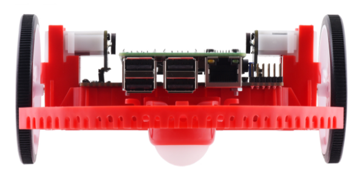

Getting to know your Romi
=========================

Directional Conventions
-----------------------

The front of the Romi is where the Raspberry Pi USB ports, GPIO pins and suspended caster wheel are.

In all Romi documentation, references to driving forward use the above definition of "front".

Hardware, Sensors, and GPIO
---------------------------

The Romi has the following built-in hardware/peripherals:

- 2x geared motors with encoders
- 1x Inertial Measurement Unit (IMU)
- 3x LEDs (green, yellow, red)
- 3x pushbuttons (marked A, B, and C)
- 5x configurable GPIO channels (EXT)
- Buzzer

.. note:: The Buzzer is currently not supported by WPILib.

Motors, Wheels, and Encoders
^^^^^^^^^^^^^^^^^^^^^^^^^^^^

The motors used on the Romi have a 120:1 gear reduction, and a no-load output speed of 150 RPM at 4.5V. The free current is 0.13 amps and the stall current is 1.25 amps. Stall torque is 25 oz-in (0.1765 N-m) but the built-in safety clutch might start slipping at lower torques.

The wheels have a diameter of 70mm (2.75"). They have a trackwidth of 141mm (5.55").

The encoders are connected directly to the motor output shaft and have 12 Counts Per Revolution (CPR). With the provided gear ratio, this nets 1440 counts per wheel revolution.

The motor PWM channels are listed in the table below.

+-------------+--------------------------+
| Channel     | Romi Hardware Component  |
+=============+==========================+
| PWM 0       | Left Motor               |
+-------------+--------------------------+
| PWM 1       | Right Motor              |
+-------------+--------------------------+

.. note:: The right motor will spin in a backward direction when positive output is applied. Thus, the corresponding motor controller needs to be inverted in robot code.

The encoder channels are listed in the table below.

+-------------+--------------------------------------+
| Channel     | Romi Hardware Component              |
+=============+======================================+
| DIO 4       | Left Encoder Quadrature Channel A    |
+-------------+--------------------------------------+
| DIO 5       | Left Encoder Quadrature Channel B    |
+-------------+--------------------------------------+
| DIO 6       | Right Encoder Quadrature Channel A   |
+-------------+--------------------------------------+
| DIO 7       | Right Encoder Quadrature Channel B   |
+-------------+--------------------------------------+

.. note:: By default, the encoders count up when the Romi moves forward.

Inertial Measurement Unit
^^^^^^^^^^^^^^^^^^^^^^^^^

The Romi includes an STMicroelectronics LSM6DS33 Inertial Measurement Unit (IMU) which contains a 3-axis gyro and a 3-axis accelerometer.

The accelerometer has selectable sensitivity of 2G, 4G, 8G, and 16G. The gyro has selectable sensitivity of 125 Degrees Per Second (DPS), 250 DPS, 500 DPS, 1000 DPS, and 2000 DPS.

The Romi Web UI also provides a means to calibrate the gyro and measure its zero-offsets before use with robot code.

Onboard LEDs and Push Buttons
^^^^^^^^^^^^^^^^^^^^^^^^^^^^^

The Romi 32U4 control board has 3 push buttons and 3 LEDs onboard that are exposed as Digital IO (DIO) channels to robot code.

+-------------+--------------------------------------+
| DIO Channel | Romi Hardware Component              |
+=============+======================================+
| DIO 0       | Button A (input only)                |
+-------------+--------------------------------------+
| DIO 1       | Button B (input), Green LED (output) |
+-------------+--------------------------------------+
| DIO 2       | Button C (input), Red LED (output)   |
+-------------+--------------------------------------+
| DIO 3       | Yellow LED (output only)             |
+-------------+--------------------------------------+

Writes to DIO 0, 4, 5, 6 and 7 will result in no-ops.

Configurable GPIO Pins
^^^^^^^^^^^^^^^^^^^^^^^^^^

The control board has 5 configurable GPIO pins (named EXT0 through EXT4) that allow a user to connect external sensors and actuators to the Romi.

All 5 pins support the following modes: Digital IO, Analog In, and PWM (with the exception of EXT 0, which only supports Digital IO and PWM). The mode of the ports can be configured with :ref:`The Romi Web UI <docs/romi-robot/web-ui:External IO Configuration>`.

The GPIO channels are exposed via a 3-pin, servo style interface, with connections for Ground, Power and Signal (with the Ground connection being closest to the edge of the board, and the signal being closest to the inside of the board).

The power connections for the GPIO pins are initially left unconnected but can be hooked into the Romi's on-board 5V supply by using a jumper to connect the 5V pin to the power bus (as seen in the image above). Additionally, if more power than the Romi can provide is needed, the user can provide their own 5V power supply and connect it directly to power bus and ground pins.

GPIO Default Configuration
^^^^^^^^^^^^^^^^^^^^^^^^^^^^^^^^^^^^

The table below shows the default configuration of the GPIO pins (EXT0 through EXT4). :ref:`The Romi Web UI <docs/romi-robot/web-ui:External IO Configuration>` allows the user to customize the functions of the 5 configurable GPIO pins. The UI will also provide the appropriate WPILib channel/device mappings on screen once the IO configuration is complete.

+-------------+---------+
| Channel     | Ext Pin |
+=============+=========+
| DIO 8       | EXT0    |
+-------------+---------+
| Analog In 0 | EXT1    |
+-------------+---------+
| Analog In 1 | EXT2    |
+-------------+---------+
| PWM 2       | EXT3    |
+-------------+---------+
| PWM 3       | EXT4    |
+-------------+---------+
