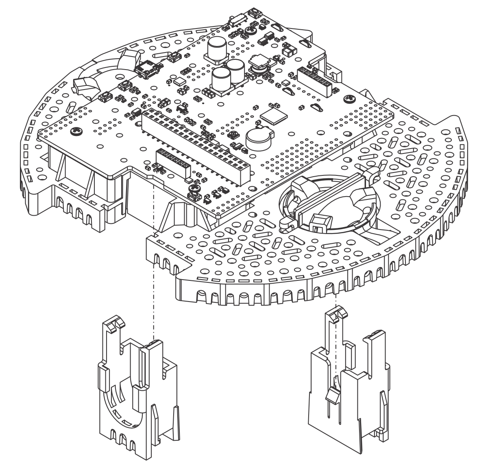
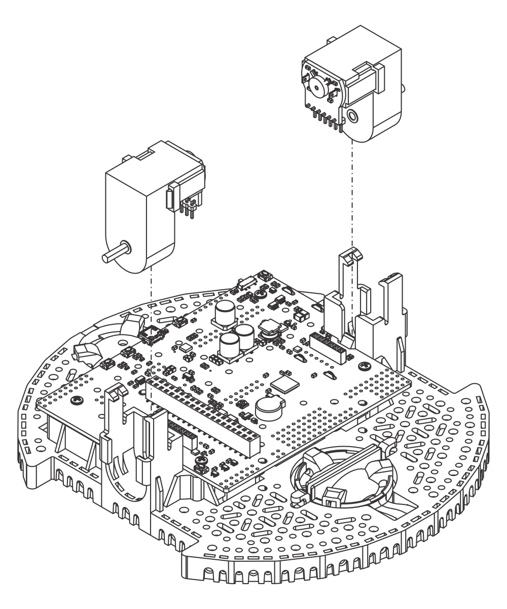
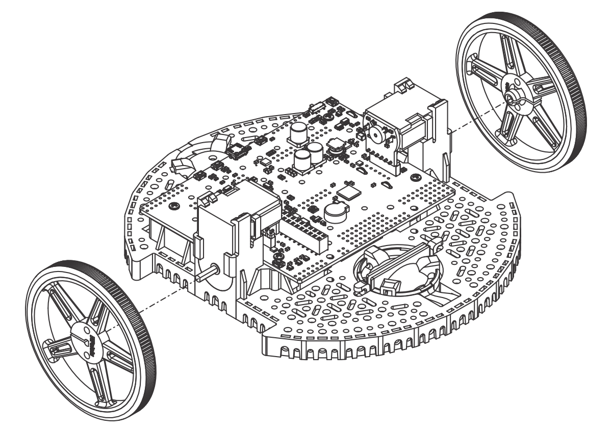
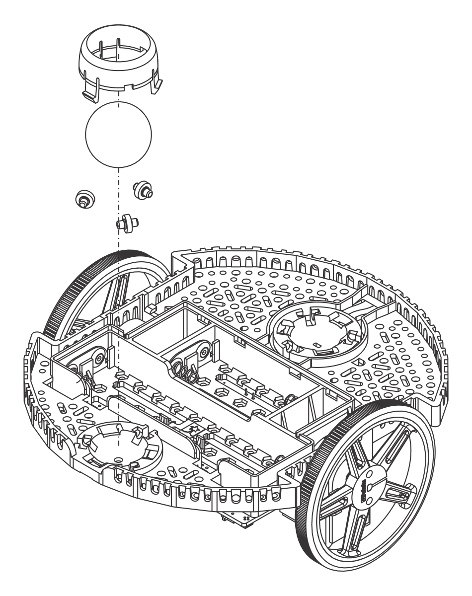
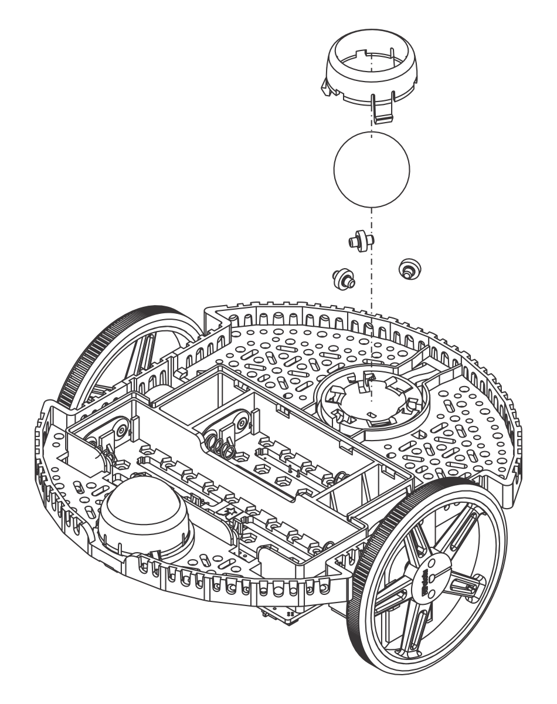
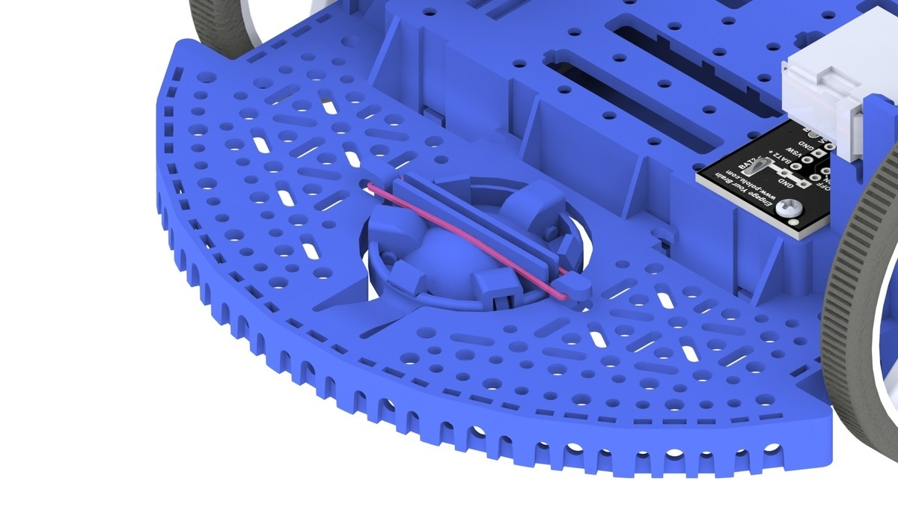
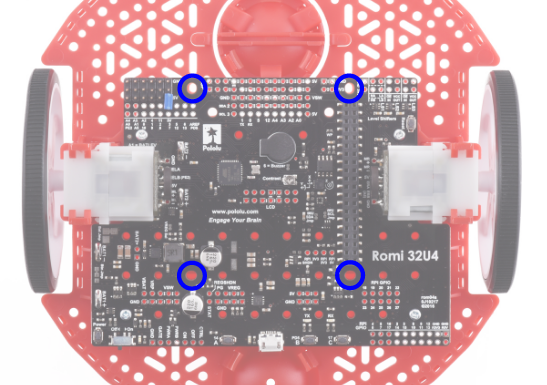
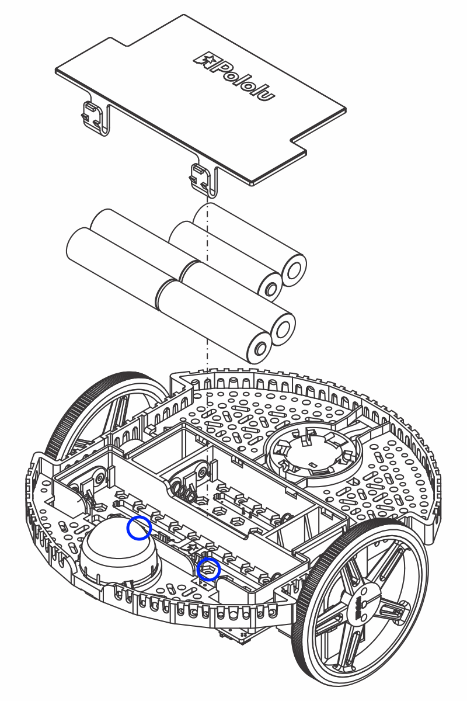
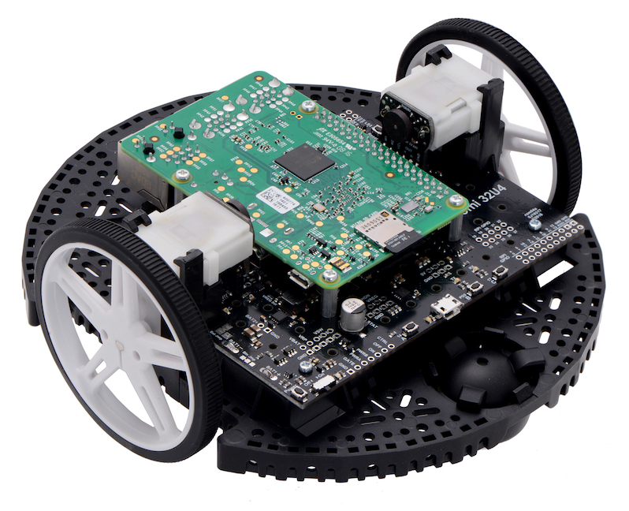

Romi Hardware & Assembly
========================

To get started with the Romi, you will need to have the necessary hardware.

1. `Romi Kit from Pololu <https://www.pololu.com/product/4022>`__ – Order qualifies for free shipping
2. `Raspberry Pi <https://www.amazon.com/gp/product/B07BFH96M3/>`__ – 3B+ or 4
3. `8GB (or larger) Micro SD card <https://www.amazon.com/dp/B073K14CVB/>`__
4. `Micro SD card reader <https://www.amazon.com/gp/product/B0779V61XB/>`__ - if you don't already have one
5. `6 AA batteries <https://www.amazon.com/gp/product/B07TW9T8JW/>`__ – Rechargeable is best (don't forget the charger)

Assembly
--------

The Romi Robot Kit for FIRST comes pre-soldered and only has to be put together before it can be used. Once you have gathered all the materials you can begin assembly:

1. Align the motor clips with the chassis as indicated and press them firmly into the chassis until the bottom of the clips are even with the bottom of the chassis (you may hear several clicks).

2. Push the Mini Plastic Gearmotors into the motor clips until they snap into place. Note that the motor blocks the clip release, so if you need to remove a motor bracket later, you will first need to remove the motor. The Mini Plastic Gearmotors that come with the kit have extended motor shafts to enable quadrature encoders for position feedback.

3. Press the wheels onto the output shafts of the motors until the motor shaft is flush with the outer face of the wheel. One way to do this is to set the wheel on a flat surface and line the chassis up with it so that the flat part of the motor’s D-shaft lines up correctly with the wheel. Then, lower the chassis, pressing the motor shaft into the wheel until it contacts the surface.

4. Flip the chassis upside down and place the three rollers for the rear ball caster into the cutouts in the chassis. Place the 1″ plastic ball on top of the three rollers. Then push the ball caster retention clip over the ball and into the chassis so the three legs snap into their respective holes.

5. Repeat for the front ball caster so there is a caster on the front and the back of the robot.

6. Optional: The front ball caster is supported by a flexible arm that acts as a suspension system. If you want to make it stiffer, you can wrap a rubber band around the two hooks located on either side of the ball caster on the top side of the chassis.

7. Install the standoffs to support the Raspberry Pi board. Two standoffs (thread side down) mount in the holes on the side of the Romi board closest to the "Romi 32U4" label as shown in the picture. The nuts for these standoffs are inside the battery compartment. The other two standoffs go into the holes on the opposite side of the board. To attach them, you will need a needle-nose pliers to hold the nut while you screw in the standoffs. The circled holes in the image below show where the standoffs should go.

8. The chassis works with four or six AA batteries (we recommend using rechargeable AA NiMH cells). The correct orientation for the batteries is indicated by the battery-shaped holes in the Romi chassis as well as the + and - indicators in the chassis itself.

9. Attach the Raspberry Pi board upside down, carefully aligning the 2x20 pin connector on the Pi with the 2x20 pin socket on the Romi. Push with even pressure taking care to not bend any of the pins. Once inserted, use the supplied screws to fasten the Raspberry Pi board to the standoffs that were installed in a previous step.

.. note:: Two of the screws will require placing a nut in a hexagonal hole inside the battery compartment.  The locations are shown by the blue circles in the image above.

The assembly of your Romi chassis is now complete!
