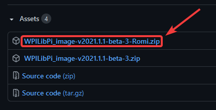
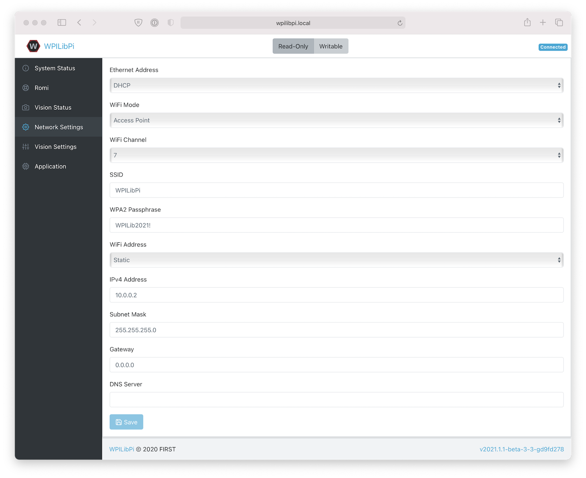
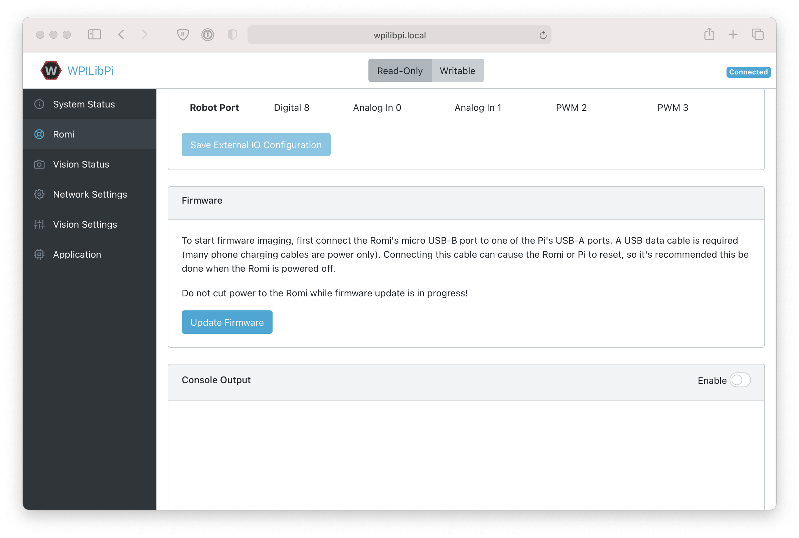
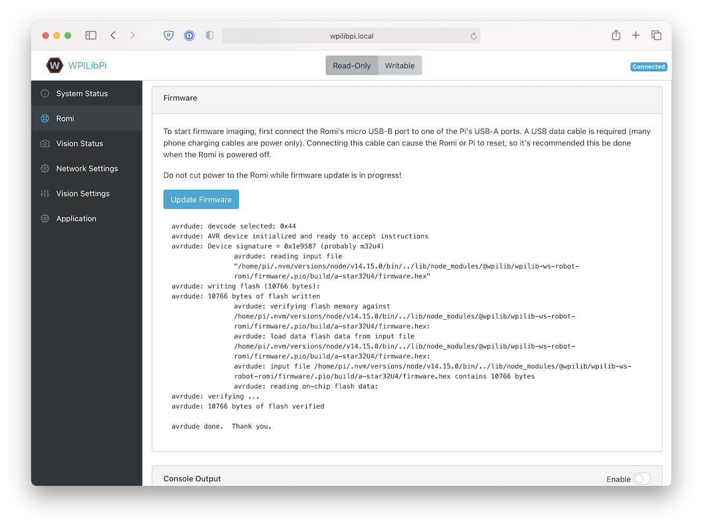

Imaging your Romi
=================

The Romi has 2 microprocessor boards:

#. A **Raspberry Pi** that handles high-level communication with the robot program running on the desktop and
#. A **Romi 32U4 Control Board** that handles low-level motor and sensor operation.

Both boards need to have firmware installed so that the robot operates properly.

Raspberry Pi
------------

Download
^^^^^^^^

The Raspberry Pi firmware is based on WPILibPi (formerly FRCVision) and must be downloaded and written to the Raspberry Pi micro SD card. Click on ``Assets`` at the bottom of the description to see the available image files:

`Romi WPILibPi <https://github.com/wpilibsuite/WPILibPi/releases>`__

Be sure to download the Romi version and not the standard release of WPILibPi. The Romi version is suffixed with ``-Romi``. See the below image for an example.

Imaging
^^^^^^^

The procedure for installing the image is described here: :doc:`WPILibPi Installation</docs/software/vision-processing/wpilibpi/installing-the-image-to-your-microsd-card>`.

Wireless Network Setup
^^^^^^^^^^^^^^^^^^^^^^

Perform the following steps to get your Raspberry Pi ready to use with the Romi:

1. Turn the Romi on by sliding the power switch on the Romi 32U4 board to the on position. The first time it is started with a new image it will take approximately 2-3 minutes to boot while it resizes the file system and reboots. Subsequent times it will boot in less than a minute.

2. Using your computer, connect to the Romi WiFi network using the SSID ``WPILibPi-<number>`` (where ``<number>`` is based on the Raspberry Pi serial number) with the WPA2 passphrase ``WPILib2021!``.

.. note:: If powering on the Raspberry Pi in an environment with multiple WPILibPi-running Raspberry Pis, the SSID for a particular Raspberry Pi is also announced audibly through the headphone port. The default SSID is also written to the ``/boot/default-ssid.txt`` file, which can be read by inserting the SD card (via a reader) into a computer and opening the ``boot`` partition.

3. Open a web browser and connect to the Raspberry Pi dashboard at either ``http://10.0.0.2/`` or ``http://wpilibpi.local/``.

.. note:: The image boots up read-only by default, so it is necessary to click the ``Writable`` button to make changes. Once done making changes, click the ``Read-Only`` button to prevent memory corruption.

4. Select :guilabel:`Writable` at the top of the dashboard web page.

5. Change the default password for your Romi by setting a new password in the ``WPA2 Passphrase`` field.

6. Press the :guilabel:`Save` button at the bottom of the page to save changes.

7. Change the network SSID to a unique name if you plan on operating your Romi on a wireless network with other Romis.

8. Reconnect to the Romi's WiFi network with the new password you set.

Be sure to set the Dashboard to ``Read-only`` when all the changes have been completed.

32U4 Control Board
------------------

The Raspberry Pi can now be used to write the firmware image to the 32U4 Control Board.

#. Turn off the Romi
#. Connect a USB A to micro-B cable from one of the Raspberry Pi's USB ports to the micro USB port on the 32U4 Control Board.
#. Turn on the Romi and connect to its Wifi network and connect to the web dashboard as in the previous steps.
#. On the ``Romi`` configuration page, press the :guilabel:`Update Firmware` button.

A console will appear showing a log of the firmware deploy process. Once the firmware has been deployed to the 32U4 Control Board, the message ``avrdude done. Thank you.`` will appear.

