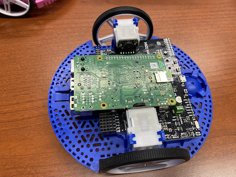

Getting Started with Romi
=========================

The Romi is a small and inexpensive robot designed for learning about programming FRC robots. All the same tools used for programming full-sized FRC robots can be used to program the Romi. The Romi comes with two drive motors with integrated wheel encoders. It also includes an IMU sensor that can be used for measuring headings and accelerations. Using it is as simple as writing a robot program, and running it on your computer. It will command the Romi to follow the steps in the program.

.. tip:: A course that teaches programming using the Romi Robot is available via Thinkscape. Information on this course is available `here <https://www.firstinspires.org/robotics/frc/blog/2021-skill-building-update-intro-to-programming-module>`__

.. toctree::
   :maxdepth: 1

   hardware
   imaging-romi
   getting-to-know-romi
   hardware-support
   web-ui
   programming-romi
   programming-romi-in-labview
