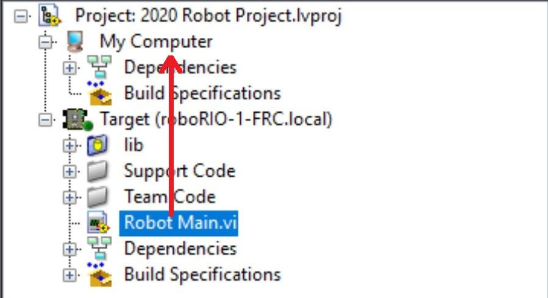

Programming the Romi
====================

Writing a LabVIEW program for the Romi is very similar to writing a program for a regular FRC robot. In fact, all the same tools (LabVIEW, Driver Station, SmartDashboard, etc) can be used with the Romi.

Creating a Romi Program
-----------------------

Creating a new program for a Romi is no different than creating a normal FRC program, similar to the :doc:`Zero To Robot </docs/zero-to-robot/step-4/index>` programming steps. Initially you may wish to create a separate project for use on just the Romi as the Romi hardware may be connected to different ports than on your roboRIO robot.

Changing the project target
^^^^^^^^^^^^^^^^^^^^^^^^^^^

One aspect where a Romi project differs from a regular FRC robot project is that the code is not deployed directly to the Romi. Instead, a Romi project runs on your development computer, and leverages the WPILib simulation framework to communicate with the Romi robot. This means that the primary step needed to run your LabVIEW program on the Romi is to change the target to the Desktop. To change the project target, locate the Robot Main VI in the Project Explorer and click and drag it from the ``Target`` section to the ``My Computer`` section.

Setting the target IP
^^^^^^^^^^^^^^^^^^^^^

By default, your LabVIEW program will attempt to connect to a Romi with the IP address of 10.0.0.2. If you wish to use a different IP, you can specify it as an input to the ``Driver Station Start Communication VI`` inside ``Robot Main``. Locate the pink input terminal for ``Simulation URL`` then right-click and select ``Create Constant`` to create a constant pre-filled with the default value. You can then modify the IP address portion of the text, taking care to leave the protocol section (at the beginning) and port and suffix (at the end) the same.

Running a Romi Program
^^^^^^^^^^^^^^^^^^^^^^

To run a Romi program, first, ensure that your Romi is powered on. Once you connect to the ``WPILibPi-<number>`` network broadcast by the Romi, press ``the white Run arrow`` to start running the Romi program on your computer.

Your Romi code is now running! The program will automatically attempt to connect to either the IP you have specified, or the default if you have not specified an IP.

It is recommended to run the Driver Station software on the same computer as the LabVIEW code. Once your program successfully connects to the Driver Station, it will automatically notify the Driver Station that the code is running on the Desktop, allowing the Driver Station to connect without you changing any information inside the Driver Station. You can then use the controls in the Driver Station to set the robot mode and enable/disable as normal.

.. note: If your robot code is unable to connect to the Romi, the Driver Station will also show no connectivity. If you wish to verify that the code is running properly on the desktop, you can point the DS at it manually by entering ``127.0.0.1`` in the ``Team Number`` box in the Driver Station.
