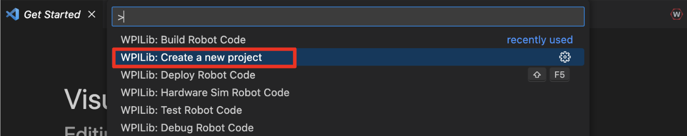
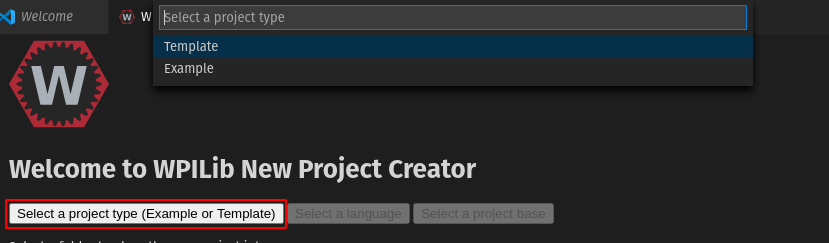
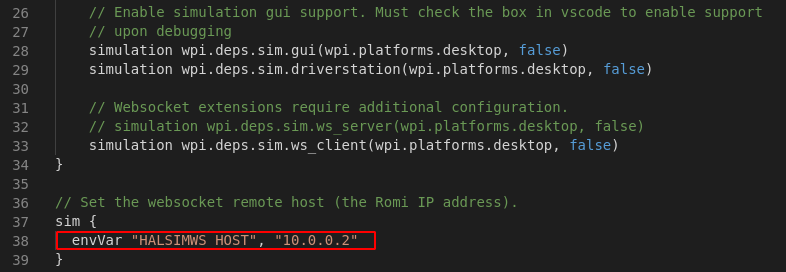
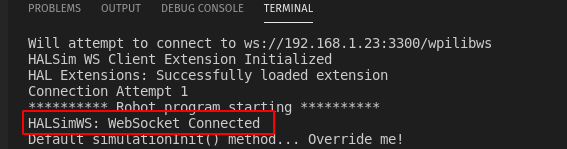

Programming the Romi
====================

Writing a program for the Romi is very similar to writing a program for a regular FRC robot. In fact, all the same tools (Visual Studio Code, Driver Station, SmartDashboard, etc) can be used with the Romi.

Creating a Romi Program
-----------------------

Creating a new program for a Romi is no different than creating a normal FRC program, similar to the :doc:`Zero To Robot </docs/zero-to-robot/step-4/index>` programming steps.

WPILib comes with several templates for Romi projects, including ones based on TimedRobot, and a Command-Based project template. Additionally, an example project is also provided which showcases some of the built-in functionality of the Romi. This article will walk through creating a project from this example.

.. note:: In order to program the Romi using C++, a compatible C++ desktop compiler must be installed. See :ref:`Robot Simulation - Additional C++ Dependency <docs/software/wpilib-tools/robot-simulation/introduction:Additional C++ Dependency>`.

Creating a New WPILib Romi Project
^^^^^^^^^^^^^^^^^^^^^^^^^^^^^^^^^^

Bring up the Visual Studio Code command palette with :kbd:`Ctrl+Shift+P`, and type "New project" into the prompt. Select the "Create a new project" command:

This will bring up the "New Project Creator Window". From here, click on "Select a project type (Example or Template), and pick "Example" from the prompt that appears:

Next, a list of examples will appear. Scroll through the list to find the "RomiReference" example:

.. image:: images/programming-romi/romi-vscode-reference-example.png

Fill out the rest of the fields in the "New Project Creator" and click "Generate Project" to create the new robot project.

Running a Romi Program
^^^^^^^^^^^^^^^^^^^^^^

Once the robot project is generated, it is essentially ready to run. The project has a pre-built ``Drivetrain`` class and associated default command that lets you drive the Romi around using a gamepad.

One aspect where a Romi project differs from a regular FRC robot project is that the code is not deployed directly to the Romi. Instead, a Romi project runs on your development computer, and leverages the WPILib simulation framework to communicate with the Romi robot.

To run a Romi program, first, ensure that your Romi is powered on. Once you connect to the ``WPILibPi-<number>`` network broadcast by the Romi, press :kbd:`F5` to start running the Romi program on your computer.

If you changed the Romi network settings (for example, to connect it to your own WiFi network), you can change the IP address that your program uses to connect to the Romi. To do this, open the "build.gradle" file and update the ``envVar`` line to the appropriate IP address.

If all goes well, you should see a line in the console output that reads "HALSimWS: WebSocket Connected":

Your Romi code is now running!

.. note:: By default, the Romi templates and examples are set up so that positive drive values correspond to the Romi moving forward. Since forward movement on a Joystick produces negative values, you will need to invert the values in appropriate places (e.g. the ``xSpeed`` parameter to ``arcadeDrive`` on a ``DifferentialDrive`` object).
