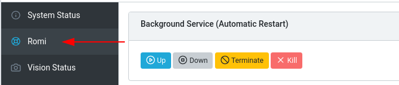
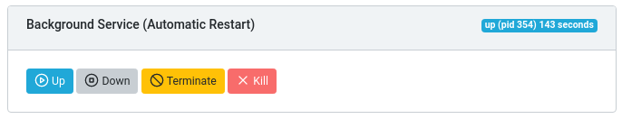
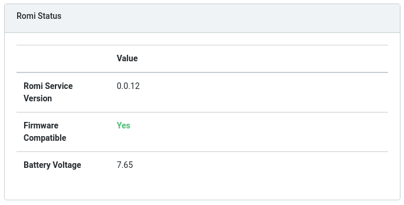
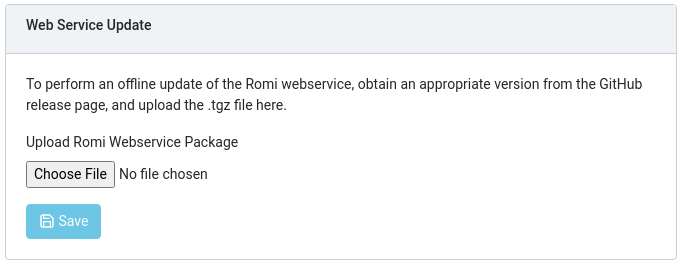
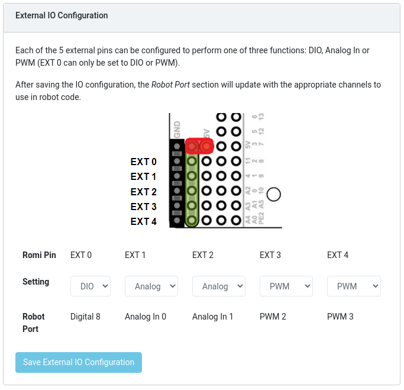
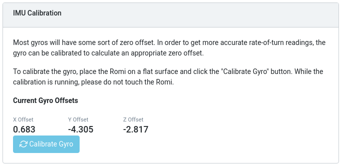
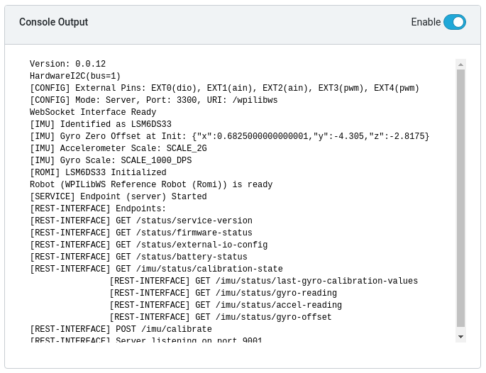
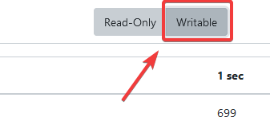
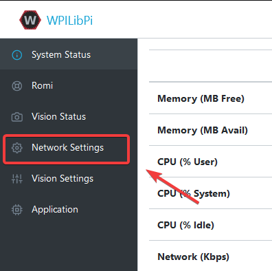
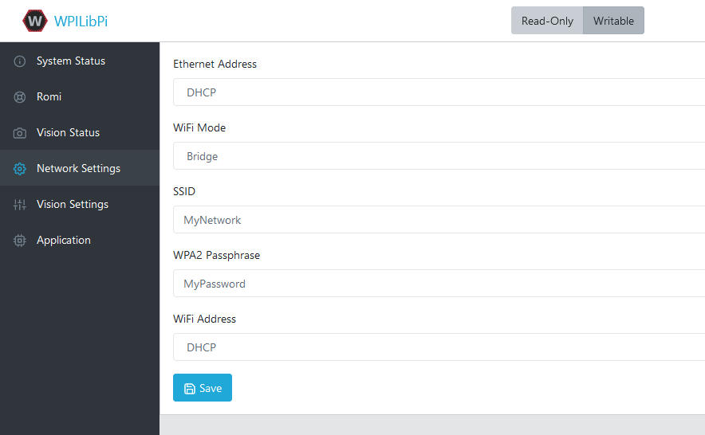

The Romi Web UI
===============

The Romi Web UI comes installed as part of the WPILibPi Raspberry Pi image. It is accessible by clicking on the Romi tab in the navigation bar of the main WPILibPi Web UI.

The rest of this section will walk through the various parts of the Romi Web UI and describe the relevant functionality.

Background Service Status
-------------------------

This section of the Romi Web UI provides information about the currently running Romi Web Service (which is what allows WPILib to talk to the Romi). The UI provides controls to bring the service up/down as well as shows the current uptime of the web service.

.. note:: Users will not need to use the functionality in this section often, but it can be useful for troubleshooting.

Romi Status
-----------

This section provides information about the Romi, including the service version, battery voltage, and whether or not the currently installed firmware on the Romi 32U4 board is compatible with the current version of the web service.

.. note:: If the firmware is not compatible, see the section on :doc:`Imaging your Romi </docs/romi-robot/imaging-romi>`

Web Service Update
------------------

.. note:: The Raspberry Pi must be in **Writable** mode for this section to work.

The Romi WPILibPi image ships with the latest (at publication time) version of the Romi web service. To support upgrading to newer versions of the Romi web service, this section allows users to upload a pre-built bundle that can be obtained via the Romi web service `GitHub releases page <https://github.com/wpilibsuite/wpilib-ws-robot-romi/releases>`__.

To perform an upgrade, download the appropriate .tgz file from the GitHub Releases page. Next, select the downloaded .tgz file and click :guilabel:`Save`. The updated web service bundle will be uploaded to the Raspberry Pi, and be installed. After a short moment, the Romi Status section should update itself with the latest version information.

External IO Configuration
-------------------------

This section allows users to configure the 5 external GPIO channels on the Romi.

.. note:: The Raspberry Pi must be in **Writable** mode for this section to work.

To change the configuration of a GPIO channel, select an appropriate option from the dropdown lists. All channels (with the exception of EXT 0) support Digital IO, Analog In and PWM as channel types. Once the appropriate selections are made, click on :guilabel:`Save External IO Configuration`. The web service will then restart and pick up the new IO configuration.

The "Robot Port" row provides the appropriate WPILib mapping for each configured GPIO channel. For example, EXT 0 is configured as a Digital IO channel, and will be accessible in WPILib as a DigitalInput (or DigitalOutput) channel 8.

IMU Calibration
---------------

.. note:: The Raspberry Pi must be in **Writable** mode for this section to work.

This section allows users to calibrate the gyro on the Romi. Gyros usually have some sort of zero-offset error, and calibration allows the Romi to calculate the offset and use it in calculations.

To begin calibration, place the Romi on a flat, stable surface. Then, click the :guilabel:`Calibrate Gyro` button. A progress bar will appear, showing the current calibration process. Once calibration is complete, the latest offset values will be displayed on screen and registered with the Romi web service.

These offset values are saved to disk and persist between reboots.

Firmware
--------

.. note:: See the section on :doc:`Imaging your Romi </docs/romi-robot/imaging-romi>`

Console Output
--------------

When enabled, this section allows users to view the raw console output that the Romi web service provides. This is useful for troubleshooting issues with the Romi, or just to find out more about what goes on behind the scenes.

Bridge Mode
-----------

Bridge mode allows your Romi robot to connect to a WiFi network instead of acting as an Access Point (AP). This is especially useful in remote learning environments, as you can use the internet while using the Romi without extra hardware.

.. note:: Bridge mode is not likely to work properly in restricted network environments (Educational Institutions).

1. Enable :guilabel:`Writable` in the top menu.

2. Click on :guilabel:`Network Settings`.

3. The following network settings must be applied:

- **Ethernet**: DHCP
- **WiFi Mode**: Bridge
- **SSID**: SSID (name) of your network
- **WPA2 Passphrase**: Password of your wifi network
- **WiFi Address**: DHCP

Once the settings are applied, please reboot the Romi. You should now be able to navigate to ``wpilibpi.local`` in your web browser while connected to your specified network.

Unable to Access Romi
^^^^^^^^^^^^^^^^^^^^^

If the Romi has the correct bridge settings and you are unable to access it, we have a few workarounds.

- Ethernet into the Romi
- Reimage the Romi

Some restricted networks can interfere with the hostname of the Romi resolving, you can workaround this by using `Angry IP Scanner <https://angryip.org/>`__ to find the IP address.

.. warning:: Angry IP Scanner is flagged by some antivirus as spyware as it pings devices on your network! It is a safe application!
