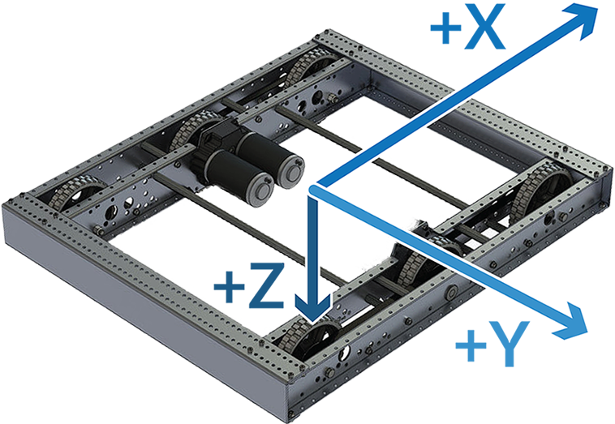

.. include:: <isonum.txt>

Using the WPILib Classes to Drive your Robot
======================================================

WPILib includes many classes to help make your robot get driving faster.

Standard drivetrains
--------------------

Differential Drive Robots
^^^^^^^^^^^^^^^^^^^^^^^^^
.. image:: /docs/zero-to-robot/step-1/images/how-to-wire-a-robot/layout.jpg
   :alt: The wiring of a simple differential drive robot.
   :width: 600

These drive bases typically have two or more in-line traction or omni  wheels per side (e.g., 6WD or 8WD) and may also be known as  "skid-steer", "tank drive", or "West Coast Drive". The Kit of Parts  drivetrain is an example of a differential drive. These drivetrains are capable of driving forward/backward and can turn by driving the two sides in opposite directions causing the wheels to skid sideways. These drivetrains are not capable of sideways translational movement.

Mecanum Drive
^^^^^^^^^^^^^
.. image:: images/am-14u4-6in-mecanum-upgrade.png
   :alt: A four wheel Mecanum robot using the KOP chassis.
   :width: 600

Mecanum drive is a method of driving using specially designed wheels that allow the robot to drive in any direction without changing the orientation of the robot. A robot with a conventional drivetrain (all wheels pointing in the same direction) must turn in the direction it needs to drive. A mecanum robot can move in any direction without first turning and is called a holonomic drive. The wheels (shown on this robot) have rollers that cause the forces from driving to be applied at a 45 degree angle rather than straight forward as in the case of a conventional drive.

When viewed from the top, the rollers on a mecanum drivetrain should form an 'X' pattern. This results in the force vectors (when driving the wheel forward) on the front two wheels pointing forward and inward and the rear two wheels pointing forward and outward. By spinning the wheels in different directions, various components of the force vectors cancel out, resulting in the desired robot movement. A quick chart of different movements has been provided below, drawing out the force vectors for each of these motions may help in understanding how these drivetrains work. By varying the speeds of the wheels in addition to the direction, movements can be combined resulting in translation in any direction and rotation, simultaneously.

Drive Class Conventions
-----------------------

Motor Inversion
^^^^^^^^^^^^^^^

By default, the class inverts the motor outputs for the right side of the drivetrain. Generally this will mean that no inversion needs to be done on the individual SpeedController objects. To disable this behavior, use the `setRightSideInverted()` method.

Squaring Inputs
^^^^^^^^^^^^^^^

When driving robots, it is often desirable to manipulate the joystick inputs such that the robot has finer control at low speeds while still using the full output range. One way to accomplish this is by squaring the joystick input, then reapplying the sign. By default the Differential Drive class will square the inputs. If this is not desired (e.g. if passing values in from a PIDController), use one of the drive methods with the squaredInputs parameter and set it to false.

Input Deadband
^^^^^^^^^^^^^^

By default, the Differential Drive class applies an input deadband of 0.02. This means that input values with a magnitude below 0.02 (after any squaring as described above) will be set to 0. In most cases these small inputs result from imperfect joystick centering and are not sufficient to cause drivetrain movement, the deadband helps reduce unnecessary motor heating that may result from applying these small values to the drivetrain. To change the deadband, use the `setDeadband()` method.

Maximum Output
^^^^^^^^^^^^^^

Sometimes drivers feel that their drivetrain is driving too fast and want to limit the output.  This can be accomplished with the `setMaxOutput()` method.  This maximum output is multiplied by result of the previous drive functions like deadband and squared inputs.

Motor Safety
^^^^^^^^^^^^

Motor Safety is a mechanism in WPILib that takes the concept of a watchdog and breaks it out into one watchdog (Motor Safety timer) for each individual actuator. Note that this protection mechanism is in addition to the System Watchdog which is controlled by the Network Communications code and the FPGA and will disable all actuator outputs if it does not receive a valid data packet for 125ms.

The purpose of the Motor Safety mechanism is the same as the purpose of a watchdog timer, to disable mechanisms which may cause harm to themselves, people or property if the code locks up and does not properly update the actuator output. Motor Safety breaks this concept out on a per actuator basis so that you can appropriately determine where it is necessary and where it is not. Examples of mechanisms that should have motor safety enabled are systems like drive trains and arms. If these systems get latched on a particular value they could cause damage to their environment or themselves. An example of a mechanism that may not need motor safety is a spinning flywheel for a shooter. If this mechanism gets latched on a particular value it will simply continue spinning until the robot is disabled. By default Motor Safety is enabled for DifferentialDrive, KilloughDrive, and MecanumDrive objects and disabled for all other motor controllers and servos.

The Motor Safety feature operates by maintaining a timer that tracks how long it has been since the feed() method has been called for that actuator. Code in the Driver Station class initiates a comparison of these timers to the timeout values for any actuator with safety enabled every 5 received packets (100ms nominal). The set() methods of each motor controller class and the set() and setAngle() methods of the servo class call feed() to indicate that the output of the actuator has been updated.

The Motor Safety interface of motor controllers can be interacted with by the user using the following methods:

.. tabs::

    .. code-tab:: java

        exampleJaguar.setSafetyEnabled(true);
        exampleJaguar.setSafetyEnabled(false);
        exampleJaguar.setExpiration(.1);
        exampleJaguar.feed()

    .. code-tab:: c++

        exampleJaguar->SetSafetyEnabled(true);
        exampleJaguar->SetSafetyEnabled(false);
        exampleJaguar->SetExpiration(.1);
        exampleJaguar->Feed();

By default all Drive objects enable Motor Safety. Depending on the mechanism and the structure of your program, you may wish to configure the timeout length of the motor safety (in seconds). The timeout length is configured on a per actuator basis and is not a global setting. The default (and minimum useful) value is 100ms.

Axis Conventions
^^^^^^^^^^^^^^^^

This library uses the NED axes convention (North-East-Down as external reference in the world frame). The positive X axis points ahead, the positive Y axis points right, and the positive Z axis points down. Rotations follow the right-hand rule, so clockwise rotation around the Z axis is positive.

.. warning:: This convention is different than the convention for joysticks which typically have -Y as Up (commonly mapped to throttle) and +X as Right. Pay close attention to the examples below if you want help with typical Joystick->Drive mapping.

Using the DifferentialDrive class to control Differential Drive robots
----------------------------------------------------------------------

.. note:: WPILib provides separate Robot Drive classes for the most common drive train configurations (differential, mecanum, and Killough).  The DifferentialDrive class handles the differential drivetrain configuration. These drive bases typically have two or more in-line traction or omni wheels per side (e.g., 6WD or 8WD) and may also be known as "skid-steer", "tank drive", or "West Coast Drive" (WCD). The Kit of Parts drivetrain is an example of a differential drive. There are methods to control the drive with 3 different styles ("Tank", "Arcade", or "Curvature"), explained in the article below.

DifferentialDrive is a method provided for the control of "skid-steer" or "West Coast" drivetrains, such as the Kit of Parts chassis. Instantiating a DifferentialDrive is as simple as so:

.. tabs::

    .. group-tab:: Java

        .. code-block:: java

            public class Robot {
                Spark m_left = new Spark(1);
                Spark m_right = new Spark(2);
                DifferentialDrive m_drive = new DifferentialDrive(m_left, m_right);

                public void robotInit() {
                    m_left.setInverted(true); // if you want to invert motor outputs, you must do so here
                }

    .. group-tab:: C++ (Header)

        .. code-block:: cpp

            class Robot {
                private:
                    frc::Spark m_left{1};
                    frc::Spark m_right{2};
                    frc::DifferentialDrive m_drive{m_left, m_right};

    .. group-tab:: C++ (Source)

        .. code-block:: cpp

            void Robot::RobotInit() {
                m_left.SetInverted(true); // if you want to invert motor outputs, you must do so here
            }

Multi-Motor DifferentialDrive with SpeedControllerGroups
^^^^^^^^^^^^^^^^^^^^^^^^^^^^^^^^^^^^^^^^^^^^^^^^^^^^^^^^

Many FRC\ |reg| drivetrains have more than 1 motor on each side. In order to use these with DifferentialDrive, the motors on each side have to be collected into a single SpeedController, using the SpeedControllerGroup class. The examples below show a 4 motor (2 per side) drivetrain. To extend to more motors, simply create the additional controllers and pass them all into the SpeedController group constructor (it takes an arbitrary number of inputs).

.. tabs::

    .. group-tab:: Java

        .. code-block:: java

            public class Robot {
                Spark m_frontLeft = new Spark(1);
                Spark m_rearLeft = new Spark(2);
                SpeedControllerGroup m_left = new SpeedControllerGroup(m_frontLeft, m_rearLeft);

                Spark m_frontRight = new Spark(3);
                Spark m_rearRight = new Spark(4);
                SpeedControllerGroup m_right = new SpeedControllerGroup(m_frontRight, m_rearRight);
                DifferentialDrive m_drive = new DifferentialDrive(m_left, m_right);

                public void robotInit() {
                    m_left.setInverted(true); // if you want to invert the entire side you can do so here
                }

    .. group-tab:: C++ (Header)

        .. code-block:: c++

            class Robot {
                public:
                    frc::Spark m_frontLeft{1};
                    frc::Spark m_rearLeft{2};
                    frc::SpeedControllerGroup m_left{m_frontLeft, m_rearLeft};

                    frc::Spark m_frontRight{3};
                    frc::Spark m_rearRight{4};
                    frc::SpeedControllerGroup m_right{m_frontRight, m_rearRight};

                    frc::DifferentialDrive m_drive{m_left, m_right};

    .. group-tab:: C++ (Source)

        .. code-block:: c++

            void Robot::RobotInit() {
                m_left.SetInverted(true); // if you want to invert the entire side you can do so here
            }

Drive Modes
^^^^^^^^^^^
.. note::
    The DifferentialDrive class contains three different default modes of driving your robot's motors.

    - Tank Drive, which controls the left and right side independently
    - Arcade Drive, which controls a forward and turn speed
    - Curvature Drive, a subset of Arcade Drive, which makes your robot handle like a car with constant-curvature turns.

The DifferentialDrive class contains three default methods for controlling skid-steer or WCD robots. Note that you can create your own methods of controlling the robot's driving and have them call tankDrive() with the derived inputs for left and right motors.

The Tank Drive mode is used to control each side of the drivetrain independently (usually with an individual joystick axis controlling each). This example shows how to use the Y-axis of two separate joysticks to run the drivetrain in Tank mode. Construction of the objects has been omitted, for above for drivetrain construction and here for Joystick construction.

The Arcade Drive mode is used to control the drivetrain using speed/throttle and rotation rate. This is typically used either with two axes from a single joystick, or split across joysticks (often on a single gamepad) with the throttle coming from one stick and the rotation from another. This example shows how to use a single joystick with the Arcade mode. Construction of the objects has been omitted, for above for drivetrain construction and here for Joystick construction.

Like Arcade Drive, the Curvature Drive mode is used to control the drivetrain using speed/throttle and rotation rate. The difference is that the rotation control input controls the radius of curvature instead of rate of heading change, much like the steering wheel of a car. This mode also supports turning in place, which is enabled when the third :code:`boolean` parameter is true.

.. tabs::

    .. code-tab:: java

        public void teleopPeriodic() {
            // Tank drive with a given left and right rates
            myDrive.tankDrive(-leftStick.getY(), -rightStick.getY());

            // Arcade drive with a given forward and turn rate
            myDrive.arcadeDrive(-driveStick.getY(), driveStick.getX());

            // Curvature drive with a given forward and turn rate, as well as a quick-turn button
            myDrive.curvatureDrive(-driveStick.getY(), driveStick.getX(), driveStick.getButton(1));
        }

    .. code-tab:: c++

        void TeleopPeriodic() override {
            // Tank drive with a given left and right rates
            myDrive.TankDrive(-leftStick.GetY(), -rightStick.GetY());

            // Arcade drive with a given forward and turn rate
            myDrive.ArcadeDrive(-driveStick.GetY(), driveStick.GetX());

            // Curvature drive with a given forward and turn rate, as well as a quick-turn button
            myDrive.CurvatureDrive(-driveStick.GetY(), driveStick.GetX(), driveStick.GetButton(1));
        }

Using the MecanumDrive class to control Mecanum Drive robots
------------------------------------------------------------

MecanumDrive is a method provided for the control of holonomic drivetrains with Mecanum wheels, such as the Kit of Parts chassis with the mecanum drive upgrade kit, as shown above. Instantiating a MecanumDrive is as simple as so:

.. tabs::

  .. tab:: Java

    .. remoteliteralinclude:: https://raw.githubusercontent.com/wpilibsuite/allwpilib/v2020.3.2/wpilibjExamples/src/main/java/edu/wpi/first/wpilibj/examples/mecanumdrive/Robot.java
      :language: java
      :lines: 31-45
      :linenos:
      :lineno-start: 31

  .. tab:: C++

    .. remoteliteralinclude:: https://raw.githubusercontent.com/wpilibsuite/allwpilib/v2020.3.2/wpilibcExamples/src/main/cpp/examples/MecanumDrive/cpp/Robot.cpp
      :language: cpp
      :lines: 33-46
      :linenos:
      :lineno-start: 33

Mecanum Drive Modes
^^^^^^^^^^^^^^^^^^^
.. note::
    The drive axis conventions are different from common joystick axis conventions. See the `Axis Conventions`_ above for more information.

The MecanumDrive class contains two different default modes of driving your robot's motors.

  - driveCartesian: Angles are measured clockwise from the positive X axis. The robot's speed is independent from its angle or rotation rate.

  - drivePolar: Angles are measured counter-clockwise from straight ahead. The speed at which the robot drives (translation) is independent from its angle or rotation rate.

.. tabs::

    .. code-tab:: java

        public void teleopPeriodic() {
            m_robotDrive.driveCartesian(m_stick.getX(), -m_stick.getY(), m_stick.getZ());
            m_robotDrive.drivePolar(m_stick.getX(), -m_stick.getY(), m_stick.getZ());
        }

    .. code-tab:: c++

        void TeleopPeriodic() override {
            m_robotDrive.driveCartesian(m_stick.GetX(), -m_stick.GetY(), m_stick.GetZ());
            m_robotDrive.drivePolar(m_stick.GetX(), -m_stick.GetY(), m_stick.GetZ());
        }

Field-Oriented Driving
^^^^^^^^^^^^^^^^^^^^^^

A 4th parameter can be supplied to the ``driveCartesian(double ySpeed, double xSpeed, double zRotation, double gyroAngle)`` method, the angle returned from a Gyro sensor. This will adjust the rotation value supplied. This is particularly useful with mecanum drive since, for the purposes of steering, the robot really has no front, back or sides. It can go in any direction. Adding the angle in degrees from a gyro object will cause the robot to move away from the drivers when the joystick is pushed forwards, and towards the drivers when it is pulled towards them, regardless of what direction the robot is facing.

The use of field-oriented driving makes often makes the robot much easier to drive, especially compared to a "robot-oriented" drive system where the controls are reversed when the robot is facing the drivers.

Just remember to get the gyro angle each time ``driveCartesian()`` is called.

.. note:: Many teams also like to ramp the joysticks inputs over time to promote a smooth acceleration and reduce jerk.  This can be accomplished with a :ref:`Slew Rate Limiter <docs/software/advanced-controls/filters/slew-rate-limiter:Slew Rate Limiter>`.
