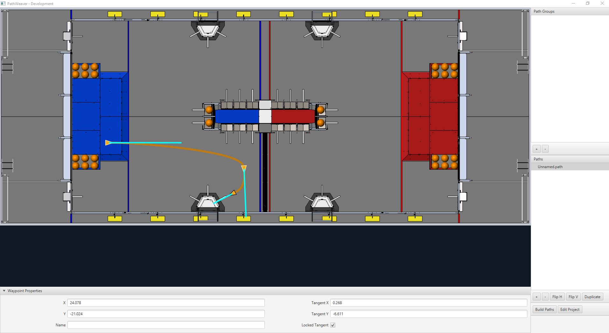

Visualizing PathWeaver Trajectories
===================================
PathWeaver's primary feature is to visualize trajectories. The following images depict a smooth trajectory that represents a trajectory that a robot might take during the autonomous period. Paths can have any number of waypoints that can allow more complex driving to be described. In this case there are 3 waypoints (including the start and stop) depicted with the triangle icons. Each waypoint consists of a X, Y position on the field as well as a robot heading described as the X and Y tangent lines.

Creating the Initial Trajectory
-------------------------------
To start creating a trajectory, click the + (plus) button in the path window. A default trajectory will be created that probably does not have the proper start and end points that you desire. The path also shows the tangent vectors (teal lines) for the start and end points. Changing the angle of the tangent vectors changes the shape of the trajectory.

.. image:: images/pathweaver-6.png

Drag the start and end points of the trajectory to the desired locations. Notice that in this case, the default trajectory does not start in a legal spot for the 2019 game. We can drag the initial waypoint to make the robot start on the HAB.

Changing a Waypoint Heading
---------------------------
The robot heading can be changed by dragging the tangent vector (teal) line. Here, the final waypoint was dragged to the desired final pose and was rotated to face the rocket.

.. image:: images/pathweaver-7.png

Adding Additional Waypoints to Control the Robot Path
-----------------------------------------------------
Adding additional waypoints and changing their tangent vectors can affect the path that is followed. Additional waypoints can be added by dragging in the middle of the path. In this case, we added another waypoint in the middle of the path.

.. image:: images/pathweaver-8.png

Locking the Tangent Lines
-------------------------
Locking tangent lines prevents them from changing when the trajectory is being manipulated. The tangent lines will also be locked when the point is moved.

More Precise control of Waypoints
---------------------------------
While PathWeaver makes it simple to draw trajectories that the robot should follow, it is sometimes hard to precisely set where the waypoints should be placed. In this case, setting the waypoint locations can be done by entering the X and Y value which might come from an accurate CAD model of the field. The points can be entered in the X and Y fields when a waypoint is selected.
