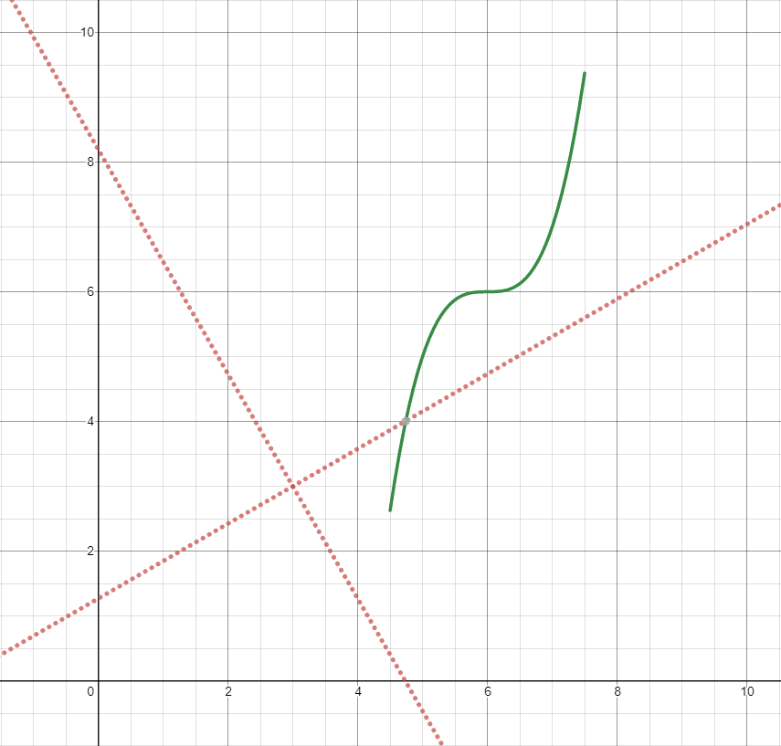
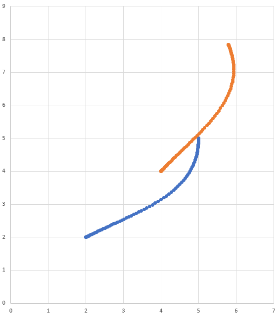

Transforming Trajectories
=========================
Trajectories can be transformed from one coordinate system to another and moved within a coordinate system using the ``relativeTo`` and the ``transformBy`` methods. These methods are useful for moving trajectories within space, or redefining an already existing trajectory in another frame of reference.

.. note:: Neither of these methods changes the shape of the original trajectory.

The ``relativeTo`` Method
-------------------------
The ``relativeTo`` method is used to redefine an already existing trajectory in another frame of reference. This method takes one argument: a pose, (via a ``Pose2d`` object) that is defined with respect to the current coordinate system, that represents the origin of the new coordinate system.

For example, a trajectory defined in coordinate system A can be redefined in coordinate system B, whose origin is at (2, 2, 30 degrees) in coordinate system A, using the ``relativeTo`` method.

.. tabs::

   .. code-tab:: java

      Pose2d bOrigin = new Pose2d(2, 2, Rotation2d.fromDegrees(30));
      Trajectory bTrajectory = aTrajectory.relativeTo(bOrigin);

   .. code-tab:: c++

      frc::Pose2d bOrigin{2_m, 2_m, frc::Rotation2d(30_deg)};
      frc::Trajectory bTrajectory = aTrajectory.RelativeTo(bOrigin);

In the diagram above, the original trajectory (``aTrajectory`` in the code above) has been defined in coordinate system A, represented by the black axes. The red axes, located at (2, 2) and 30° with respect to the original coordinate system, represent coordinate system B. Calling ``relativeTo`` on ``aTrajectory`` will redefine all poses in the trajectory to be relative to coordinate system B (red axes).

The ``transformBy`` Method
--------------------------
The ``transformBy`` method can be used to move (i.e. translate and rotate) a trajectory within a coordinate system. This method takes one argument: a transform (via a ``Transform2d`` object) that maps the current initial position of the trajectory to a desired initial position of the same trajectory.

For example, one may want to transform a trajectory that begins at (2, 2, 30 degrees) to make it begin at (4, 4, 50 degrees) using the ``transformBy`` method.

.. tabs::

   .. code-tab:: java

      Transform2d transform = new Pose2d(4, 4, Rotation2d.fromDegrees(50)).minus(trajectory.getInitialPose());
      Trajectory newTrajectory = trajectory.transformBy(transform);

   .. code-tab:: c++

      frc::Transform2d transform = Pose2d(4_m, 4_m, Rotation2d(50_deg)) - trajectory.InitialPose();
      frc::Trajectory newTrajectory = trajectory.TransformBy(transform);

In the diagram above, the original trajectory, which starts at (2, 2) and at 30° is visible in blue. After applying the transform above, the resultant trajectory's starting location is changed to (4, 4) at 50°. The resultant trajectory is visible in orange.
