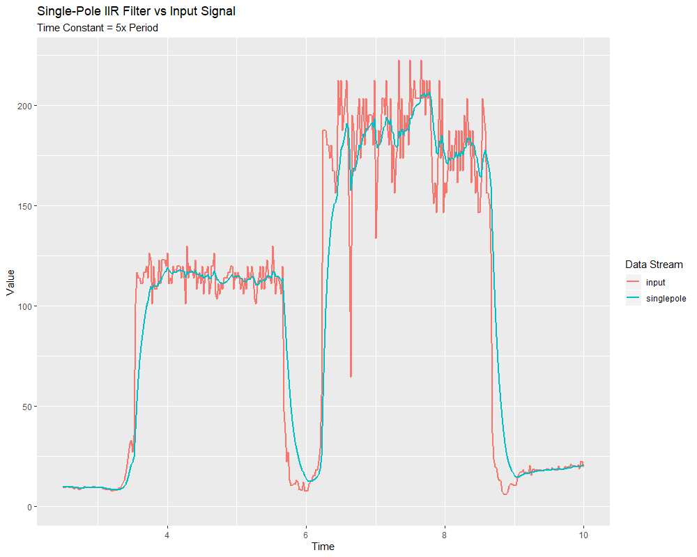
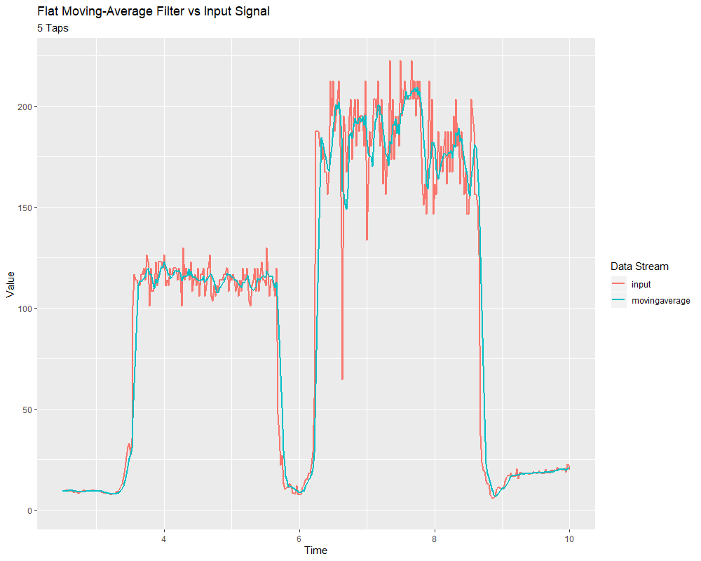
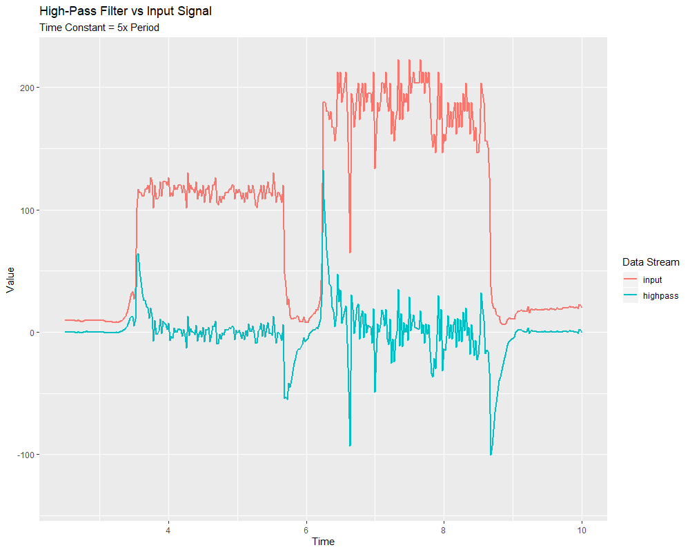

Linear Filters
==============

The first (and most commonly-employed) sort of filter that WPILib supports is a *linear filter* - or, more specifically, a linear time-invariant (LTI) filter.

An LTI filter is, put simply, a weighted moving average - the value of the output stream at any given time is a localized, weighted average of the inputs near that time.  The difference between different types of LTI filters is thus reducible to the difference in the choice of the weighting function (also known as a "window function" or an "impulse response") used.  The mathematical term for this operation is :term:`convolution`.

There are two broad "sorts" of impulse responses: infinite impulse responses (IIR), and finite impulse responses (FIR).

Infinite impulse responses have infinite "support" - that is, they are nonzero over an infinitely-large region.  This means, broadly, that they also have infinite "memory" - once a value appears in the input stream, it will influence *all subsequent outputs, forever*.  This is typically undesirable from a strict signal-processing perspective, however filters with infinite impulse responses tend to be very easy to compute as they can be expressed by simple recursion relations.

Finite impulse responses have finite "support" - that is, they are nonzero on a bounded region.  The "archetypical" FIR filter is a flat moving average - that is, simply setting the output equal to the average of the past n inputs.  FIR filters tend to have more-desirable properties than IIR filters, but are more costly to compute.

Linear filters are supported in WPILib through the ``LinearFilter`` class (`Java <https://first.wpi.edu/wpilib/allwpilib/docs/beta/java/edu/wpi/first/math/filter/LinearFilter.html>`__, `C++ <https://first.wpi.edu/wpilib/allwpilib/docs/beta/cpp/classfrc_1_1_linear_filter.html>`__).

Creating a LinearFilter
-----------------------

.. note:: The C++ ``LinearFilter`` class is templated on the data type used for the input.

.. note:: Because filters have "memory", each input stream requires its own filter object.  Do *not* attempt to use the same filter object for multiple input streams.

While it is possible to directly instantiate ``LinearFilter`` class to build a custom filter, it is far more convenient (and common) to use one of the supplied factory methods, instead:

singlePoleIIR
^^^^^^^^^^^^^

The ``singlePoleIIR()`` factory method creates a single-pole infinite impulse response filter which performs :term:`exponential smoothing`. This is the "go-to," "first-try" low-pass filter in most applications; it is computationally trivial and works in most cases.

.. tabs::

  .. code-tab:: java

    // Creates a new Single-Pole IIR filter
    // Time constant is 0.1 seconds
    // Period is 0.02 seconds - this is the standard FRC main loop period
    LinearFilter filter = LinearFilter.singlePoleIIR(0.1, 0.02);

  .. code-tab:: c++

    // Creates a new Single-Pole IIR filter
    // Time constant is 0.1 seconds
    // Period is 0.02 seconds - this is the standard FRC main loop period
    frc::LinearFilter<double> filter = frc::LinearFilter<double>::SinglePoleIIR(0.1_s, 0.02_s);

The "time constant" parameter determines the "characteristic timescale" of the filter's impulse response; the filter will cancel out any signal dynamics that occur on timescales significantly shorter than this.  Relatedly, it is also the approximate timescale of the introduced :ref:`phase lag <docs/software/advanced-controls/filters/introduction:Phase Lag>`.  The reciprocal of this timescale, multiplied by 2 pi, is the "cutoff frequency" of the filter.

The "period" parameter is the period at which the filter's ``calculate()`` method will be called.  For the vast majority of implementations, this will be the standard main robot loop period of 0.02 seconds.

movingAverage
^^^^^^^^^^^^^

The ``movingAverage`` factory method creates a simple flat moving average filter.  This is the simplest possible low-pass FIR filter, and is useful in many of the same contexts as the single-pole IIR filter.  It is somewhat more costly to compute, but generally behaves in a somewhat nicer manner.

.. tabs::

  .. code-tab:: java

    // Creates a new flat moving average filter
    // Average will be taken over the last 5 samples
    LinearFilter filter = LinearFilter.movingAverage(5);

  .. code-tab:: c++

    // Creates a new flat moving average filter
    // Average will be taken over the last 5 samples
    frc::LinearFilter<double> filter = frc::LinearFilter<double>::MovingAverage(5);

The "taps" parameter is the number of samples that will be included in the flat moving average.  This behaves similarly to the "time constant" above - the effective time constant is the number of taps times the period at which ``calculate()`` is called.

highPass
^^^^^^^^

The ``highPass`` factory method creates a simple first-order infinite impulse response high-pass filter.  This is the "counterpart" to the `singlePoleIIR`_.

.. tabs::

  .. code-tab:: java

    // Creates a new high-pass IIR filter
    // Time constant is 0.1 seconds
    // Period is 0.02 seconds - this is the standard FRC main loop period
    LinearFilter filter = LinearFilter.highPass(0.1, 0.02);

  .. code-tab:: c++

    // Creates a new high-pass IIR filter
    // Time constant is 0.1 seconds
    // Period is 0.02 seconds - this is the standard FRC main loop period
    frc::LinearFilter<double> filter = frc::LinearFilter<double>::HighPass(0.1_s, 0.02_s);

The "time constant" parameter determines the "characteristic timescale" of the filter's impulse response; the filter will cancel out any signal dynamics that occur on timescales significantly longer than this.  Relatedly, it is also the approximate timescale of the introduced :ref:`phase lead <docs/software/advanced-controls/filters/introduction:Phase lag>`.  The reciprocal of this timescale, multiplied by 2 pi, is the "cutoff frequency" of the filter.

The "period" parameter is the period at which the filter's ``calculate()`` method will be called.  For the vast majority of implementations, this will be the standard main robot loop period of 0.02 seconds.

Using a LinearFilter
--------------------

.. note:: In order for the created filter to obey the specified timescale parameter, its ``calculate()`` function *must* be called regularly at the specified period.  If, for some reason, a significant lapse in ``calculate()`` calls must occur, the filter's ``reset()`` method should be called before further use.

Once your filter has been created, using it is easy - simply call the ``calculate()`` method with the most recent input to obtain the filtered output:

.. tabs::

  .. code-tab:: java

    // Calculates the next value of the output
    filter.calculate(input);

  .. code-tab:: c++

    // Calculates the next value of the output
    filter.Calculate(input);
