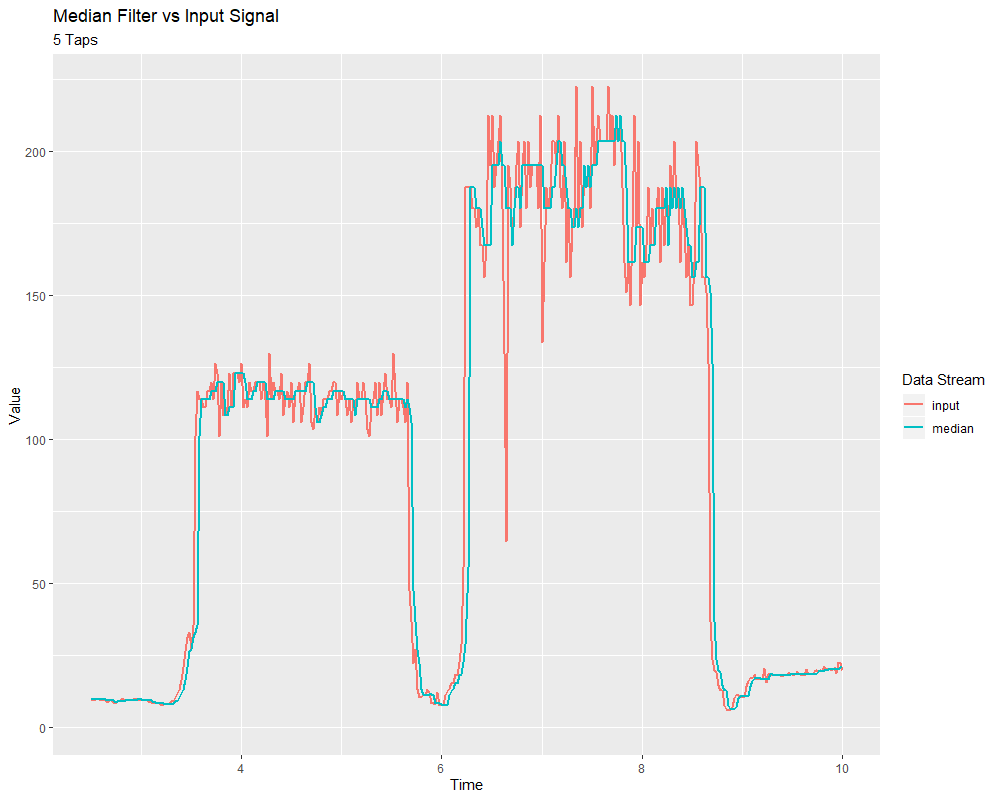

Median Filter
=============

A `statistically robust` alternative to the :ref:`moving-average filter <docs/software/advanced-controls/filters/linear-filter:movingAverage>` is the *median filter*.  Where a moving average filter takes the arithmetic *mean* of the input over a moving sample window, a median filter (per the name) takes a median instead.

The median filter is most-useful for removing occasional outliers from an input stream.  This makes it particularly well-suited to filtering inputs from distance sensors, which are prone to occasional interference.  Unlike a moving average, the median filter will remain completely unaffected by small numbers of outliers, no matter how extreme.

The median filter is supported in WPILib through the ``MedianFilter`` class (`Java <https://first.wpi.edu/wpilib/allwpilib/docs/beta/java/edu/wpi/first/math/filter/MedianFilter.html>`__, `C++ <https://first.wpi.edu/wpilib/allwpilib/docs/beta/cpp/classfrc_1_1_median_filter.html>`__).

Creating a MedianFilter
-----------------------

.. note:: The C++ ``MedianFilter`` class is templated on the data type used for the input.

.. note:: Because filters have "memory", each input stream requires its own filter object.  Do *not* attempt to use the same filter object for multiple input streams.

Creating a ``MedianFilter`` is simple:

.. tabs::

  .. code-tab:: java

    // Creates a MedianFilter with a window size of 5 samples
    MedianFilter filter = new MedianFilter(5);

  .. code-tab:: c++

    // Creates a MedianFilter with a window size of 5 samples
    frc::MedianFilter<double> filter(5);

Using a MedianFilter
--------------------

Once your filter has been created, using it is easy - simply call the ``calculate()`` method with the most recent input to obtain the filtered output:

.. tabs::

  .. code-tab:: java

    // Calculates the next value of the output
    filter.calculate(input);

  .. code-tab:: c++

    // Calculates the next value of the output
    filter.Calculate(input);
