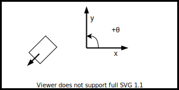
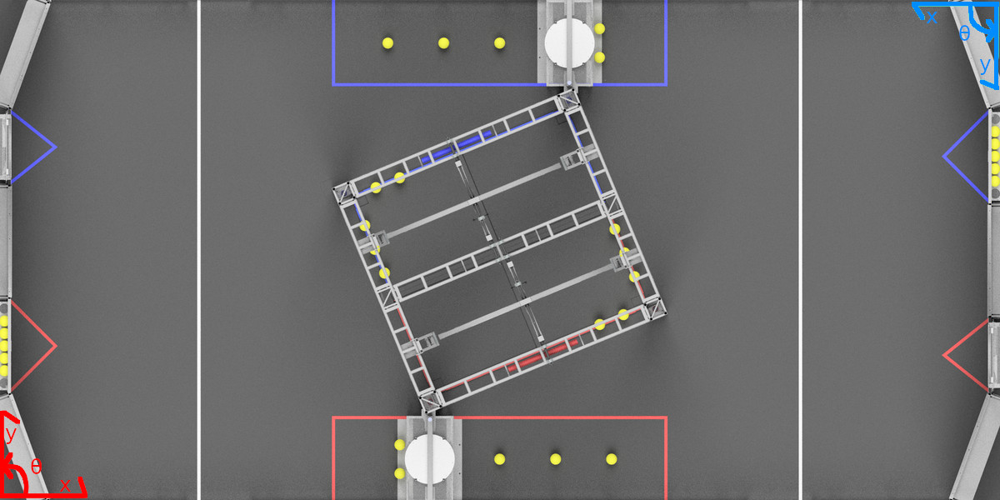
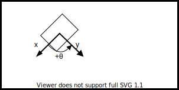

.. include:: <isonum.txt>

Coordinate Systems
==================

In FRC\ |reg|, there are two main coordinate systems that we use for representing objects' positions.

Field Coordinate System
-----------------------

The field coordinate system (or global coordinate system) is an absolute coordinate system where a point on the field is designated as the origin. Positive :math:`\theta` (theta) is in the counter-clockwise direction, and the positive x-axis points away from your alliance's driver station wall, and the positive y-axis is perpendicular and to the left of the positive x-axis.

.. note:: The axes are shown at the middle of the field for visibility. The origins of the coordinate system for each alliance are shown below.

Below is an example of a field coordinate system overlayed on the 2020 FRC field. The red axes shown are for the red alliance, and the blue axes shown are for the blue alliance.

Robot Coordinate System
-----------------------

The robot coordinate system (or local coordinate system) is a relative coordinate system where the robot is the origin. The direction the robot is facing is the positive x axis, and the positive y axis is perpendicular, to the left of the robot. Positive :math:`\theta` is counter-clockwise.

.. note:: WPILib's ``Gyro`` class is clockwise-positive, so you have to invert the reading in order to get the rotation with either coordinate system.

