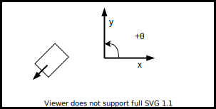
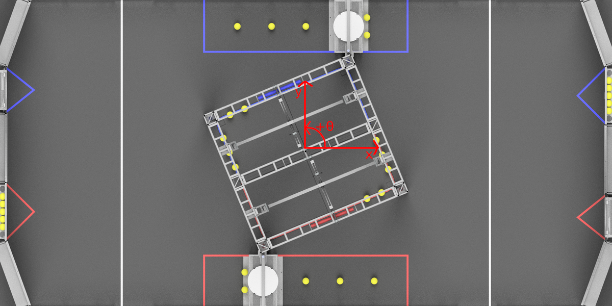

Coordinate Systems
==================

In FRC, there are two main coordinate systems that we use for representing objects' positions.

Field Coordinate System
-----------------------

The field coordinate system (or global coordinate system) is an absolute coordinate system where a point on the field is designated as the origin. Positive :math:`theta` is in the counter-clockwise direction, and the x-axis goes through the driver stations.

Below is an example of a field coordinate system overlayed on the 2020 FRC field.

Robot Coordinate System
-----------------------

The robot coordinate system (or local coordinate system) is a relative coordinate system where the robot is the origin. The direction the robot is facing is the positive x axis, and the positive y axis is perpendicular, following the right hand rule. Positive :math:`theta` is counter-clockwise.

.. note:: WPILib's :code:`Gyro` class is clockwise-positive, so you have to invert the reading in order to get the rotation with either coordinate system.

.. image:: diagrams/coordinate-systems-2.drawio.svg
