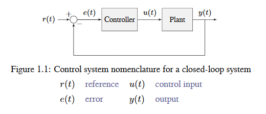
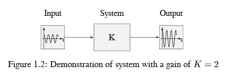
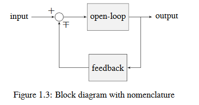
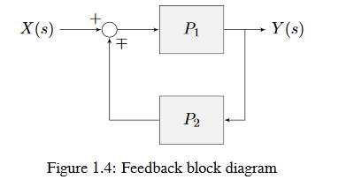

Control System Basics
=====================

.. note:: This article includes sections of `Controls Engineering in FRC <https://file.tavsys.net/control/controls-engineering-in-frc.pdf>`__ by Tyler Veness with permission.

The Need for Control Systems
----------------------------

Control systems are all around us and we interact with them daily. A small list of ones you may have seen includes heaters and air conditioners with thermostats, cruise control and the anti-lock braking system (ABS) on automobiles, and fan speed modulation on modern laptops. Control systems monitor or control the behavior of systems like these and may consist of humans controlling them directly (manual control), or of only machines (automatic control).

All of these examples have a mechanism which does useful work, but cannot be *directly* commanded to the state that is desired.

For example, an air conditioner's fans and compressor have no mechanical or electrical input where the user specifies a temperature. Rather, some additional mechanism must compare the current air temperature to some setpoint, and choose how to cycle the compressor and fans on and off to achieve that temperature.

Similarly, an automobile's engine and transmission have no mechanical lever which directly sets a particular speed. Rather, some additional mechanism must measure the current speed of the vehicle, and adjust the transmission gear and fuel injected into the cylinders to achieve the desired vehicle speed.

*Controls Engineering* is the study of how to design those additional mechanisms to bridge the gap from what the user wants a mechanism to do, to how the mechanism is actually manipulated.

How can we prove closed-loop controllers on an autonomous car, for example, will behave safely and meet the desired performance specifications in the presence of uncertainty? Control theory is an application of algebra and geometry used to analyze and predict the behavior of systems, make them respond how we want them to, and make them robust to disturbances and uncertainty.

Controls engineering is, put simply, the engineering process applied to control theory. As such, it's more than just applied math. While control theory has some beautiful math behind it, controls engineering is an engineering discipline like any other that is filled with trade-offs. The solutions control theory gives should always be sanity checked and informed by our performance specifications. We don't need to be perfect; we just need to be good enough to meet our specifications.

Nomenclature
------------

Most resources for advanced engineering topics assume a level of knowledge well above that which is necessary. Part of the problem is the use of jargon. While it efficiently communicates ideas to those within the field, new people who aren't familiar with it are lost.

The system or collection of actuators being controlled by a control system is called the *plant*. A controller is used to drive the plant from its current state to some desired state (the reference). Controllers which don't include information measured from the plant's output are called open-loop controllers.

Controllers which incorporate information fed back from the plant's output are called closed-loop controllers or feedback controllers.

.. note:: The input and output of a system are defined from the plant's point of view. The negative feedback controller shown is driving the difference between the reference and output, also known as the error, to zero.

What is Gain?
-------------

*Gain* is a proportional value that shows the relationship between the magnitude of an input signal to the magnitude of an output signal at steady-state. Many systems contain a method by which the gain can be altered, providing more or less "power" to the system.

The figure below shows a system with a hypothetical input and output. Since the output is twice the amplitude of the input, the system has a gain of two.

What is a Model?
----------------

A *model* of your mechanism is a mathematical description of its behavior. Specifically, this mathematical description must define the mechanism's inputs and outputs, and how the output values change over time as a function of its input values.

The mathematical description is often just simple algebra equations. It can also include some linear algebra, matrices, and differential equations. WPILib provides a number of classes to help simplify the more complex math.

:term:`Classical Mechanics` defines many of the equations used to build up models of system behavior. Many of the values inside those equations can be determined by doing experiments on the mechanism.

Block Diagrams
--------------

When designing or analyzing a control system, it is useful to model it graphically. Block diagrams are used for this purpose. They can be manipulated and simplified systematically.

The open-loop gain is the total gain from the sum node at the input (the circle) to the output branch. this would be the system's gain if the feedback loop was disconnected. The feedback gain is the total gain from the output back to the input sum node. A sum node's output is the sum of its inputs.

The below figure is a block diagram with more formal notation in a feedback configuration.

:math:`\mp` means "minus or plus" where a minus represents negative feedback.

A Note on Dimensionality
------------------------

For the purposes of the introductory section, all systems and controllers (except feedforward controllers) are assumed to be "single-in, single-out" (SISO) - this means they only map single values to single values.  For example, a DC motor is considered to take an :term:`input` of a single scalar value (voltage) and yield an :term:`output` of only a single scalar value in return (either position or velocity).  This forces us to consider *position controllers* and *velocity controllers* as separate entities - this is sometimes source of confusion in situations when we want to control both (such as when following a motion profiles).  Limiting ourselves to SISO systems also means that we are unable to analyze more-complex "multiple-in, multiple-out" (MIMO) systems like drivetrains that cannot be represented with a single state (there are at least two independent sets of wheels in a drive).

Nonetheless, we restrict ourselves to SISO systems here to be able to present the following tutorials in terms of the PID Controller formalism, which is commonly featured in introductory course material and has extensive documentation and many available implementations.

The :ref:`state-space <docs/software/advanced-controls/state-space/state-space-intro:Introduction to State-Space Control>` formalism is an alternate way to conceptualize these systems which allows us to easily capture interactions between different quantities (as well as simultaneously represent multiple aspects of the same quantity, such as position and velocity of a motor).  It does this, roughly, by replacing the single-dimensional scalars (e.g. the :term:`gain`, :term:`input`, and :term:`output`) with multi-dimensional vectors.  In the state-space formalism, the equivalent of a "PID" controller is a vector-proportional controller on a single vector-valued mechanism state, with a single :term:`gain` vector (instead of three different :term:`gain` scalars).

If you remember that a state-space controller is really just a PID controller written with dense notation, many of the principles covered in this set of introductory articles will transfer seamlessly to the case of state-space control.
