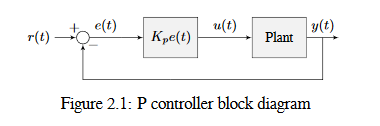
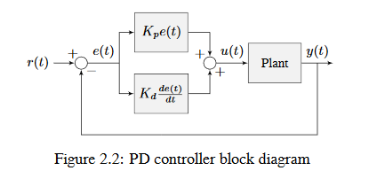
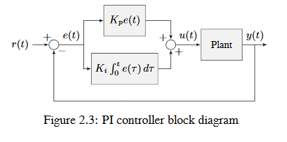
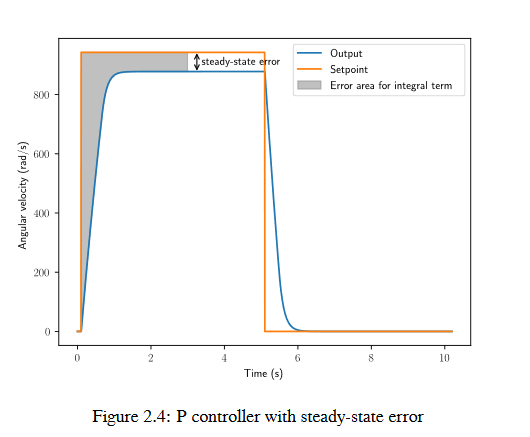
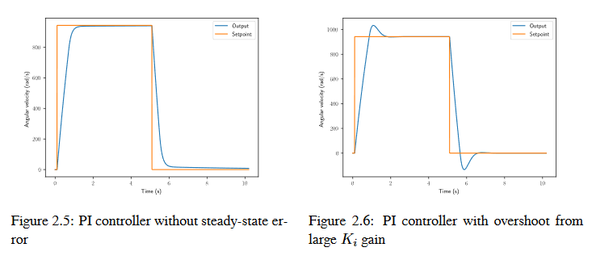
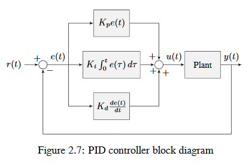
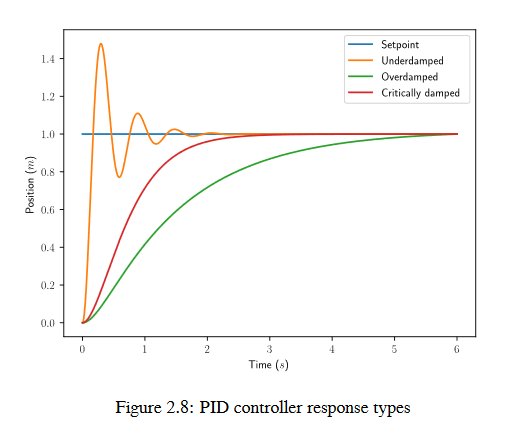

.. include:: <isonum.txt>

Introduction to PID
===================

.. note:: For a guide on implementing PID control with WPILib, see :ref:`docs/software/advanced-controls/controllers/pidcontroller:PID Control in WPILib`.

This page explains the conceptual and mathematical workings of a PID controller. :ref:`A video explanation from WPI is also available <docs/software/advanced-controls/introduction/pid-video:PID Introduction Video by WPI>`.

What is a PID Controller?
-------------------------

The PID controller is a common :ref:`feedback controller<docs/software/advanced-controls/introduction/picking-control-strategy:Feedback Control: Correcting for Errors and Disturbances>` consisting of proportional, integral, and derivative terms, hence the name. This article will build up the definition of a PID controller term by term while trying to provide some intuition for how each term behaves.

First, we'll get some nomenclature for PID controllers out of the way. In a PID context, we use the term :term:`reference` or :term:`setpoint` to mean the desired state of the mechanism, and the term :term:`output` or :term:`process variable` to refer to the measured state of the mechanism. Below are some common variable naming conventions for relevant quantities.

============ =================================== ============ ========================================
:math:`r(t)` :term:`setpoint`, :term:`reference` :math:`u(t)` :term:`control effort`
:math:`e(t)` :term:`error`                       :math:`y(t)` :term:`output`, :term:`process variable`
============ =================================== ============ ========================================

The :term:`error` :math:`e(t)` is the difference between the :term:`reference` and the :term:`output`, :math:`r(t) - y(t)`.

For those already familiar with PID control, this interpretation may not be consistent with the classical explanation of the P, I, and D terms corresponding to response to "past", "present", and "future" errors. While that model has merit, we will instead be approaching PID control from the viewpoint of modern control theory, as proportional controllers applied to different physical quantities we care about. This will provide a more complete explanation of the derivative term's behavior for constant and moving :term:`setpoints <setpoint>`.

Roughly speaking: the proportional term drives the position error to zero, the derivative term drives the velocity error to zero, and the integral term drives the total accumulated error-over-time to zero.  All three terms are added together to produce the :term:`control signal` We'll go into more detail on each of these below.

.. note::
   Throughout the WPILib documentation, you'll see two ways of writing the tunable constants of the PID controller.

   For example, for the proportional gain:

      * :math:`K_p` is the standard math-equation-focused way to notate the constant.
      * ``kP`` is a common way to see it written as a variable in software.

   Despite the differences in capitalization, the two formats refer to the same concept.

Proportional Term
-----------------

The *Proportional* term attempts to drive the position error to zero by contributing to the control signal proportionally to the current position error.  Intuitively, this tries to move the :term:`output` towards the :term:`reference`.

.. math:: u(t) = K_p e(t)

where :math:`K_p` is the proportional gain and :math:`e(t)` is the error at the current time :math:`t`.

The below figure shows a block diagram for a :term:`system` controlled by a P controller.

Proportional gains act like a "software-defined springs" that pull the :term:`system` toward the desired position. Recall from physics that we model springs as :math:`F = - kx` where :math:`F` is the force applied, :math:`k` is a proportional constant, and :math:`x` is the displacement from the equilibrium point. This can be written another way as :math:`F = k(0-x)` where :math:`0` is the equilibrium point. If we let the equilibrium point be our feedback controller's :term:`setpoint`, the equations have a one to one correspondence.

.. math::
   F &= k(r - x) \\
   u(t) &= K_p e(t) = K_p(r(t) - y(t))

so the "force" with which the proportional controller pulls the :term:`system's <system>` :term:`output` toward the :term:`setpoint` is proportional to the :term:`error`, just like a spring.

Derivative Term
---------------

The *Derivative* term attempts to drive the derivative of the error to zero by contributing to the control signal proportionally to the derivative of the error.  Intuitively, this tries to make the :term:`output` move at the same rate as the :term:`reference`.

.. math::
   u(t) = K_p e(t) + K_d \frac{de}{dt}

where :math:`K_p` is the proportional gain, :math:`K_d` is the derivative gain, and :math:`e(t)` is the error at the current time :math:`t`.

The below figure shows a block diagram for a :term:`system` controlled by a PD controller.

A PD controller has a proportional controller for position (:math:`K_p`) and a proportional controller for velocity (:math:`K_d`). The velocity :term:`setpoint` is implicitly provided by how the position :term:`setpoint` changes over time. To prove this, we will rearrange the equation for a PD controller.

.. math::
   u_k = K_p e_k + K_d \frac{e_k - e_{k-1}}{dt}

where :math:`u_k` is the :term:`control effort` at timestep :math:`k` and :math:`e_k` is the :term:`error` at timestep :math:`k`. :math:`e_k` is defined as :math:`e_k = r_k - x_k` where :math:`r_k` is the :term:`setpoint` and :math:`x_k` is the current :term:`state` at timestep :math:`k`.

.. math::
   u_k &= K_p (r_k - x_k) + K_d \frac{(r_k - x_k) - (r_{k-1} - x_{k-1})}{dt} \\
   u_k &= K_p (r_k - x_k) + K_d \frac{r_k - x_k - r_{k-1} + x_{k-1}}{dt} \\
   u_k &= K_p (r_k - x_k) + K_d \frac{r_k - r_{k-1} - x_k + x_{k-1}}{dt} \\
   u_k &= K_p (r_k - x_k) + K_d \frac{(r_k - r_{k-1}) - (x_k - x_{k-1})}{dt} \\
   u_k &= K_p (r_k - x_k) + K_d \left(\frac{r_k - r_{k-1}}{dt} -
     \frac{x_k - x_{k-1}}{dt}\right)

Notice how :math:`\frac{r_k - r_{k-1}}{dt}` is the velocity of the :term:`setpoint`. By the same reason, :math:`\frac{x_k - x_{k-1}}{dt}` is the :term:`system's <system>` velocity at a given timestep. That means the :math:`K_d` term of the PD controller is driving the estimated velocity to the :term:`setpoint` velocity.

If the :term:`setpoint` is constant, the implicit velocity :term:`setpoint` is zero, so the :math:`K_d` term slows the :term:`system` down if it's moving. This acts like a "software-defined damper". These are commonly seen on door closers, and their damping force increases linearly with velocity.

Integral Term
-------------

.. important:: Integral gain is generally not recommended for FRC\ |reg| use. It is almost always better to use a feedforward controller to eliminate steady-state error.  If you do employ integral gain, it is crucial to provide some protection against :ref:`integral windup <docs/software/advanced-controls/introduction/common-control-issues:Integral Term Windup>`.

The *Integral* term attempts to drive the total accumulated error to zero by contributing to the control signal proportionally to the sum of all past errors.  Intuitively, this tries to drive the *average* of all past :term:`output` values towards the *average* of all past :term:`reference` values.

.. math::
   u(t) = K_p e(t) + K_i \int_0^t e(\tau) \,d\tau

where :math:`K_p` is the proportional gain, :math:`K_i` is the integral gain, :math:`e(t)` is the error at the current time :math:`t`, and :math:`\tau` is the integration variable.

The Integral integrates from time :math:`0` to the current time :math:`t`. we use :math:`\tau` for the integration because we need a variable to take on multiple values throughout the integral, but we can't use :math:`t` because we already defined that as the current time.

The below figure shows a block diagram for a :term:`system` controlled by a PI controller.

When the :term:`system` is close the :term:`setpoint` in steady-state, the proportional term may be too small to pull the :term:`output` all the way to the :term:`setpoint`, and the derivative term is zero. This can result in :term:`steady-state error` as shown in figure 2.4

A common way of eliminating :term:`steady-state error` is to integrate the :term:`error` and add it to the :term:`control effort`. This increases the :term:`control effort` until the :term:`system` converges. Figure 2.4 shows an example of :term:`steady-state error` for a flywheel, and figure 2.5 shows how an integrator added to the flywheel controller eliminates it. However, too high of an integral gain can lead to overshoot, as shown in figure 2.6.

Putting It All Together
-----------------------

.. note:: For information on using the WPILib provided PIDController, see the :ref:`relevant article <docs/software/advanced-controls/controllers/pidcontroller:PID Control in WPILib>`.

When these terms are combined by summing them all together, one gets the typical definition for a PID controller.

.. math::
   u(t) = K_p e(t) + K_i \int_0^t e(\tau) \,d\tau + K_d \frac{de}{dt}

where :math:`K_p` is the proportional gain, :math:`K_i` is the integral gain, :math:`K_d` is the derivative gain, :math:`e(t)` is the error at the current time :math:`t`, and :math:`\tau` is the integration variable.

The below figure shows a block diagram for a PID controller.

Response Types
--------------

A :term:`system` driven by a PID controller generally has three types of responses: underdamped, over-damped, and critically damped. These are shown in figure 2.8.

For the :term:`step responses <step response>` in figure 2.7, :term:`rise time` is the time the :term:`system` takes to initially reach the reference after applying the :term:`step input`. :term:`Settling time <settling time>` is the time the :term:`system` takes to settle at the :term:`reference` after the :term:`step input` is applied.

An *underdamped* response oscillates around the :term:`reference` before settling. An *overdamped* response

is slow to rise and does not overshoot the :term:`reference`. A *critically damped* response has the fastest :term:`rise time` without overshooting the :term:`reference`.
