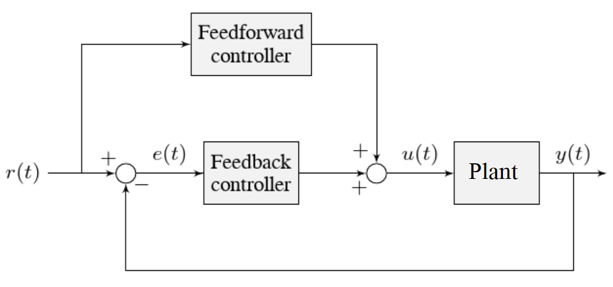

Tuning a Vertical Elevator with Motion Profiling
================================================

In this section, we will tune a simple position controller for a vertical elevator.  In addition, we will discussion advanges of using motion profiling with 

Elevator Model Description
--------------------------

Vertical elevators are commonly used to lift gamepieces from the ground up to a scoring position. Other similar examples include shooter hoods and veritcal arms.

Our "vertical elevator" consists of:

  * A mass on a carriage, under the force of gravity, traveling up and down in a constrained vertical path
  * A motor and gearbox driving a linear chain, to which the mass-on-a-carriage is attached

 The simulation assumes the plant (the elevator itself) is controlled by motion profiling, feedforward and feedback controllers, composed in this fashion:

Where:

* The plant's :term:`output` :math:`y(t)` is the elevator's height
* The controller's :term:`setpoint` :math:`r(t)` is the unprofiled desired height of the elevator
* TODO: The Motion Profiler's output :math:`blah` is the profiled desired position of the elevator
* TODO: The Motion Profiler's output :math:`dblah/dt` is the profiled desired velocity of the elevator
* TODO: The Motion Profiler's output :math:`d^2blah/dt^2` is the profiled desired accelerator of the elevator
* The controller's :term:`control effort`, :math:`u(t)` is the voltage applied to the motor driving the elevator

TODO: better diagram

Picking the Control Strategy for a Vertical Elevator
----------------------------------------------------

Applying voltage to the motor causes a force on the mechanism that drives the elevator up or down. If there is no voltage, gravity still acts on the elevator to pull it downward.  Generally, it is desirable to fight this effect, and keep the elevator at a specific height.

Additionally, the operator will command a position that changes in "steps" - in one loop, the commanded position will snap from one value to a different one. Since it is not physically plausable for the elevator to move in that manner, using a *motion profiler* is useful. Two main benifits arise:

1. Motion is constrained to be realistic
2. Desired velocity and acceleration signals are produced.

Realistic motion is just a generally good principle for robust controls: don't ask the physical system to do something it physically can't. Having desired velocity and acceleration signals are also useful for supporting a more complex feedforward model.

The tutorials below will demonstrate the behavior of the system under pure feedforward, pure feedback (PID), and combined feedforward-feedback control strategies.  Follow the instructions to learn how to manually tune these controllers, and expand the "tuning solution" to view an optimal model-based set of tuning parameters.  Even though WPILib tooling can provide you with optimal gains, it is worth going through the manual tuning process to see how the different control strategies interact with the mechanism.

Pure Feedback Control
~~~~~~~~~~~~~~~~~~~~~

Interact with the simulation below to examine how the vertical elevator system responds when controlled only by a feedback (PID) controller.

.. raw:: html

   <h1> TODO </h1>
    <!-- 

      

         

         

      

      

         

         

      

      
    

Perform the following:

1. Set :math:`K_p`, :math:`K_i`, :math:`K_d`, and :math:`K_g` to zero.
2. Increase :math:`K_p` until the mechanism responds to a sudden change in setpoint by moving sharply to the new position.  If the controller oscillates too much around the setpoint, reduce `K_p` until it stops.
3. Increase :math:`K_i` when the :term:`output` gets "stuck" before converging to the :term:`setpoint`.
4. Increase :math:`K_d` to help the system track smoothly-moving setpoints and further reduce oscillation.

.. note:: Feedback-only control is not a viable control scheme for vertical elevators!  Do not be surprised if/when the simulation below does not behave well, even when the "correct" constants are used.

.. collapse:: Tuning solution

   There is no good tuning solution for this control strategy.  Values of :math:`K_p = ??` and :math:`K_d = ??` yield a possible solution, but with a lot of oscillation and large settling times.

Motion Profiled, Feedforward, and Feedback Control
~~~~~~~~~~~~~~~~~~~~~~~~~~~~~~~~~~~~~~~~~~~~~~~~~~

Interact with the simulation below to examine how the elevator system responds when controlled only by a feedforward controller.

.. note:: To change the elevator setpoint, click on the desired angle along the vertical height. 

.. raw:: html

   <h1> TODO </h1>
    <!-- 

      

         

         

      

      

         

         

      

      
    

To tune the feedforward controller, perform the following:

1. Set :math:`K_g`, :math:`K_s` :math:`K_v`, and :math:`K_a` to zero.
2. Increase :math:`K_g` until the elevator can hold its position with as little movement as possible. If the elevator moves in the opposite direction, decrease :math:`K_g` until it remains stationary.  You will have to zero in on :math:`K_g` fairly precisely (at least four decimal places).
3. Increase the velocity feedforward gain :math:`K_v` until the elevator tracks the setpoint during smooth, slow motion.  If the elevator overshoots, reduce the gain.  Note that the elevator may "lag" the commanded motion - this is normal, and is fine so long as it moves the correct amount in total.

.. note:: Feedforward-only control is not a viable control scheme for vertical elevators!  Do not be surprised if/when the simulation below does not behave well, even when the "correct" constants are used.

.. collapse:: Tuning solution

   The exact gains used by the simulation are :math:`K_g = 1.75` and :math:`K_v = 1.95`.

A Note on Feedforward and Static Friction
-----------------------------------------

For the sake of simplicity, the simulations above omit the :math:`K_s` term from the WPILib SimpleMotorFeedforward equation.  On actual mechanisms, however, this can be important - especially if there's a lot of friction in the mechanism gearing.

In the case of a vertical arm or elevator, :math:`K_s` can be somewhat tedious to estimate separately from :math:`K_g`.  If your arm or elevator has enough friction for :math:`K_s` to be important, it is recommended that you use the :doc:`WPILib system identification tool </docs/software/advanced-controls/system-identification/introduction>` to determine your system gains.
