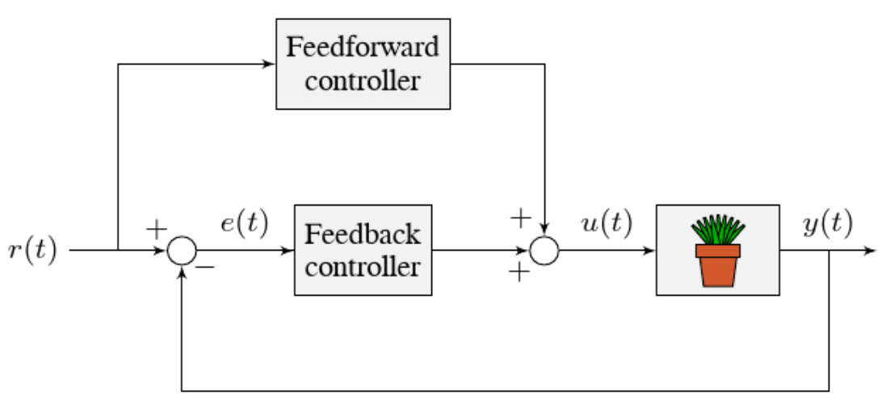

Tuning a Turret Position Controller
===================================

In this section, we will tune a simple position controller for a turret.  The tuning principles explained here will also work for almost any position-control scenarios under no external loading.

Turret Model Description
------------------------

A turret rotates some mechanism side-to-side to position it for scoring gamepieces.

Our "turret" consists of:

  * A rotating inertial mass (the turret)
  * A motor and gearbox driving the mass

For the purposes of this tutorial, this plant is modeled with the same equation used by WPILib's :ref:`docs/software/advanced-controls/controllers/feedforward:SimpleMotorFeedforward`, with additional adjustment for sensor delay and gearbox inefficiency. The simulation assumes the plant is controlled by feedforward and feedback controllers, composed in this fashion:

Where:

* The plant's :term:`output` :math:`y(t)` is the turret's position
* The controller's :term:`setpoint` :math:`r(t)` is the desired position of the turret
* The controller's :term:`control effort`, :math:`u(t)` is the voltage applied to the motor driving the turret

Picking the Control Strategy for a Turret Position Controller
-------------------------------------------------------------

In general: the more voltage that is applied to the motor, the faster the motor (and turret) will spin. Once voltage is removed, friction and back-EMF slowly decrease the spinning until the turret stops.  We want to make the turret rotate to a given position.

The tutorials below will demonstrate the behavior of the system under pure feedforward, pure feedback (PID), and combined feedforward-feedback control strategies.  Follow the instructions to learn how to manually tune these controllers, and expand the "tuning solution" to view an optimal model-based set of tuning parameters.  Even though WPILib tooling can provide you with optimal gains, it is worth going through the manual tuning process to see how the different control strategies interact with the mechanism.

This simulation does not include any motion profile generation, so acceleration setpoints are not very well-defined.  Accordingly, the `kA` term of the feedforward equation is not used by the controller.  This means there will be some amount of delay/lag inherent to the feedforward-only response.

Pure Feedforward Control
~~~~~~~~~~~~~~~~~~~~~~~~

Interact with the simulation below to examine how the turret system responds when controlled only by a feedforward controller.

.. note:: To change the turret setpoint, click on the desired angle along the perimeter of the turret.  To command smooth motion, click and drag the setpoint indicator.

.. raw:: html

    

      

         

         

      

      

         

         

      

      
    

To tune the feedforward controller, perform the following:

1. Set :math:`K_v` to zero.
2. Increase the velocity feedforward gain :math:`K_v` until the turret tracks the setpoint during smooth, slow motion.  If the turret overshoots, reduce the gain.

Note that the turret may "lag" the commanded motion - this is normal, and is fine so long as it moves the correct amount in total.

.. note:: Feedforward-only control is not a viable control scheme for turrets!  Do not be surprised if/when the simulation below does not behave well, even when the "correct" constants are used.

.. collapse:: Tuning solution

   The exact gain used by the plant is :math:`K_v = 0.2`. Note that due to timing inaccuracy in browser simulations, the :math:`K_v` that works best in the simulation may be somewhat smaller than this.

Issues with Feed-Forward Control Alone
^^^^^^^^^^^^^^^^^^^^^^^^^^^^^^^^^^^^^^

As mentioned above, our simulated mechanism perfectly obeys the WPILib :ref:`docs/software/advanced-controls/controllers/feedforward:SimpleMotorFeedforward` equation (as long as the "system noise" option is disabled).  We might then expect, like in the case of the :ref:`flywheel velocity controller <docs/software/advanced-controls/introduction/tuning-flywheel:Tuning a Flywheel Velocity Controller>`, that we should be able to achieve perfect convergence-to-setpoint with a feedforward loop alone.

However, our feedforward equation relates *velocity* and *acceleration* to voltage - it allows us to control the *instantaneous motion* of our mechanism with high accuracy, but it does not allow us direct control over the *position*.  This is a problem even in our simulation (in which the feedforward equation is the *actual* equation of motion), because unless we employ a :ref:`motion profile <docs/software/advanced-controls/controllers/trapezoidal-profiles:Trapezoidal Motion Profiles in WPILib>` to generate a sequence of velocity setpoints we can ask the turret to jump immediately from one position to another.  This is impossible, even for our simulated turret.

The resulting behavior from the feedforward controller is to output a single "voltage spike" when the position setpoint changes (corresponding to a single loop iteration of very high velocity), and then zero voltage (because it is assumed that the system has already reached the setpoint).  In practice, we can see in the simulation that this results in an initial "impulse" movement towards the target position, that stops at some indeterminate position in-between.  This kind of response is called a "kick," and is generally seen as undesirable.

You may notice that *smooth* motion below the turret's maximum achievable speed can be followed accurately in the simulation with feedforward alone.  This is misleading, however, because no real mechanism perfectly obeys its feedforward equation.  With the "system noise" option enabled, we can see that even smooth, slow motion eventually results in compounding position errors when only feedforward control is used.  To accurately converge to the setpoint, we need to use a feedback (PID) controller.

Pure Feedback Control
~~~~~~~~~~~~~~~~~~~~~

Interact with the simulation below to examine how the turret system responds when controlled only by a feedback (PID) controller.

.. raw:: html

    

      

         

         

      

      

         

         

      

      
    

Perform the following:

1. Set :math:`K_p`, :math:`K_i`, :math:`K_d`, and :math:`K_v` to zero.
2. Increase :math:`K_p` until the mechanism responds to a sudden change in setpoint by moving sharply to the new position.  If the controller oscillates too much around the setpoint, reduce `K_p` until it stops.
3. Increase :math:`K_d` to reduce the amount of "lag" when the controller tries to track a smoothly moving setpoint (reminder: click and drag the turret's directional indicator to move it smoothly).  If the controller starts to oscillate, reduce `K_d` until it stops.

.. collapse:: Tuning solution

   Gains of :math:`K_p = 0.3` and :math:`K_d = 0.05` yield rapid and stable convergence to the setpoint.  Other, similar gains will work nearly as well.

Issues with Feedback Control Alone
^^^^^^^^^^^^^^^^^^^^^^^^^^^^^^^^^^

Note that even with system noise enabled, the feedback controller is able to drive the turret to the setpoint in a stable manner over time.  However, it may not be possible to smoothly track a moving setpoint without lag using feedback alone, as the feedback controller can only respond to errors once they have built up.  To get the best of both worlds, we need to combine our feedback controller with a feedforward controller.

Combined Feedforward and Feedback Control
~~~~~~~~~~~~~~~~~~~~~~~~~~~~~~~~~~~~~~~~~

Interact with the simulation below to examine how the turret system responds under simultaneous feedforward and feedback control.

.. raw:: html

    

      

         

         

      

      

         

         

      

      
    

Tuning the combined turret controller is simple - we first tune the feedforward controller following the same procedure as in the feedforward-only section, and then we tune the PID controller following the same procedure as in the feedback-only section.  Notice that PID portion of the controller is *much* easier to tune "on top of" an accurate feedforward.

.. collapse:: Tuning solution

   The optimal gains for the combined controller are just the optimal gains for the individual controllers: gains of :math:`K_v = 0.15`, :math:`K_p = 0.3`, and :math:`K_d = 0.05` yield rapid and stable convergence to the setpoint and relatively accurate tracking of smooth motion.  Other, similar gains will work nearly as well.

Once tuned properly, the combined controller should accurately track a smoothly moving setpoint, and also accurately converge to the setpoint over time after a "jump" command.

Tuning Conclusions
------------------

Choice of Control Strategies
~~~~~~~~~~~~~~~~~~~~~~~~~~~~

Like in the case of the :ref:`vertical arm <docs/software/advanced-controls/introduction/tuning-vertical-arm:Tuning a Vertical Arm Position Controller>`, and unlike the case of the :ref:`flywheel <docs/software/advanced-controls/introduction/tuning-flywheel:Tuning a Flywheel Velocity Controller>`, we are trying to control the *position* rather than the *velocity* of our mechanism.

In the case of the flywheel *velocity* controller we could achieve good control performance with feedforward alone.  However, it is very hard to predict how much voltage will cause a certain total change in *position* (time can turn even small errors in velocity into very big errors in position).  In this case, we cannot rely on feedforward control alone - as with the vertical arm, we will need a feedback controller.

Unlike in the case of the vertical arm, though, there is no voltage required to keep the mechanism at the setpoint once it's there.  As a consequence, it is often possible to effectively control a turret without any feedforward controller at all, relying only on the output of the feedback controller (if the mechanism has a lot of friction, this may not work well and both a feedforward and feedback controller may be needed).  Simple position control in the absence of external forces is one of the only cases in which pure feedback control works well.

Controlling a mechanism with only feedback can produce reasonable results in cases where no :term:`control effort` is required to keep the :term:`output` at the :term:`setpoint`. On a turret, this can work acceptably - however, it may still run into problems when trying to follow a moving setpoint, as it relies entirely on the controller transients to control the mechanism's intermediate motion between position setpoints.

We saw in the feedforward-only example above that an accurate feedforward can track slow, smooth velocity setpoints quite well.  Combining a feedforward controller with the feedback controller gives the smooth velocity-following of a feedforward controller with the stable long-term error elimination of a feedback controller.

Reasons for Non-Ideal Performance
~~~~~~~~~~~~~~~~~~~~~~~~~~~~~~~~~

This simulation does not include any motion profile generation, so acceleration setpoints are not very well-defined.  Accordingly, the `kA` term of the feedforward equation is not used by the controller.  This means there will be some amount of delay/lag inherent to the feedforward-only response.

A Note on Feedforward and Static Friction
-----------------------------------------

For the sake of simplicity, the simulations above omit the :math:`K_s` term from the WPILib SimpleMotorFeedforward equation.  On actual mechanisms, however, this can be important - especially if there's a lot of friction in the mechanism gearing.  A turret with a lot of static friction will be very hard to control accurately with feedback alone - it will get "stuck" near (but not at) the setpoint when the loop output falls below :math:`K_s`.

To measure :math:`K_s` manually, slowly increase the voltage to the mechanism until it starts to move.  The value of :math:`K_s` is the largest voltage applied before the mechanism begins to move.

It can be mildly difficult to *apply* the measured :math:`K_s` to a position controller without motion profiling, as the WPILib SimpleMotorFeedforward class uses the velocity setpoint to determine the direction in which the :math:`K_s` term should point.  To overcome this, either use a motion profile, or else add :math:`K_s` manually to the output of the controller depending on which direction the mechanism needs to move to get to the setpoint.
