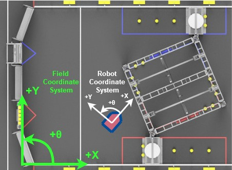

State-space Differential Drive Controllers
==========================================

WPILib includes two new path following controllers for differential drivetrains: the ``LTVUnicycleController`` and ``LTVDiffDriveController``. These controllers can be used to accurately track trajectories and account for external disturbances.

Linear Time-Varying Unicycle Controller
---------------------------------------

Similar to the :ref:`docs/software/advanced-controls/trajectories/ramsete:Ramsete Controller`, the LTV (Linear Time-Varying) Unicycle Controller generates ``ChassisSpeeds`` (C++/Java) references to steer the robot along a trajectory. Similar to Ramsete, the system used by this controller has states :math:`\begin{bmatrix}x & y & \theta \end{bmatrix}^T` in the global frame, and linear and angular velocity inputs :math:`\begin{bmatrix}v & \omega \end{bmatrix}^T` in the robot frame. However, this controller utilizes tolerances grounded in reality to pick gains rather than the magical Beta and Zeta gains used by Ramsete.

.. note:: Field (global) and robot coordinate systems are defined as follows:

The LTV Unicycle controller generates feedback gains using a Linear Quadratic Regulator to balance control effort and state excursion. Because the system has states :math:`\begin{bmatrix}x & y & \theta \end{bmatrix}^T` and inputs :math:`\begin{bmatrix}v & \omega \end{bmatrix}^T`, the LQR used to compute the controller's feedback gain takes maximum desired error tolerances for :math:`x`, :math:`y` and :math:`\theta` (in meters and radians) and maximum desired control effort (in meters per second and radians per second). Note that because the controller deals with cross-track error, a tight heading tolerance will penalize steering the robot back toward the trajectory. Furthermore, the control effort tolerances are the maximum effort that the controller will apply on top of feedforward to steer the robot along the trajectory, not the robot's maximum velocity.

.. note:: Unit conversion can be easily accomplished with :ref:`docs/software/basic-programming/cpp-units:The C++ Units Library` or Java's Units class.

The following example shows how a LTV Unicycle controller could be used to compute wheel speeds while tracking a trajectory. After computing these speeds, a PID loop combined with the ``SimpleMotorFeedforward`` class can be used to generate left and right voltage commands, similar to Ramsete. A more complete example is available in WPILib's examples.

.. tabs::

   .. code-tab:: java

      LTVUnicycleController controller = new LTVUnicycleController(
          VecBuilder.fill(0.1, 0.1, 10), // X, Y and heading tolerances
          VecBuilder.fill(2.5, 1.5), 0.020); // linear and angular velocity input tolerances

      <...>

      ChassisSpeeds adjustedSpeeds = controller.calculate(currentRobotPose, goal);
      DifferentialDriveWheelSpeeds wheelSpeeds = kinematics.toWheelSpeeds(adjustedSpeeds);
      double left = wheelSpeeds.leftMetersPerSecond;
      double right = wheelSpeeds.rightMetersPerSecond;

   .. code-tab:: cpp

      frc::LTVUnicycleController controller{
          {0.1, 0.1, 10}, // X, Y and heading tolerances
          {2.5, 2.5}, 20_ms}; // linear and angular velocity input tolerances

      <...>

      ChassisSpeeds adjustedSpeeds = controller.Calculate(currentRobotPose, goal);
      auto [left, right] = kinematics.ToWheelSpeeds(adjustedSpeeds);

LTV Unicycle Controller in the Command-Based Framework
^^^^^^^^^^^^^^^^^^^^^^^^^^^^^^^^^^^^^^^^^^^^^^^^^^^^^^

For ease of use, a ``LTVUnicycleCommand`` class is built in to WPILib. This command is a drop-in replacement for the existing ``RamseteCommand``.

LTV Differential Drive Controller
---------------------------------

The Linear Time-Varying Differential Drive Controller is a more advanced path following controller. This controller is advantageous over the LTV Unicycle controller (detailed above) as it is easier to specify the relative weighting of states and inputs. Because this controller is not cascaded, it is simple to adjust the LQR weights such that the X, Y, Theta state errors have more jurisdiction over the input than the left and right velocity controller.

This controller has five states, :math:`\begin{bmatrix}x & y & \theta & v_{left} & v_{right} \end{bmatrix}^T` in the field coordinate system, and voltage inputs :math:`\begin{bmatrix}V_{left} & V_{right} \end{bmatrix}^T`. These states can be easily estimated using the :ref:`Differential Drive State Estimator class <docs/software/advanced-controls/state-space/state-space-pose_state-estimators:The Differential Drive State Estimator>`. The controller uses the locally optimal :term:`control law` :math:`u= K(v)(r-x)`, where :math:`v` is the drivetrain's linear velocity, :math:`r` is the reference state and :math:`x` is the current state.

This controller uses cross-track error in the robot's reference frame to generate voltage commands to steer the robot along a trajectory. The controller uses a :ref:`Linear-Quadratic Regulator <docs/software/advanced-controls/state-space/state-space-intro:The Linear-Quadratic Regulator>` to compute optimal feedback gains. Because the controller deals with cross-track error in the robot's reference frame, the system only needs to be linearized twice -- around :math:`v=0` and :math:`v=1`. We use this to our advantage to pre-compute feedback gains at :math:`v=0` and :math:`v=1`, avoiding time-intensive recomputation of feedback gains at every timestep.

A derivation for this controller can be found in `Controls Engineering in FRC <https://file.tavsys.net/control/controls-engineering-in-frc.pdf>`__.

Unlike the :ref:`docs/software/advanced-controls/trajectories/ramsete:Ramsete Controller` or the LTV Unicycle controller, the LTV Differential Drive Controller only calculates feedback inputs, and does not internally perform feedforward calculations or input normalization. The ``LinearSystemFeedforward`` class can calculate feedforward inputs given a system and a reference. The following code snippet shows an example implementation of this controller using the WPILib :ref:`Trajectory Generator <docs/software/advanced-controls/trajectories/trajectory-generation:Trajectory Generation>`:

.. tabs::

    .. code-tab:: java
        // Instantiating our controller, feedforward and state observer
        final double kDt = 0.02;

        plant = LinearSystem.identifyDrivetrainSystem( // A state-space system representing our drivetrain
                3.02, 0.642, 1.382, 0.08495, 12);

        kinematics = new DifferentialDriveKinematics(1);

        controller = new LTVDiffDriveController(
                plant,
                new MatBuilder<>(Nat.N5(), Nat.N1()).fill(0.0625, 0.125, 2.5, 0.95, 0.95), // State excursion weights
                new MatBuilder<>(Nat.N2(), Nat.N1()).fill(12.0, 12.0), // Maximum control effort
                kinematics,
                kDt);

        feedforward = new PlantInversionFeedforward<>( 
                Nat.N10(), Nat.N2(), controller::getDynamics, kDt);

        estimator = new DifferentialDriveStateEstimator(
                plant,
                MatrixUtils.zeros(Nat.N10()), 
                new MatBuilder<>(Nat.N10(), Nat.N1()).fill(
                    0.002, 0.002, 0.0001, 1.5, 1.5, 0.5, 0.5, 10.0, 10.0, 2.0), // model state standard deviations
                new MatBuilder<>(Nat.N3(), Nat.N1()).fill(0.0001, 0.005, 0.005), // encoder and gyro measurement standard deviations
                new MatBuilder<>(Nat.N3(), Nat.N1()).fill(0.5, 0.5, 0.5), // global measurement standard deviations
                kinematics,
                kDt);

        var u = VecBuilder.fill(0, 0); // our last control input

        <...>

        double t = timer.get();
        var currentState = estimator.updateWithTime(
            robotHeading, leftEncoderPos, rightEncoderPos, u, t);

        var desiredState = trajectory.sample(t);

        var wheelVelocities = kinematics.toWheelSpeeds(
            new ChassisSpeeds(desiredState.velocityMetersPerSecond,
                    0,
                    desiredState.velocityMetersPerSecond * desiredState.curvatureRadPerMeter));

        Matrix<N5, N1> stateRef = new MatBuilder<>(Nat.N5(), Nat.N1()).fill(
                desiredState.poseMeters.getTranslation().getX(),
                desiredState.poseMeters.getTranslation().getY(),
                desiredState.poseMeters.getRotation().getRadians(),
                wheelVelocities.leftMetersPerSecond,
                wheelVelocities.rightMetersPerSecond);

        var augmentedRef = MatrixUtils.zeros(Nat.N10());
        augmentedRef.getStorage().insertIntoThis(0, 0, stateRef.getStorage());

        u = controller.calculate(
            currentState.block(Nat.N5(), Nat.N1(), new Pair<>(0, 0)), desiredState)
            .plus(feedforward.calculate(augmentedRef));

        // Normalize our output to preserve the ratio between left and right voltages while staying
        // at or below 12v
        boolean isOutputCapped = Math.abs(u.get(0, 0)) > 12.0 || Math.abs(u.get(1, 0)) > 12.0;
        if (isOutputCapped) {
            u = u.times(12.0 / CommonOps_DDRM.elementMaxAbs(u.getStorage().getDDRM()));
        }

        double leftVoltage = u.get(0, 0);
        double rightVoltage = u.get(1, 0);

        // Now send voltages to motors

    .. code-tab:: cpp
        // Instantiating our controller, feedforward and state observer
        constexpr auto kDt = 0.02_s;

        LinearSystem<2, 2, 2> plant = // A state-space system representing our drivetrain
            frc::IdentifyDrivetrainSystem(3.02, 0.642, 1.382, 0.08495, 12_V);

        const DifferentialDriveKinematics kinematics{1_m};

        LTVDiffDriveController controller{
            plant, {0.0625, 0.125, 2.5, 0.95, 0.95}, // State excursion weights
            {12.0, 12.0}, // Maximum control effort
            kinematics, kDt};

        std::function<Eigen::Matrix<double, 10, 1>(
            const Eigen::Matrix<double, 10, 1>&, const Eigen::Matrix<double, 2, 1>&)>
            controllerDynamics =
                [&](auto& x, auto& u) { return controller.Dynamics(x, u); };

        PlantInversionFeedforward<10, 2> feedforward{controllerDynamics, kDt};

        frc::DifferentialDriveStateEstimator estimator{
            plant,
            Eigen::Matrix<double, 10, 1>::Zero(),
            frc::MakeMatrix<10, 1>(0.002, 0.002, 0.0001, 1.5, 1.5, 0.5, 0.5, 10.0,
                                    10.0, 2.0), // model state standard deviations
            frc::MakeMatrix<3, 1>(0.0001, 0.005, 0.005), // encoder and gyro measurement standard deviations
            frc::MakeMatrix<3, 1>(0.1, 0.1, 0.01), // global measurement standard deviations
            kinematics,
            kDt};

        Eigen::Matrix<double, 2, 1> u;
        u.setZero(); // our last control input

        <...>

        double t = timer.get();
        Eigen::Matrix<double, 10, 1> currentState = estimator.UpdateWithTime(
            robotHeading, leftEncoderPos, rightEncoderPos, u, t);

        auto desiredState = trajectory.Sample(t);

        const ChassisSpeeds chassisSpeeds{
            desiredState.velocity, 0_mps,
            desiredState.velocity * desiredState.curvature};

        auto [left, right] = kinematics.ToWheelSpeeds(chassisSpeeds);

        Eigen::Matrix<double, 5, 1> stateRef;
        stateRef << desiredState.pose.Translation().X().to<double>(),
            desiredState.pose.Translation().Y().to<double>(),
            desiredState.pose.Rotation().Radians().to<double>(), left.to<double>(),
            right.to<double>();

        Eigen::Matrix<double, 10, 1> augmentedRef;
        augmentedRef.block<5, 1>(0, 0) = stateRef;

        u = controller.Calculate(currentState.block<5, 1>(0, 0), desiredState) +
            feedforward.Calculate(augmentedRef);

        // Normalize our output to preserve the ratio between left and right voltages while staying
        // at or below 12v
        bool outputCapped =
            std::abs((*u)(0, 0)) > 12.0 || std::abs((*u)(1, 0)) > 12.0;
        if (outputCapped) {
            u = 12.0 / u.lpNorm<Eigen::Infinity>();
        }

        double leftVoltage = u.get(0, 0);
        double rightVoltage = u.get(1, 0);

        // Now send voltages to motors

State Space Drivetrain Controllers in the Command-Based Framework
-----------------------------------------------------------------

For ease of use, ``LTVDiffDriveCommand`` and ``LTVUnicycleCommand`` classes are built in to WPILib. 
