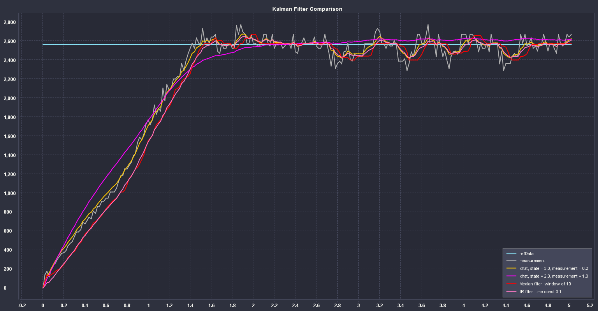

.. include:: <isonum.txt>

State-Space Controller Walkthrough
==================================

.. note:: Before following this tutorial, readers are recommended to have read an :ref:`docs/software/advanced-controls/state-space/state-space-intro:Introduction to state-space control`.

The goal of this tutorial is to provide "end-to-end" instructions on implementing a state-space controller for a flywheel.  By following this tutorial, readers will learn how to:

1. Create an accurate state-space model of a flywheel using :term:`system identification` or CAD software.
2. Implement a Kalman Filter to filter encoder velocity measurements without lag.
3. Implement a :ref:`LQR <docs/software/advanced-controls/state-space/state-space-intro:The Linear-Quadratic Regulator>` feedback controller which, when combined with model-based feedforward, will generate voltage :term:`inputs <input>` to drive the flywheel to a :term:`reference`.

This tutorial is intended to be approachable for teams without a great deal of programming expertise.  While the WPILib library offers significant flexibility in the manner in which its state-space control features are implemented, closely following the implementation outlined in this tutorial should provide teams with a basic structure which can be reused for a variety of state-space systems.

The full example is available in the state-space flywheel (`Java <https://github.com/wpilibsuite/allwpilib/blob/main/wpilibjExamples/src/main/java/edu/wpi/first/wpilibj/examples/statespaceflywheel/Robot.java>`__/`C++ <https://github.com/wpilibsuite/allwpilib/blob/main/wpilibcExamples/src/main/cpp/examples/StateSpaceFlywheel/cpp/Robot.cpp>`__) and state-space flywheel system identification (`Java <https://github.com/wpilibsuite/allwpilib/blob/main/wpilibjExamples/src/main/java/edu/wpi/first/wpilibj/examples/statespaceflywheelsysid/Robot.java>`__/`C++ <https://github.com/wpilibsuite/allwpilib/blob/main/wpilibcExamples/src/main/cpp/examples/StateSpaceFlywheelSysId/cpp/Robot.cpp>`__) example projects.

Why Use State-Space Control?
----------------------------

Because state-space control focuses on creating an accurate model of our system, we can accurately predict how our :term:`model` will respond to control :term:`inputs <input>`. This allows us to simulate our mechanisms without access to a physical robot, as well as easily choose :term:`gains <gain>` that we know will work well. Having a model also allows us to create lagless filters, such as Kalman Filters, to optimally filter sensor readings.

Modeling Our Flywheel
---------------------

:ref:`Recall <docs/software/advanced-controls/state-space/state-space-intro:What is State-Space Notation?>` that continuous state-space systems are modeled using the following system of equations:

.. math::
    \dot{\mathbf{x}} &= \mathbf{A}\mathbf{x} + \mathbf{B}\mathbf{u} \\
    \mathbf{y} &= \mathbf{C}\mathbf{x} + \mathbf{D}\mathbf{u}

Where :term:`x-dot` is the rate of change of the :term:`system`'s :term:`state`, :math:`\mathbf{x}` is the system's current state, :math:`\mathbf{u}` is the :term:`input` to the system, and :math:`\mathbf{y}` is the system's :term:`output`.

Let's use this system of equations to model our flywheel in two different ways. We'll first model it using :term:`system identification` using the SysId toolsuite, and then model it based on the motor and flywheel's :term:`moment of inertia`.

The first step of building up our state-space system is picking our system's states. We can pick anything we want as a state -- we could pick completely unrelated states if we wanted -- but it helps to pick states that are important. We can include :term:`hidden states <hidden state>` in our state (such as elevator velocity if we were only able to measure its position) and let our Kalman Filter estimate their values. Remember that the states we choose will be driven towards their respective :term:`references <reference>` by the feedback controller (typically the :ref:`Linear-Quadratic Regulator <docs/software/advanced-controls/state-space/state-space-intro:The Linear-Quadratic Regulator>` since it's optimal).

For our flywheel, we care only about one state: its velocity. While we could chose to also model its acceleration, the inclusion of this state isn't necessary for our system.

Next, we identify the :term:`inputs <input>` to our system. Inputs can be thought of as things we can put "into" our system to change its state. In the case of the flywheel (and many other single-jointed mechanisms in FRC\ |reg|), we have just one input: voltage applied to the motor. By choosing voltage as our input (over something like motor duty cycle), we can compensate for battery voltage sag as battery load increases.

A continuous-time state-space system writes :term:`x-dot`, or the instantaneous rate of change of the system's :term:`system`\'s state, as proportional to the current :term:`state` and :term:`inputs <input>`. Because our state is angular velocity, :math:`\mathbf{\dot{x}}` will be the flywheel's angular acceleration.

Next, we will model our flywheel as a continuous-time state-space system. WPILib's ``LinearSystem`` will convert this to discrete-time internally. Review :ref:`state-space notation <docs/software/advanced-controls/state-space/state-space-intro:What is State-Space Notation?>` for more on continuous-time and discrete-time systems.

Modeling with System Identification
^^^^^^^^^^^^^^^^^^^^^^^^^^^^^^^^^^^

To rewrite this in state-space notation using :term:`system identification`, we recall from the flywheel :ref:`state-space notation example <docs/software/advanced-controls/state-space/state-space-intro:State-space Notation Example: Flywheel from Kv and Ka>`, where we rewrote the following equation in terms of :math:`\mathbf{a}`.

.. math::
    V = kV \cdot \mathbf{v} + kA \cdot \mathbf{a}\\
    \mathbf{a} = \mathbf{\dot{v}} = \begin{bmatrix}\frac{-kV}{kA}\end{bmatrix} v + \begin{bmatrix}\frac{1}{kA}\end{bmatrix} V

Where :math:`\mathbf{v}` is flywheel velocity, :math:`\mathbf{a}` and :math:`\mathbf{\dot{v}}` are flywheel acceleration, and :math:`V` is voltage. Rewriting this with the standard convention of :math:`\mathbf{x}` for the state vector and :math:`\mathbf{u}` for the input vector, we find:

.. math::
    \mathbf{\dot{x}} = \begin{bmatrix}\frac{-kV}{kA} \end{bmatrix} \mathbf{x} + \begin{bmatrix}\frac{1}{kA} \end{bmatrix} \mathbf{u}

The second part of state-space notation relates the system's current :term:`state` and :term:`inputs <input>` to the :term:`output`. In the case of a flywheel, our output vector :math:`\mathbf{y}` (or things that our sensors can measure) is our flywheel's velocity, which also happens to be an element of our :term:`state` vector :math:`\mathbf{x}`. Therefore, our output matrix is :math:`\mathbf{C} = \begin{bmatrix}1 \end{bmatrix}`, and our system feedthrough matrix is :math:`\mathbf{D} = \begin{bmatrix}0 \end{bmatrix}`. Writing this out in continuous-time state-space notation yields the following.

.. math::
    \mathbf{\dot{x}} &= \begin{bmatrix}\frac{-kV}{kA} \end{bmatrix} \mathbf{x} + \begin{bmatrix}\frac{1}{kA} \end{bmatrix} \mathbf{u} \\
    \mathbf{y} &= \begin{bmatrix}1\end{bmatrix} \mathbf{x} + \begin{bmatrix}0\end{bmatrix} \mathbf{u}

The ``LinearSystem`` class contains methods for easily creating state-space systems identified using :term:`system identification`. This example shows a flywheel model with a kV of 0.023 and a kA of 0.001:

.. tabs::

   .. group-tab:: Java

      .. remoteliteralinclude:: https://raw.githubusercontent.com/wpilibsuite/allwpilib/v2023.1.1-beta-1/wpilibjExamples/src/main/java/edu/wpi/first/wpilibj/examples/statespaceflywheelsysid/Robot.java
         :language: java
         :lines: 33-47
         :linenos:
         :lineno-start: 33

   .. group-tab:: C++

      .. remoteliteralinclude:: https://raw.githubusercontent.com/wpilibsuite/allwpilib/v2023.1.1-beta-1/wpilibcExamples/src/main/cpp/examples/StateSpaceFlywheelSysId/cpp/Robot.cpp
         :language: cpp
         :lines: 17-17
         :linenos:
         :lineno-start: 17

      .. remoteliteralinclude:: https://raw.githubusercontent.com/wpilibsuite/allwpilib/v2023.1.1-beta-1/wpilibcExamples/src/main/cpp/examples/StateSpaceFlywheelSysId/cpp/Robot.cpp
         :language: cpp
         :lines: 30-46
         :linenos:
         :lineno-start: 32

Modeling Using Flywheel Moment of Inertia and Gearing
^^^^^^^^^^^^^^^^^^^^^^^^^^^^^^^^^^^^^^^^^^^^^^^^^^^^^

A flywheel can also be modeled without access to a physical robot, using information about the motors, gearing and flywheel's :term:`moment of inertia`. A full derivation of this model is presented in Section 8.2.1 of  `Controls Engineering in FRC <https://file.tavsys.net/control/controls-engineering-in-frc.pdf>`__.

The ``LinearSystem`` class contains methods to easily create a model of a flywheel from the flywheel's motors, gearing and :term:`moment of inertia`. The moment of inertia can be calculated using CAD software or using physics. The examples used here are detailed in the flywheel example project (`Java <https://github.com/wpilibsuite/allwpilib/tree/3b283ab9aaf9d23d7870b9c3723d03760a0bd378/wpilibjExamples/src/main/java/edu/wpi/first/wpilibj/examples/statespaceflywheel>`__/`C++ <https://github.com/wpilibsuite/allwpilib/blob/3b283ab9aaf9d23d7870b9c3723d03760a0bd378/wpilibcExamples/src/main/cpp/examples/StateSpaceFlywheel/cpp/Robot.cpp>`__).

.. note:: For WPILib's state-space classes, gearing is written as output over input -- that is, if the flywheel spins slower than the motors, this number should be greater than one.

.. note:: The C++ LinearSystem class uses :ref:`the C++ Units Library <docs/software/basic-programming/cpp-units:The C++ Units Library>` to prevent unit mixups and assert dimensionality.

.. tabs::

   .. group-tab:: Java

      .. remoteliteralinclude:: https://raw.githubusercontent.com/wpilibsuite/allwpilib/v2023.1.1-beta-1/wpilibjExamples/src/main/java/edu/wpi/first/wpilibj/examples/statespaceflywheel/Robot.java
         :language: java
         :lines: 34-47
         :linenos:
         :lineno-start: 34

   .. group-tab:: C++

      .. remoteliteralinclude:: https://raw.githubusercontent.com/wpilibsuite/allwpilib/v2023.1.1-beta-1/wpilibcExamples/src/main/cpp/examples/StateSpaceFlywheel/cpp/Robot.cpp
         :language: cpp
         :lines: 17-17
         :linenos:
         :lineno-start: 17

      .. remoteliteralinclude:: https://raw.githubusercontent.com/wpilibsuite/allwpilib/v2023.1.1-beta-1/wpilibcExamples/src/main/cpp/examples/StateSpaceFlywheel/cpp/Robot.cpp
         :language: cpp
         :lines: 31-46
         :linenos:
         :lineno-start: 31

Kalman Filters: Observing Flywheel State
----------------------------------------

Kalman filters are used to filter our velocity measurements using our state-space model to generate a state estimate :math:`\mathbf{\hat{x}}`. As our flywheel model is linear, we can use a Kalman filter to estimate the flywheel's velocity. WPILib's Kalman filter takes a ``LinearSystem`` (which we found above), along with standard deviations of model and sensor measurements. We can adjust how "smooth" our state estimate is by adjusting these weights. Larger state standard deviations will cause the filter to "distrust" our state estimate and favor new measurements more highly, while larger measurement standard deviations will do the opposite.

In the case of a flywheel we start with a state standard deviation of 3 rad/s and a measurement standard deviation of 0.01 rad/s. These values are up to the user to choose -- these weights produced a filter that was tolerant to some noise but whose state estimate quickly reacted to external disturbances for *a* flywheel -- and should be tuned to create a filter that behaves well for your specific flywheel. Graphing states, measurements, inputs, references, and outputs over time is a great visual way to tune Kalman filters.

The above graph shows two differently tuned Kalman filters, as well as a :ref:`single-pole IIR filter <docs/software/advanced-controls/filters/linear-filter:Linear Filters>` and a :ref:`docs/software/advanced-controls/filters/median-filter:Median Filter`. This data was collected with a shooter over ~5 seconds, and four balls were run through the shooter (as seen in the four dips in velocity). While there are no hard rules on choosing good state and measurement standard deviations, they should in general be tuned to trust the model enough to reject noise while reacting quickly to external disturbances.

Because the feedback controller computes error using the :term:`x-hat` estimated by the Kalman filter, the controller will react to disturbances only as quickly the filter's state estimate changes. In the above chart, the upper left plot (with a state standard deviation of 3.0 and measurement standard deviation of 0.2) produced a filter that reacted quickly to disturbances while rejecting noise, while the upper right plot shows a filter that was barely affected by the velocity dips.

.. tabs::

   .. group-tab:: Java

      .. remoteliteralinclude:: https://raw.githubusercontent.com/wpilibsuite/allwpilib/v2023.1.1-beta-1/wpilibjExamples/src/main/java/edu/wpi/first/wpilibj/examples/statespaceflywheel/Robot.java
         :language: java
         :lines: 49-59
         :linenos:
         :lineno-start: 59

   .. group-tab:: C++

      .. remoteliteralinclude:: https://raw.githubusercontent.com/wpilibsuite/allwpilib/v2023.1.1-beta-1/wpilibcExamples/src/main/cpp/examples/StateSpaceFlywheelSysId/cpp/Robot.cpp
         :language: cpp
         :lines: 13-13
         :linenos:
         :lineno-start: 13

      .. remoteliteralinclude:: https://raw.githubusercontent.com/wpilibsuite/allwpilib/v2023.1.1-beta-1/wpilibcExamples/src/main/cpp/examples/StateSpaceFlywheel/cpp/Robot.cpp
         :language: cpp
         :lines: 48-53
         :linenos:
         :lineno-start: 48

Because Kalman filters use our state-space model in the :ref:`docs/software/advanced-controls/state-space/state-space-observers:Predict step`, it is important that our model is as accurate as possible. One way to verify this is to record a flywheel's input voltage and velocity over time, and replay this data by calling only ``predict`` on the Kalman filter. Then, the kV and kA gains (or moment of inertia and other constants) can be adjusted until the model closely matches the recorded data.

.. todo:: do we need to elaborate on this^ more?

Linear-Quadratic Regulators and Plant Inversion Feedforward
-----------------------------------------------------------

:ref:`docs/software/advanced-controls/state-space/state-space-intro:The Linear-Quadratic Regulator` finds a feedback controller to drive our flywheel :term:`system` to its :term:`reference`. Because our flywheel has just one state, the control law picked by our LQR will be in the form :math:`\mathbf{u = K (r - x)}` where :math:`\mathbf{K}` is a 1x1 matrix; in other words, the control law picked by LQR is simply a proportional controller, or a PID controller with only a P gain. This gain is chosen by our LQR based on the state excursion and control efforts we pass it. More on tuning LQR controllers can be found in the :ref:`LQR application example <docs/software/advanced-controls/state-space/state-space-intro:LQR: example application>`.

Much like ``SimpleMotorFeedforward`` can be used to generate feedforward voltage inputs given kS, kV, and kA constants, the Plant Inversion Feedforward class generate :ref:`feedforward <docs/software/advanced-controls/state-space/state-space-intro:Visualizing Feedforward>` voltage inputs given a state-space system. The voltage commands generated by the ``LinearSystemLoop`` class are the sum of the feedforward and feedback inputs.

.. tabs::

   .. group-tab:: Java

      .. remoteliteralinclude:: https://raw.githubusercontent.com/wpilibsuite/allwpilib/v2023.1.1-beta-1/wpilibjExamples/src/main/java/edu/wpi/first/wpilibj/examples/statespaceflywheel/Robot.java
         :language: java
         :lines: 60-71
         :linenos:
         :lineno-start: 60

   .. group-tab:: C++

      .. remoteliteralinclude:: https://raw.githubusercontent.com/wpilibsuite/allwpilib/v2023.1.1-beta-1/wpilibcExamples/src/main/cpp/examples/StateSpaceFlywheelSysId/cpp/Robot.cpp
         :language: cpp
         :lines: 11
         :linenos:
         :lineno-start: 11

      .. remoteliteralinclude:: https://raw.githubusercontent.com/wpilibsuite/allwpilib/v2023.1.1-beta-1/wpilibcExamples/src/main/cpp/examples/StateSpaceFlywheel/cpp/Robot.cpp
         :language: cpp
         :lines: 55-75
         :linenos:
         :lineno-start: 54

Bringing it All Together: LinearSystemLoop
------------------------------------------

LinearSystemLoop combines our system, controller, and observer that we created earlier. The constructor shown will also instantiate a ``PlantInversionFeedforward``.

.. tabs::

   .. group-tab:: Java

      .. remoteliteralinclude:: https://raw.githubusercontent.com/wpilibsuite/allwpilib/v2023.1.1-beta-1/wpilibjExamples/src/main/java/edu/wpi/first/wpilibj/examples/statespaceflywheel/Robot.java
         :language: java
         :lines: 73-75
         :linenos:
         :lineno-start: 73

   .. group-tab:: C++

      .. remoteliteralinclude:: https://raw.githubusercontent.com/wpilibsuite/allwpilib/v2023.1.1-beta-1/wpilibcExamples/src/main/cpp/examples/StateSpaceFlywheelSysId/cpp/Robot.cpp
         :language: cpp
         :lines: 15-15
         :linenos:
         :lineno-start: 15

      .. remoteliteralinclude:: https://raw.githubusercontent.com/wpilibsuite/allwpilib/v2023.1.1-beta-1/wpilibcExamples/src/main/cpp/examples/StateSpaceFlywheel/cpp/Robot.cpp
         :language: cpp
         :lines: 71-74
         :linenos:
         :lineno-start: 71

Once we have our ``LinearSystemLoop``, the only thing left to do is actually run it. To do that, we'll periodically update our Kalman filter with our new encoder velocity measurements and apply new voltage commands to it. To do that, we first set the :term:`reference`, then ``correct`` with the current flywheel speed, ``predict`` the Kalman filter into the next timestep, and apply the inputs generated using ``getU``.

.. tabs::

   .. group-tab:: Java

      .. remoteliteralinclude:: https://raw.githubusercontent.com/wpilibsuite/allwpilib/v2023.1.1-beta-1/wpilibjExamples/src/main/java/edu/wpi/first/wpilibj/examples/statespaceflywheel/Robot.java
         :language: java
         :lines: 96-121
         :linenos:
         :lineno-start: 96

   .. group-tab:: C++

      .. remoteliteralinclude:: https://raw.githubusercontent.com/wpilibsuite/allwpilib/v2023.1.1-beta-1/wpilibcExamples/src/main/cpp/examples/StateSpaceFlywheelSysId/cpp/Robot.cpp
         :language: cpp
         :lines: 5-17
         :linenos:
         :lineno-start: 5

      .. remoteliteralinclude:: https://raw.githubusercontent.com/wpilibsuite/allwpilib/v2023.1.1-beta-1/wpilibcExamples/src/main/cpp/examples/StateSpaceFlywheel/cpp/Robot.cpp
         :language: cpp
         :lines: 92-114
         :linenos:
         :lineno-start: 92

Angle Wrap with LQR
-------------------

Mechanisms with a continuous angle can have that angle wrapped by calling the code below instead of ``lqr.Calculate(x, r)``.

.. tabs::

   .. group-tab:: Java

      .. code-block:: Java

         var error = lqr.getR().minus(x);
         error.set(0, 0, MathUtil.angleModulus(error.get(0, 0)));
         var u = lqr.getK().times(error);

   .. group-tab:: C++

      .. code-block:: C++

         Eigen::Vector<double, 2> error = lqr.R() - x;
         error(0) = frc::AngleModulus(units::radian_t{error(0)}).value();
         Eigen::Vector<double, 2> u = lqr.K() * error;
