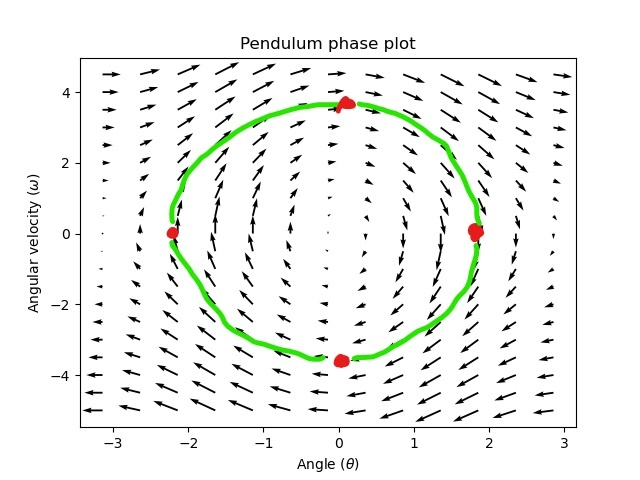
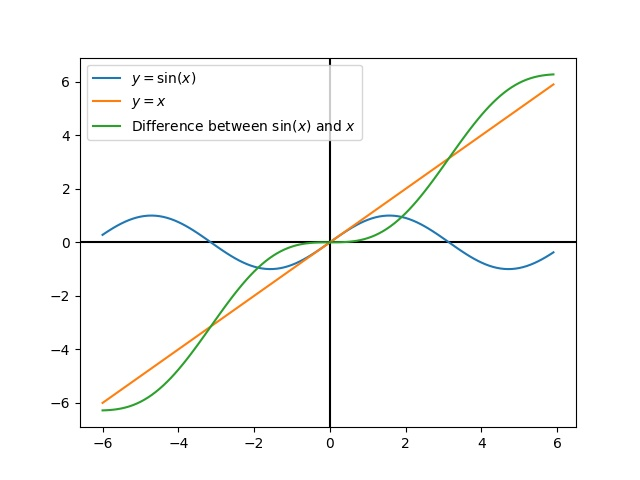

Introduction to state-space control
===================================

.. note:: This article is from `Controls Engineering in FRC <https://file.tavsys.net/control/controls-engineering-in-frc.pdf>`__ by Tyler Veness with permission.
 
From PID to model-based control
-------------------------------

When tuning PID controllers, we focus on fiddling with controller parameters relating to the current, past, and future :term:`error` (P, I and D terms) rather than the underlying system states. While this approach works in a lot of situations, it is an incomplete view of the world.

Model-based control focus on developing an accurate model of the system they are trying to control. These models help inform :term:`gains <gain>` picked for feedback controllers based on the physical responses of the system, rather than an arbitrary proportional :term:`gain` derived through testing. This allows us not only to predict ahead of time how a system will react, but also test our controllers without a physical robot and save time debugging simple bugs.

.. note:: State-space control makes extensive use of linear algebra. More on linear algebra in modern control theory, including an introduction to linear algebra and resources, can be found in Chapter 4 of `Controls Engineering in FRC <https://file.tavsys.net/control/controls-engineering-in-frc.pdf>`__

If you've used WPILib's feedforward classes for ``SimpleMotorFeedforward`` or its sister classes, or used FRC-Characterization to pick PID :term:`gains <gain>` for you, you're already familiar with model-based control! The ``kv`` and ``ka`` :term:`gains <gain>` can be used to describe how a motor (or arm, or drivetrain) will react to voltage. We can put these constants into standard state-space notation using WPILib's ``LinearSystem``, something we will do in a later article.

Vocabulary
----------

For the background vocabulary that will be used throught this article, see the :ref:`Glossary <docs/software/advanced-controls/state-space/state-space-glossary:State-Space Glossary>`.

What is state-space?
--------------------

Recall that 2D space has two axes: x and y. We represent locations within this space as a pair of numbers packaged in a vector, and each coordinate is a measure of how far to move along the corresponding axis. State-space is a `Cartesian coordinate system <https://en.wikipedia.org/wiki/Cartesian_coordinate_system>`__ with an axis for each state variable, and we represent locations within it the same way we do for 2D space: with a list of numbers in a vector. Each element in the vector corresponds to a state of the system. This example shows two example state vectors in the state-space of an elevator model with the states :math:`[\text{position}, \text{velocity}]`

In this image, the vectors representing states in state-space are arrows. From now on these vectors will be represented simply by a point at the vector's tip, but remember that the rest of the vector is still there.

In addition to the state, inputs and :term:`outputs <output>` are represented as vectors. Since the mapping from the current states and inputs to the change in state is a system of equations, it’s natural to write it in matrix form. This matrix equation can be written in state-space notation.

What is state-space notation
----------------------------

State-space notation is a set of matrix equations which describe how a system will evolve over time. These equations relate the change in state :math:`\dot{\mathbf{x}}`, and the :term:`output` :math:`\mathbf{y}`, to linear combinations of the current state vector :math:`\mathbf{x}` and :term:`input` vector :math:`\mathbf{u}`. See section 4.2 of `Controls Engineering in FRC <https://file.tavsys.net/control/controls-engineering-in-frc.pdf>`__ for an introduction to linear combinations. The core idea of linear transformations is that we are simply summing or scaling the elements of :math:`\mathbf{x}` and :math:`\mathbf{u}`. For example, an operation involving an exponent or trigonometric function would not be considered a linear transformation. 

State-space control can deal with continuous-time and discrete-time systems. A continuous-time system is modeled by a system of differential equations (as seen in the continuous-time case below). However, modern computer processors such as the RoboRIO run in discrete "steps," making it impossible to precisely model a system that is constantly evaluated. A continuous-time state-space system can be converted into a discrete-time system through a process called discretization. A discrete-time system expresses the state of the system at our next timestep based on the previous state and inputs, as opposed to the state derivative :math:`\dot{\mathbf{x}}`.

The following two sets of equations are the standard form of continuous-time and discrete-time state-space notation:

.. math::
    \text{Continuous: }
    \dot{\mathbf{x}} &= \mathbf{A}\mathbf{x} + \mathbf{B}\mathbf{u} \\
    \mathbf{y} &= \mathbf{C}\mathbf{x} + \mathbf{D}\mathbf{u} \\
    \nonumber \\
    \text{Discrete: }
    \mathbf{x}_{k+1} &= \mathbf{A}\mathbf{x}_k + \mathbf{B}\mathbf{u}_k \\
    \mathbf{y}_k &= \mathbf{C}\mathbf{x}_k + \mathbf{D}\mathbf{u}_k

.. math::
    \begin{array}{llll}
      \mathbf{A} & \text{system matrix}      & \mathbf{x} & \text{state vector} \\
      \mathbf{B} & \text{input matrix}       & \mathbf{u} & \text{input vector} \\
      \mathbf{C} & \text{output matrix}      & \mathbf{y} & \text{output vector} \\
      \mathbf{D} & \text{feedthrough matrix} &  &  \\
    \end{array}

Systems are often modeled first as continuous-time systems, and later converted to discrete-time systems. 

.. important:: WPILib's LinearSystem takes continuous-time system matrices, and converts them internally where necessary. 

.. note:: Since a microcontroller performs discrete steps, there is a sample delay that introduces phase loss in the controller. Large amounts of phase loss can make a stable controller in the continuous-time domain become unstable in the discrete domain. The easiest way to combat phase loss and increase performance is to decrease the time between updates. WPILib's ``Notifier`` class can be used if updates faster than the main robot loop are desired. 

State-space notation example -- Flywheel from kV and kA
~~~~~~~~~~~~~~~~~~~~~~~~~~~~~~~~~~~~~~~~~~~~~~~~~~~~~~~

Recall that we can model the motion of a flywheel connected to a brushed DC motor with the equation :math:`V = kV \cdot v + kA \cdot a`, where V is voltage output, v is the flywheel's angular velocity and a is its angular acceleration. This equation can be rewritten as :math:`a = \frac{V - kV \cdot v}{kA}`, or :math:`a = \frac{-kV}{kA} \cdot v + \frac{1}{kA} \cdot V`. Notice anything familiar? This equation relates the angular acceleration of the flywheel to its angular velocity and the voltage applied. 

We can convert this equation to state-space notation. We can create a system with one state (velocity), one :term:`input` (voltage), and one :term:`output` (velocity). Recalling that the first derivative of velocity is acceleration, we can write our equation as follows, replacing velocity with :math:`\mathbf{x}` and acceleration with :math:`\mathbf{\dot{x}}`:

.. math:: 
    \mathbf{\dot{x}} = [\frac{-kV}{kA}] \cdot \mathbf{x} + \frac{1}{kA} \cdot V

That's it! That's the state-space model of a system for which we have the kV and kA constants. This same math is use in FRC-Characterization to model flywheels and drivetrain velocity systems.

Visualizing State-space responses: phase portrait
-------------------------------------------------

A `phase portrait <https://en.wikipedia.org/wiki/Phase_portrait>`__ can help give a visual intuition for the response of a system in state-space. The vectors on the graph have their roots at some point :math:`\mathbf{x}` in state-space, and point in the direction of :math:`\mathbf{\dot{x}}`, the direction that the system will evolve over time. This example shows a model of a pendulum with the states of angle and angular velocity. 

.. .. raw:: html

..     

..     <iframe width="100%" height="350" src="https://raw.githubusercontent.com/mcm001/state-space-animations/master/videos/phase-space/720p30/PendulumCirclingOrigin.mp4" frameborder="0" allow="autoplay; encrypted-media" allowfullscreen></iframe>
..     

To trace a potential trajectory that a system could take through state-space, choose a point to start at and follow the arrows around. In this example, we might start at :math:`[-2, 0]`. From there, the velocity increases as we swing through vertical and starts to decrease until we reach the opposite extreme of the swing. This cycle of spinning about the origin repeats indefinitely.

Note that near the edges of the phase portrait, the X axis wraps around as a rotation of :math:`\pi` radians counter clockwise and a rotation of :math:`\pi` radians clockwise will end at the same point.

For more on differential equations and phase portraits, see `3Blue1Brown's Differential Equations video <https://www.youtube.com/watch?v=p_di4Zn4wz4>`__ -- they do a great job of animating the pendulum phase space at around 15:30.

Visualizing Feedforward
~~~~~~~~~~~~~~~~~~~~~~~

This phase portrait shows the "open loop" responses of the system -- that is, how it will react if we were to let the state evolve naturally. If we want to, say, balance the pendulum horizontal (at :math:`(\frac{\pi}{2}, 0)` in state space), we would need to somehow apply a control :term:`input` to counteract the open loop tendency of the pendulum to swing downward. This is what feedforward is trying to do -- make it so that our phase portrait will have an equilibrium at the :term:`reference` position (or setpoint) in state-space. Looking at our phase portrait from before, we can see that at :math:`(\frac{\pi}{2}, 0)` in state space, gravity is pulling the pendulum down with some torque T, and producing some downward angular acceleration with magnitude :math:`\frac{\tau}{i}`, where I is angular `moment of inertia <https://en.wikipedia.org/wiki/Moment_of_inertia>`__ of the pendulum. If we want to create an equilibrium at our :term:`reference` of :math:`(\frac{\pi}{2}, 0)`, we would need to apply an :term:`input` that produces a :math:`\mathbf{\dot{x}}` is equal in magnitude and opposite in direction to the :math:`\mathbf{\dot{x}}` produced by the system's open-loop response to due to gravity. The math for this will be presented later. Here is the phase portrait where we apply a constant :term:`input` that opposes the force of gravity at :math:`(\frac{\pi}{2}, 0)`:

.. image:: images/pendulum-balance.png

Feedback Control and LQR
------------------------

In the case of a DC motor, with just a mathematical model and knowledge of all current states of the system(i.e., angular velocity), we can predict all future states given the future voltage inputs. But if the system is disturbed in any way that isn’t modeled by our equations, like a load or unexpected friction,the angular velocity of the motor will deviate from the model over time. To combat this, we can give the motor corrective commands to account for model uncertainty. 

A PID controller is a form of feedback control. State-space control often uses the :term:`control law` :math:`\mathbf{u} = \mathbf{K(r - x)}`, where K is some controller :term:`gain` matrix, r is the :term:`reference` state and x is the current state in state-space. The difference between these two vectors, :math:`r - x`, is known as :term:`error`. This :term:`control law` is essentially a multidimensional proportional controller. Because model-based control means that we can predict the future states of a system given an initial condition and future control inputs, we can pick a mathematically optimal :term:`gain` matrix K. 

Let's start with the open loop pendulum example. The case where K is the zero matrix would mean that no control :term:`input` is applied, and the phase portrait would look identical to the one above. Let's pick a K of [[2, 0], [0, 2]], where are :term:`input` to the pendulum is angular acceleration. This K would mean that for every degree of position :term:`error`, the angular acceleration would be 1 degree per second squared; similarly, we accelerate by 1 degree per second squared for every degree per second of :term:`error`. Try following an arrow from somewhere in state-space inwards -- no matter the initial conditions, the state will settle at the :term:`reference` rather than circle endlessly with pure feedforward. 

.. image:: images/pendulum-closed-loop.png

But with a real system, how can we choose an optimal :term:`gain` matrix K? While we can manually choose :term:`gains <gain>` and simulate the system response, or use tools like pole placement, modern control theory has a better answer: the Linear-Quadratic Regulator (LQR).

The Linear-Quadratic Regulator
------------------------------

Linear-Quadratic Regulators works by finding a :term:`control law` that minimizes the following cost function, which weights the sum of :term:`error` and :term:`control effort` over time, subject to the linear :term:`system` dynamics :math:`\mathbf{\dot{x} = Ax + Bu}`.

.. math::
    J = \int\limits_0^\infty \left(\mathbf{x}^T\mathbf{Q}\mathbf{x} +
    \mathbf{u}^T\mathbf{R}\mathbf{u}\right) dt

The :term:`control law` that minimizes :math:`\mathbf{J}` can be written as :math:`\mathbf{u = K(r - x)}`, where :math:`r-x` is the :term:`error`.

By adjusting the state excursion weight :math:`\mathbf{Q}` and :term:`control effort` weight :math:`\mathbf{R}`, the response of the system can be tuned to suit the application. 

.. note:: LQR design's :math:`\mathbf{Q}` and :math:`\mathbf{R}` matrices don't need discretization, but the :math:`\mathbf{K}` calculated for continuous-time and discrete time :term:`systems <system>` will be different.

Bryson's Rule
~~~~~~~~~~~~~

Picking these :math:`\mathbf{Q}` and :math:`\mathbf{R}` weights can be done using Bryson's rule, which provides a simple form for these cost matrices. With Bryson's rule, the diagonals of the :math:`\mathbf{Q}` and :math:`\mathbf{R}` matrices are chosen based on the maximum acceptable value for each :term:`state` and :term:`input`. The nondiagonal elements are zero.

.. math::
    \begin{array}{cc}
        \mathbf{Q} = \begin{bmatrix}
            \frac{\rho}{x_{1,max}^2} & 0 & \ldots & 0 \\
            0 & \frac{\rho}{x_{2,max}^2} & & \vdots \\
            \vdots & & \ddots & 0 \\
            0 & \ldots & 0 & \frac{\rho}{x_{n,max}^2}
        \end{bmatrix} &
        \mathbf{R} = \begin{bmatrix}
            \frac{1}{u_{1,max}^2} & 0 & \ldots & 0 \\
            0 & \frac{1}{u_{2,max}^2} & & \vdots \\
            \vdots & & \ddots & 0 \\
            0 & \ldots & 0 & \frac{1}{u_{n,max}^2}
        \end{bmatrix}
    \end{array}

Where the weighting factor :math:`\rho` can be used to change the balance of :term:`control effort` and state excursion. Small values of :math:`\rho` penalize :term:`control effort`, while large values of :math:`\rho` penalize state excursion. The values of :math:`x_1, x_2...x_m` are the maximum desired :term:`error` tolerance for each state of the system, and :math:`u_1, u_2...u_n` are maximum desired :term:`control efforts <control effort>` for each input. 

.. note::
    Don't confuse Q and R with the elements we use to construct :math:`\mathbf{Q}` and :math:`\mathbf{R}` with using Bryson's rule! Q and R are matrices with dimensionality states by states and states by inputs restively. We fill Q with as many "q elements" as the :term:`system` has :term:`states <state>`, and R with as may "r elements" as the :term:`system` has :term:`inputs <input>`.

Increasing the q elements :math:`x_1, x_2...x_m` or decreasing :math:`\rho` would make the LQR penalize large errors less heavily, and the resulting :term:`control law` will behave more conservatively. This has a similar effect to penalizing :term:`control effort` more heavily by decreasing the r elements :math:`u_1, u_2...u_n`.

Similarly, decreasing the q elements :math:`x_1, x_2...x_m` or increasing :math:`\rho` would make the LQR penalize large errors more heavily, and the resulting :term:`control law` will behave more aggressively. This has a similar effect to penalizing :term:`control effort` less heavily by increasing the r elements :math:`u_1, u_2...u_n`.

LQR: example application
~~~~~~~~~~~~~~~~~~~~~~~~

Let's apply a Linear-Quadratic Regulator to a real-world example. Say we have a flywheel velocity system determined through system identification to have :math:`kV = 2.9 \frac{\text{volts}}{\text{radian per second}}` and :math:`kA = 0.3 \frac{\text{volts}}{\text{radians per second squared}}`. Using the flywheel example above, we have the following linear :term:`system`:

.. math::
    \mathbf{\dot{x}} = [\frac{-kV}{kA}] \cdot v + \frac{1}{kA} \cdot V

We arbitrarily choose a desired state excursion of :math:`q = [0.1 \text{rad/sec}]`, and constrain our :term:`control effort` to :math:`r = [12 \text{volts}]`. After discretization with a timestep of 20ms, we find a :term:`gain` of K = ~13. This K :term:`gain` acts as the proportional component of a PID loop on flywheel's velocity. 

Let's play with :math:`q` and :math:`r`. We except that increasing the q elements or decreasing the r elements we give Bryson's rule would make our controller more heavily penalize :term:`control effort`, analogous to trying to conserve fuel in a space ship or drive a car more conservatively. In fact, if we increase our :term:`error` tolerance q from 0.1 to 1.0, our :term:`gain` K drops from ~13 to ~6. Similarly, decreasing our maximum voltage :math:`r` to 1.2 from 12.0 produces the same resultant :math:\mathbf{K}`.

A Time Domain Graph Will Go Here

Linearization
-------------

Linearization is a tool used to approximate nonlinear functions and state-space systems using linear ones. In two-dimensional space, linear functions are straight lines while nonlinear functions curve. A common example of a nonlinear function and its corresponding linear approximation is :math:`y=\sin{x}`. This function can be approximated by :math:`y=x` near zero. This approximation is accurate while near :math:`x=0`, but looses accuracy as we stray further from the linearization point. For example, the approximation :math:`\sin{x} \approx x` is accurate to within 0.02 within 0.5 radians of :math:`y = 0`, but quickly loses accuracy past that. In the following picture, blue shows :math:`y =\sin{x}`, orange shows :math:`y=x`, and green shows the difference between the two functions.

We can also linearize state-space systems with nonlinear :term:`dynamics`. We do this by picking a point :math:`\mathbf{x}` in state-space and using this as the input to our nonlinear functions. Like in the above example, this works well for states near the point about which the system was linearized, but can quickly diverge further from that state. 

WPILib's LinearSystemLoop
-------------------------

WPILib's state-space control is based on the ``LinearSystemLoop`` class. This class contains all the components needed to control a mechanism using state-space control. It contains the following members:

- A ``LinearSystem`` representing the continuous-time state-space equations of the :term:`system`.
- A :ref:`Kalman Filter <docs/software/advanced-controls/state-space/state-space-observers:State Observers and Kalman Filters>`, used to filter noise from sensor :term:`measurements <measurement>`.
- A Linear-Quadratic Regulator, which combines feedback and feedforward to generate :term:`inputs <input>`.

As the system being controlled is in discrete domain, we follow the following steps at each update cycle:

- ``correct(measurement, nextReference)`` "fuses" the measurement and Kalman Filter :math:`\hat{\mathbf{x}}` (:term:`x-hat`) to steer the estimated state back to reality using :term:`measurements <measurement>` of what the :term:`plant` is actually doing. This updated state estimate is used by the Linear-Quadratic Regulator to generate an updated :term:`input` :math:`\mathbf{u}` to drive the system towards the next :term:`reference`.

- ``predict()`` uses the state-space model to predict where the the :term:`system`\'s :term:`state` :math:`\hat{\mathbf{x}}` (:term:`x-hat`) will be in the future based on applied inputs. The predict step is analogous to estimating a pendulum's (or other :term:`systems <system>`) next state by following the arrows in a phase portrait.

- The updated :term:`input` is set to motors or other physical actuator.
