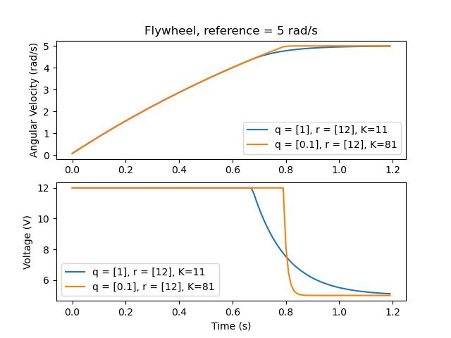
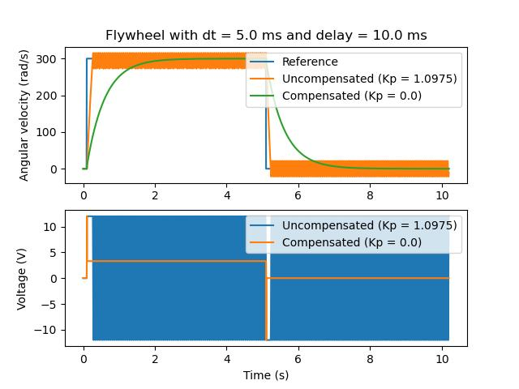

Introduction to State-Space Control
===================================

.. note:: This article is from `Controls Engineering in FRC <https://file.tavsys.net/control/controls-engineering-in-frc.pdf>`__ by Tyler Veness with permission.

From PID to Model-Based Control
-------------------------------

When tuning PID controllers, we focus on fiddling with controller parameters relating to the current, past, and future :term:`error` (P, I and D terms) rather than the underlying system states. While this approach works in a lot of situations, it is an incomplete view of the world.

Model-based control focuses on developing an accurate model of the :term:`system` (mechanism) we are trying to control. These models help inform :term:`gains <gain>` picked for feedback controllers based on the physical responses of the system, rather than an arbitrary proportional :term:`gain` derived through testing. This allows us not only to predict ahead of time how a system will react, but also test our controllers without a physical robot and save time debugging simple bugs.

.. note:: State-space control makes extensive use of linear algebra. More on linear algebra in modern control theory, including an introduction to linear algebra and resources, can be found in Chapter 4 of `Controls Engineering in FRC <https://file.tavsys.net/control/controls-engineering-in-frc.pdf>`__.

If you've used WPILib's feedforward classes for ``SimpleMotorFeedforward`` or its sister classes, or used SysId to pick PID :term:`gains <gain>` for you, you're already familiar with model-based control! The ``kv`` and ``ka`` :term:`gains <gain>` can be used to describe how a motor (or arm, or drivetrain) will react to voltage. We can put these constants into standard state-space notation using WPILib's ``LinearSystem``, something we will do in a later article.

Vocabulary
----------

For the background vocabulary that will be used throughout this article, see the :ref:`Glossary <docs/software/advanced-controls/controls-glossary:Controls Glossary>`.

Introduction to Linear Algebra
------------------------------

For a short and intuitive introduction to the core concepts of Linear Algebra, we recommend chapters 1 through 4 of `3Blue1Brown's Essence of linear algebra series <https://www.youtube.com/watch?v=fNk_zzaMoSs&list=PLZHQObOWTQDPD3MizzM2xVFitgF8hE_ab>`__ (Vectors, what even are they?, Linear combinations, span, and basis vectors, Linear transformations and matrices, and Matrix multiplication as composition).

What is State-Space?
--------------------

Recall that 2D space has two axes: x and y. We represent locations within this space as a pair of numbers packaged in a vector, and each coordinate is a measure of how far to move along the corresponding axis. State-space is a :term:`Cartesian coordinate system` with an axis for each state variable, and we represent locations within it the same way we do for 2D space: with a list of numbers in a vector. Each element in the vector corresponds to a state of the system. This example shows two example state vectors in the state-space of an elevator model with the states :math:`[\text{position}, \text{velocity}]`:

.. image:: images/state-space-graph.png
    :alt: Two vectors in state space with their corresponding arrows.

In this image, the vectors representing states in state-space are arrows. From now on these vectors will be represented simply by a point at the vector's tip, but remember that the rest of the vector is still there.

In addition to the :term:`state`, :term:`inputs <input>` and :term:`outputs <output>` are represented as vectors. Since the mapping from the current states and inputs to the change in state is a system of equations, it’s natural to write it in matrix form. This matrix equation can be written in state-space notation.

What is State-Space Notation?
-----------------------------

State-space notation is a set of matrix equations which describe how a system will evolve over time. These equations relate the change in state :math:`\dot{\mathbf{x}}`, and the :term:`output` :math:`\mathbf{y}`, to linear combinations of the current state vector :math:`\mathbf{x}` and :term:`input` vector :math:`\mathbf{u}`.

State-space control can deal with continuous-time and discrete-time systems. In the continuous-time case, the rate of change of the system's state :math:`\mathbf{\dot{x}}` is expressed as a linear combination of the current state :math:`\mathbf{x}` and input :math:`\mathbf{u}`.

In contrast, discrete-time systems expresses the state of the system at our next timestep :math:`\mathbf{x}_{k+1}` based on the current state :math:`\mathbf{x}_k` and input :math:`\mathbf{u}_k`, where :math:`k` is the current timestep and :math:`k+1` is the next timestep.

In both the continuous- and discrete-time forms, the :term:`output` vector :math:`\mathbf{y}` is expressed as a linear combination of the current :term:`state` and :term:`input`. In many cases, the output is a subset of the system's state, and has no contribution from the current input.

When modeling systems, we first derive the continuous-time representation because the equations of motion are naturally written as the rate of change of a system's state as a linear combination of its current state and inputs. We convert this representation to discrete-time on the robot because we update the system in discrete timesteps there instead of continuously.

The following two sets of equations are the standard form of continuous-time and discrete-time state-space notation:

.. math::
    \text{Continuous: }
    \dot{\mathbf{x}} &= \mathbf{A}\mathbf{x} + \mathbf{B}\mathbf{u} \\
    \mathbf{y} &= \mathbf{C}\mathbf{x} + \mathbf{D}\mathbf{u} \\
    \nonumber \\
    \text{Discrete: }
    \mathbf{x}_{k+1} &= \mathbf{A}\mathbf{x}_k + \mathbf{B}\mathbf{u}_k \\
    \mathbf{y}_k &= \mathbf{C}\mathbf{x}_k + \mathbf{D}\mathbf{u}_k

.. math::
    \begin{array}{llll}
      \mathbf{A} & \text{system matrix}      & \mathbf{x} & \text{state vector} \\
      \mathbf{B} & \text{input matrix}       & \mathbf{u} & \text{input vector} \\
      \mathbf{C} & \text{output matrix}      & \mathbf{y} & \text{output vector} \\
      \mathbf{D} & \text{feedthrough matrix} &  &  \\
    \end{array}

A continuous-time state-space system can be converted into a discrete-time system through a process called discretization.

.. note:: In the discrete-time form, the system's state is held constant between updates. This means that we can only react to disturbances as quickly as our state estimate is updated. Updating our estimate more quickly can help improve performance, up to a point. WPILib's ``Notifier`` class can be used if updates faster than the main robot loop are desired.

.. note:: While a system's continuous-time and discrete-time matrices A, B, C, and D have the same names, they are not equivalent. The continuous-time matrices describes the rate of change of the state, :math:`\mathbf{x}`, while the discrete-time matrices describe the system's state at the next timestep as a function of the current state and input.

.. important:: WPILib's LinearSystem takes continuous-time system matrices, and converts them internally to the discrete-time form where necessary.

State-space Notation Example: Flywheel from Kv and Ka
^^^^^^^^^^^^^^^^^^^^^^^^^^^^^^^^^^^^^^^^^^^^^^^^^^^^^

:ref:`Recall <docs/software/advanced-controls/controllers/feedforward:SimpleMotorFeedforward>` that we can model the motion of a flywheel connected to a brushed DC motor with the equation :math:`V = K_v \cdot v + K_a \cdot a`, where V is voltage output, v is the flywheel's angular velocity and a is its angular acceleration. This equation can be rewritten as :math:`a = \frac{V - K_v \cdot v}{K_a}`, or :math:`a = \frac{-K_v}{K_a} \cdot v + \frac{1}{K_a} \cdot V`. Notice anything familiar? This equation relates the angular acceleration of the flywheel to its angular velocity and the voltage applied.

We can convert this equation to state-space notation. We can create a system with one state (velocity), one :term:`input` (voltage), and one :term:`output` (velocity). Recalling that the first derivative of velocity is acceleration, we can write our equation as follows, replacing velocity with :math:`\mathbf{x}`, acceleration with :math:`\mathbf{\dot{x}}`, and voltage :math:`\mathbf{V}` with :math:`\mathbf{u}`:

.. math::
    \mathbf{\dot{x}} = \begin{bmatrix}\frac{-K_v}{K_a}\end{bmatrix} \mathbf{x} + \begin{bmatrix}\frac{1}{K_a}\end{bmatrix} \mathbf{u}

That's it! That's the state-space model of a system for which we have the `K_v` and `K_a` constants. This same math is use in system identification to model flywheels and drivetrain velocity systems.

Visualizing State-Space Responses: Phase Portrait
-------------------------------------------------

A :term:`phase portrait` can help give a visual intuition for the response of a system in state-space. The vectors on the graph have their roots at some point :math:`\mathbf{x}` in state-space, and point in the direction of :math:`\mathbf{\dot{x}}`, the direction that the system will evolve over time. This example shows a model of a pendulum with the states of angle and angular velocity.

To trace a potential trajectory that a system could take through state-space, choose a point to start at and follow the arrows around. In this example, we might start at :math:`[-2, 0]`. From there, the velocity increases as we swing through vertical and starts to decrease until we reach the opposite extreme of the swing. This cycle of spinning about the origin repeats indefinitely.

.. image:: images/pendulum-markedup.jpg
   :alt: Pendulum Phase Plot with arrows all around going roughly in a circle.

Note that near the edges of the phase portrait, the X axis wraps around as a rotation of :math:`\pi` radians counter clockwise and a rotation of :math:`\pi` radians clockwise will end at the same point.

For more on differential equations and phase portraits, see `3Blue1Brown's Differential Equations video <https://www.youtube.com/watch?v=p_di4Zn4wz4>`__ -- they do a great job of animating the pendulum phase space at around 15:30.

Visualizing Feedforward
^^^^^^^^^^^^^^^^^^^^^^^

This phase portrait shows the "open loop" responses of the system -- that is, how it will react if we were to let the state evolve naturally. If we want to, say, balance the pendulum horizontal (at :math:`(\frac{\pi}{2}, 0)` in state space), we would need to somehow apply a control :term:`input` to counteract the open loop tendency of the pendulum to swing downward. This is what feedforward is trying to do -- make it so that our phase portrait will have an equilibrium at the :term:`reference` position (or setpoint) in state-space.

Looking at our phase portrait from before, we can see that at :math:`(\frac{\pi}{2}, 0)` in state space, gravity is pulling the pendulum down with some :term:`torque` T, and producing some downward angular acceleration with magnitude :math:`\frac{\tau}{I}`, where I is angular :term:`moment of inertia` of the pendulum. If we want to create an equilibrium at our :term:`reference` of :math:`(\frac{\pi}{2}, 0)`, we would need to apply an :term:`input` can counteract the system's natural tendency to swing downward. The goal here is to solve the equation :math:`\mathbf{0 = Ax + Bu}` for :math:`\mathbf{u}`. Below is shown a phase portrait where we apply a constant :term:`input` that opposes the force of gravity at :math:`(\frac{\pi}{2}, 0)`:

.. image:: images/pendulum-balance.png
   :alt: Pendulum phase plot with equilibrium at (pi/2, 0).

Feedback Control
~~~~~~~~~~~~~~~~

In the case of a DC motor, with just a mathematical model and knowledge of all current states of the system (i.e., angular velocity), we can predict all future states given the future voltage inputs. But if the system is disturbed in any way that isn’t modeled by our equations, like a load or unexpected friction, the angular velocity of the motor will deviate from the model over time. To combat this, we can give the motor corrective commands using a feedback controller.

A PID controller is a form of feedback control. State-space control often uses the following :term:`control law`, where :math:`\mathbf{K}` is some controller :term:`gain` matrix, :math:`\mathbf{r}` is the :term:`reference` state, and :math:`\mathbf{x}` is the current state in state-space. The difference between these two vectors, :math:`\mathbf{r-x}`, is the :term:`error`.

.. math::
     \mathbf{u} = \mathbf{K(r - x)}

This :term:`control law` is a proportional controller for each state of our system. Proportional controllers create software-defined springs that pull our system's state toward our reference state in state-space. In the case that the system being controlled has position and velocity states, the :term:`control law` above will behave as a PD controller, which also tries to drive position and velocity error to zero.

Let's show an example of this control law in action. We'll use the pendulum system from above, where the swinging pendulum circled the origin in state-space. The case where :math:`\mathbf{K}` is the zero matrix (a matrix with all zeros) would be like picking P and D gains of zero -- no control :term:`input` would be applied, and the phase portrait would look identical to the one above.

To add some feedback, we arbitrarily pick a :math:`\mathbf{K}` of [2, 2], where our :term:`input` to the pendulum is angular acceleration. This K would mean that for every radian of position :term:`error`, the angular acceleration would be 2 radians per second squared; similarly, we accelerate by 2 radians per second squared for every radian per second of :term:`error`. Try following an arrow from somewhere in state-space inwards -- no matter the initial conditions, the state will settle at the :term:`reference` rather than circle endlessly with pure feedforward.

.. image:: images/pendulum-closed-loop.png
   :alt: Closed loop pendulum phase plot with reference at (pi/2, 0).

But how can we choose an optimal :term:`gain` matrix K for our system? While we can manually choose :term:`gains <gain>` and simulate the system response or tune it on-robot like a PID controller, modern control theory has a better answer: the Linear-Quadratic Regulator (LQR).

The Linear-Quadratic Regulator
~~~~~~~~~~~~~~~~~~~~~~~~~~~~~~

Because model-based control means that we can predict the future states of a system given an initial condition and future control inputs, we can pick a mathematically optimal :term:`gain` matrix :math:`\mathbf{K}`. To do this, we first have to define what a "good" or "bad" :math:`\mathbf{K}` would look like. We do this by summing the square of error and control input over time, which gives us a number representing how "bad" our control law will be. If we minimize this sum, we will have arrived at the optimal control law.

LQR: Definition
~~~~~~~~~~~~~~~

Linear-Quadratic Regulators work by finding a :term:`control law` that minimizes the following cost function, which weights the sum of :term:`error` and :term:`control effort` over time, subject to the linear :term:`system` dynamics :math:`\mathbf{x_{k+1} = Ax_k + Bu_k}`.

.. math::
    J = \sum\limits_{k=0}^\infty \left(\mathbf{x}_k^T\mathbf{Q}\mathbf{x}_k + \mathbf{u}_k^T\mathbf{R}\mathbf{u}_k\right)

The :term:`control law` that minimizes :math:`\mathbf{J}` can be written as :math:`\mathbf{u = K(r_k - x_k)}`, where :math:`r_k - x_k` is the :term:`error`.

.. note:: LQR design's :math:`\mathbf{Q}` and :math:`\mathbf{R}` matrices don't need discretization, but the :math:`\mathbf{K}` calculated for continuous-time and discrete time :term:`systems <system>` will be different.

LQR: tuning
~~~~~~~~~~~

Like PID controllers can be tuned by adjusting their gains, we also want to change how our control law balances our error and input. For example, a spaceship might want to minimize the fuel it expends to reach a given reference, while a high-speed robotic arm might need to react quickly to disturbances.

We can weight error and control effort in our LQR with :math:`\mathbf{Q}` and :math:`\mathbf{R}` matrices. In our cost function (which describes how "bad" our control law will perform), :math:`\mathbf{Q}` and :math:`\mathbf{R}` weight our error and control input relative to each other. In the spaceship example from above, we might use a :math:`\mathbf{Q}` with relatively small numbers to show that we don't want to highly penalize error, while our :math:`\mathbf{R}` might be large to show that expending fuel is undesirable.

With WPILib, the LQR class takes a vector of desired maximum state excursions and control efforts and converts them internally to full Q and R matrices with Bryson's rule. We often use lowercase :math:`\mathbf{q}` and :math:`\mathbf{r}` to refer to these vectors, and :math:`\mathbf{Q}` and :math:`\mathbf{R}` to refer to the matrices.

Increasing the :math:`\mathbf{q}` elements would make the LQR less heavily weight large errors, and the resulting :term:`control law` will behave more conservatively. This has a similar effect to penalizing :term:`control effort` more heavily by decreasing :math:`\mathbf{r}`\'s elements.

Similarly, decreasing the :math:`\mathbf{q}` elements would make the LQR penalize large errors more heavily, and the resulting :term:`control law` will behave more aggressively. This has a similar effect to penalizing :term:`control effort` less heavily by increasing :math:`\mathbf{r}` elements.

For example, we might use the following Q and R for an elevator system with position and velocity states.

.. tabs::

   .. group-tab:: Java

      .. code-block:: Java

         // Example system -- must be changed to match your robot.
         LinearSystem<N2, N1, N1> elevatorSystem = LinearSystemId.identifyPositionSystem(5, 0.5);
         LinearQuadraticRegulator<N2, N1, N1> controller = new LinearQuadraticRegulator(elevatorSystem,
             // q's elements
             VecBuilder.fill(0.02, 0.4),
             // r's elements
             VecBuilder.fill(12.0),
             // our dt
             0.020);

   .. group-tab:: C++

      .. code-block:: C++

         // Example system -- must be changed to match your robot.
          LinearSystem<2, 1, 1> elevatorSystem = frc::LinearSystemId::IdentifyVelocitySystem(5, 0.5);
          LinearQuadraticRegulator<2, 1> controller{
              elevatorSystem,
              // q's elements
              {0.02, 0.4},
              // r's elements
              {12.0},
              // our dt
              0.020_s};

LQR: example application
^^^^^^^^^^^^^^^^^^^^^^^^

Let's apply a Linear-Quadratic Regulator to a real-world example. Say we have a flywheel velocity system determined through system identification to have :math:`K_v = 1 \frac{\text{volts}}{\text{radian per second}}` and :math:`K_a = 1.5 \frac{\text{volts}}{\text{radian per second squared}}`. Using the flywheel example above, we have the following linear :term:`system`:

.. math::
    \mathbf{\dot{x}} = \begin{bmatrix}\frac{-K_v}{K_a}\end{bmatrix} v + \begin{bmatrix}\frac{1}{K_a}\end{bmatrix} V

We arbitrarily choose a desired state excursion (maximum error) of :math:`q = [0.1\ \text{rad/sec}]`, and an :math:`\mathbf{r}` of :math:`[12\ \text{volts}]`. After discretization with a timestep of 20ms, we find a :term:`gain` of :math:`\mathbf{K} = ~81`. This K :term:`gain` acts as the proportional component of a PID loop on flywheel's velocity.

Let's adjust :math:`\mathbf{q}` and :math:`\mathbf{r}`. We know that increasing the q elements or decreasing the :math:`\mathbf{r}` elements we use to create :math:`\mathbf{Q}` and :math:`\mathbf{R}` would make our controller more heavily penalize :term:`control effort`, analogous to trying to driving a car more conservatively to improve fuel economy. In fact, if we increase our :term:`error` tolerance q from 0.1 to 1.0, our :term:`gain` matrix :math:`\mathbf{K}` drops from ~81 to ~11. Similarly, decreasing our maximum voltage :math:`r` from 12.0 to 1.2 decreases :math:`\mathbf{K}`.

The following graph shows the flywheel's angular velocity and applied voltage over time with two different :term:`gain`\s. We can see how a higher :term:`gain` will make the system reach the reference more quickly (at t = 0.8 seconds), while keeping our motor saturated at 12V for longer. This is exactly the same as increasing the P gain of a PID controller by a factor of ~8x.

LQR and Measurement Latency Compensation
^^^^^^^^^^^^^^^^^^^^^^^^^^^^^^^^^^^^^^^^

Oftentimes, our sensors have a delay associated with their measurements. For example the SPARK MAX motor controller over CAN can have up to 30ms of delay associated with velocity measurements.

This lag means that our feedback controller will be generating voltage commands based on state estimates from the past. This often has the effect of introducing instability and oscillations into our system, as shown in the graph below.

However, we can model our controller to control where the system's :term:`state` is delayed into the future. This will reduce the LQR's :term:`gain` matrix :math:`\mathbf{K}`, trading off controller performance for stability. The below formula, which adjusts the :term:`gain` matrix to account for delay, is also used in system identification.

.. math::
    \mathbf{K_{compensated}} = \mathbf{K} \cdot \left(\mathbf{A} - \mathbf{BK}\right)^{\text{delay} / dt}

Multiplying :math:`\mathbf{K}` by :math:`\mathbf{A} - \mathbf{BK}` essentially advances the gains by one timestep. In this case, we multiply by :math:`\left(\mathbf{A} - \mathbf{BK}\right)^{\text{delay} / dt}` to advance the gains by measurement's delay.

.. note:: This can have the effect of reducing :math:`\mathbf{K}` to zero, effectively disabling feedback control.

.. note:: The SPARK MAX motor controller uses a 40-tap FIR filter with a delay of 19.5ms, and status frames are by default sent every 20ms.

The code below shows how to adjust the LQR controller's K gain for sensor input delays:

.. tabs::
   .. code-tab:: java

      // Adjust our LQR's controller for 25 ms of sensor input delay. We
      // provide the linear system, discretization timestep, and the sensor
      // input delay as arguments.
      controller.latencyCompensate(elevatorSystem, 0.02, 0.025);

   .. code-tab:: c++

      // Adjust our LQR's controller for 25 ms of sensor input delay. We
      // provide the linear system, discretization timestep, and the sensor
      // input delay as arguments.
      controller.LatencyCompensate(elevatorSystem, 20_ms, 25_ms);

Linearization
-------------

Linearization is a tool used to approximate nonlinear functions and state-space systems using linear ones. In two-dimensional space, linear functions are straight lines while nonlinear functions curve. A common example of a nonlinear function and its corresponding linear approximation is :math:`y=\sin{x}`. This function can be approximated by :math:`y=x` near zero. This approximation is accurate while near :math:`x=0`, but looses accuracy as we stray further from the linearization point. For example, the approximation :math:`\sin{x} \approx x` is accurate to within 0.02 within 0.5 radians of :math:`y = 0`, but quickly loses accuracy past that. In the following picture, we see :math:`y =\sin{x}`, :math:`y=x` and the difference between the approximation and the true value of :math:`\sin{x}` at :math:`x`.

.. image:: images/linear-sin-x.jpg
   :alt: Three plots showing sin(x), x, and sin(x) - x.

We can also linearize state-space systems with nonlinear :term:`dynamics`. We do this by picking a point :math:`\mathbf{x}` in state-space and using this as the input to our nonlinear functions. Like in the above example, this works well for states near the point about which the system was linearized, but can quickly diverge further from that state.
