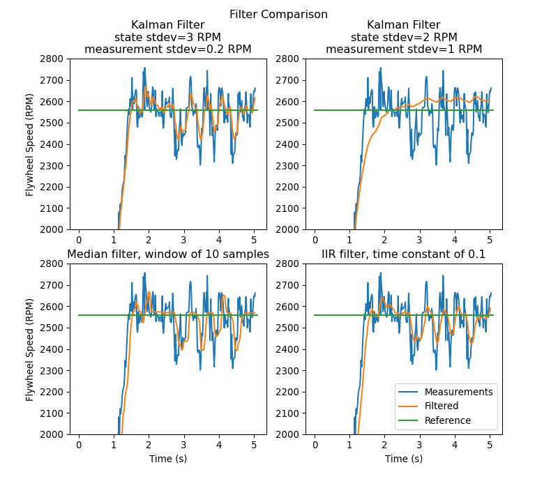

State Observers and Kalman Filters
==================================

State observers combine information about a system's behavior and external measurements to estimate the true :term:`state` of the system. A common observer used for linear systems is the Kalman Filter. Kalman filters are advantageous over other :ref:`filters <docs/software/advanced-controls/filters/index:Filters>` as they fuse measurements from one or more sensors with a state-space model of the system to optimally estimate a system's state.

This image shows flywheel velocity measurements over time, run through a variety of different filters. Note that a well-tuned Kalman filter shows no measurement lag during flywheel spinup while still rejecting noisy data and reacting quickly to disturbances as balls pass through it. More on filters can be found in the :ref:`filters section <docs/software/advanced-controls/filters/index:Filters>`\.

Gaussian Functions
------------------

Kalman filters utilize a :term:`Gaussian distribution` to model the noise in a process [1]_. In the case of a Kalman filter, the estimated :term:`state` of the system is the mean, while the variance is a measure of how certain (or uncertain) the filter is about the true :term:`state`.

.. figure:: images/normal-distribution.png
  :width: 600

The idea of variance and covariance is central to the function of a Kalman filter. Covariance is a measurement of how two random variables are correlated. In a system with a single state, the covariance matrix is simply :math:`\mathbf{\text{cov}(x_1, x_1)}`, or a matrix containing the variance :math:`\mathbf{\text{var}(x_1)}` of the state :math:`x_1`. The magnitude of this variance is the square of the standard deviation of the Gaussian function describing the current state estimate. Relatively large values for covariance might indicate noisy data, while small covariances might indicate that the filter is more confident about it's estimate. Remember that "large" and "small" values for variance or covariance are relative to the base unit being used -- for example, if :math:`\mathbf{x_1}` was measured in meters, :math:`\mathbf{\text{cov}(x_1, x_1)}` would be in meters squared.

Covariance matrices are written in the following form:

.. math::
  \mathbf{\Sigma} &= \begin{bmatrix}
    \text{cov}(x_1, x_1) & \text{cov}(x_1, x_2) & \ldots & \text{cov}(x_1, x_n) \\
    \text{cov}(x_2, x_1) & \text{cov}(x_2, x_2) & \ldots & \text{cov}(x_1, x_n) \\
    \vdots         & \vdots         & \ddots & \vdots \\
    \text{cov}(x_n, x_1) & \text{cov}(x_n, x_2) & \ldots & \text{cov}(x_n, x_n) \\
  \end{bmatrix}

Kalman Filters
--------------

.. important:: It is important to develop an intuition for what a Kalman filter is actually doing. The book `Kalman and Bayesian Filters in Python by Roger Labbe <https://github.com/rlabbe/Kalman-and-Bayesian-Filters-in-Python>`__ provides a great visual and interactive introduction to Bayesian filters. The Kalman filters in WPILib use linear algebra to gentrify the math, but the ideas are similar to the single-dimensional case. We suggest reading through Chapter 4 to gain an intuition for what these filters are doing.

To summarize, Kalman filters (and all Bayesian filters) have two parts: prediction and correction. Prediction projects our state estimate forward in time according to our system's dynamics, and correct steers the estimated state towards the measured state. While filters often preform both in the same timestep, it's not strictly necessary -- For example, WPILib's pose estimators call predict frequently, and correct only when new measurement data is available (for example, from a low-framerate vision system).

The following shows the equations of a discrete-time Kalman filter:

.. math::
    \text{Predict step} \nonumber \\
    \hat{\mathbf{x}}_{k+1}^- &= \mathbf{A}\hat{\mathbf{x}}_k + \mathbf{B} \mathbf{u}_k \\
    \mathbf{P}_{k+1}^- &= \mathbf{A} \mathbf{P}_k^- \mathbf{A}^T +
        \mathbf{\Gamma}\mathbf{Q}\mathbf{\Gamma}^T \\
    \text{Update step} \nonumber \\
    \mathbf{K}_{k+1} &=
        \mathbf{P}_{k+1}^- \mathbf{C}^T (\mathbf{C}\mathbf{P}_{k+1}^- \mathbf{C}^T +
        \mathbf{R})^{-1} \\
    \hat{\mathbf{x}}_{k+1}^+ &=
        \hat{\mathbf{x}}_{k+1}^- + \mathbf{K}_{k+1}(\mathbf{y}_{k+1} -
        \mathbf{C} \hat{\mathbf{x}}_{k+1}^- - \mathbf{D}\mathbf{u}_{k+1}) \\
    \mathbf{P}_{k+1}^+ &= (\mathbf{I} - \mathbf{K}_{k+1}\mathbf{C})\mathbf{P}_{k+1}^-

.. math::
  \begin{array}{llll}
    \mathbf{A} & \text{system matrix} & \hat{\mathbf{x}} & \text{state estimate vector} \\
    \mathbf{B} & \text{input matrix}       & \mathbf{u} & \text{input vector} \\
    \mathbf{C} & \text{output matrix}      & \mathbf{y} & \text{output vector} \\
    \mathbf{D} & \text{feedthrough matrix} & \mathbf{\Gamma} & \text{process noise intensity vector} \\
    \mathbf{P} & \text{error covariance matrix} & \mathbf{Q} & \text{process noise covariance matrix} \\
    \mathbf{K} & \text{Kalman gain matrix} & \mathbf{R} & \text{measurement noise covariance matrix}
  \end{array}

The state estimate :math:`\mathbf{x}`, together with :math:`\mathbf{P}`, describe the mean and covariance of the Gaussian function that describes our filter's estimate of the system's true state.

Process and Measurement Noise Covariance Matrices
^^^^^^^^^^^^^^^^^^^^^^^^^^^^^^^^^^^^^^^^^^^^^^^^^

The process and measurement noise covariance matrices :math:`\mathbf{Q}` and :math:`\mathbf{R}` describe the variance of each of our states and measurements. Remember that for a Gaussian function, variance is the square of the function's standard deviation. In a WPILib, Q and R are diagonal matrices whose diagonals contain their respective variances. For example, a Kalman filter with states :math:`\begin{bmatrix}\text{position} \\ \text{velocity} \end{bmatrix}` and measurements :math:`\begin{bmatrix}\text{position} \end{bmatrix}` with state standard deviations :math:`\begin{bmatrix}0.1 \\ 1.0\end{bmatrix}` and measurement standard deviation :math:`\begin{bmatrix}0.01\end{bmatrix}` would have the following :math:`\mathbf{Q}` and :math:`\mathbf{R}` matrices:

.. math::
  Q = \begin{bmatrix}0.01 & 0 \\ 0 & 1.0\end{bmatrix},
  R = \begin{bmatrix}0.0001\end{bmatrix}

Error Covariance Matrix
^^^^^^^^^^^^^^^^^^^^^^^

The error covariance matrix :math:`\mathbf{P}` describes the covariance of the state estimate :math:`\mathbf{\hat{x}}`. Informally, :math:`\mathbf{P}` describes our certainty about the estimated :term:`state`. If :math:`\mathbf{P}` is large, our uncertainty about the true state is large. Conversely, a :math:`\mathbf{P}` with smaller elements would imply less uncertainty about our true state.

As we project the model forward, :math:`\mathbf{P}` increases as our certainty about the system's true state decreases.

Predict step
------------

In prediction, our state estimate is updated according to the linear system dynamics :math:`\mathbf{\dot{x} = Ax + Bu}`. Furthermore, our error covariance :math:`\mathbf{P}` increases by the process noise covariance matrix :math:`\mathbf{Q}`. Larger values of :math:`\mathbf{Q}` will make our error covariance :math:`\mathbf{P}` grow more quickly. This :math:`\mathbf{P}` is used in the correction step to weight the model and measurements.

Correct step
------------

In the correct step, our state estimate is updated to include new measurement information. This new information is weighted against the state estimate :math:`\mathbf{\hat{x}}` by the Kalman gain :math:`\mathbf{K}`. Large values of :math:`\mathbf{K}` more highly weight incoming measurements, while smaller values of :math:`\mathbf{K}` more highly weight our state prediction. Because :math:`\mathbf{K}` is related to :math:`\mathbf{P}`, larger values of :math:`\mathbf{P}` will increase :math:`\mathbf{K}` and more heavily weight measurements. If, for example, a filter is predicted for a long duration, the large :math:`\mathbf{P}` would heavily weight the new information.

Finally, the error covariance :math:`\mathbf{P}` decreases to increase our confidence in the state estimate.

Tuning Kalman Filters
---------------------

WPILib's Kalman Filter classes' constructors take a linear system, a vector of process noise standard deviations and measurement noise standard deviations. These are converted to :math:`\mathbf{Q}` and :math:`\mathbf{R}` matrices by filling the diagonals with the square of the standard deviations, or variances, of each state or measurement. By decreasing a state's standard deviation (and therefore its corresponding entry in :math:`\mathbf{Q}`), the filter will distrust incoming measurements more. Similarly, increasing a state's standard deviation will trust incoming measurements more. The same holds for the measurement standard deviations -- decreasing an entry will make the filter more highly trust the incoming measurement for the corresponding state, while increasing it will decrease trust in the measurement.

.. tabs::

   .. group-tab:: Java

      .. remoteliteralinclude:: https://raw.githubusercontent.com/wpilibsuite/allwpilib/v2023.1.1-beta-1/wpilibjExamples/src/main/java/edu/wpi/first/wpilibj/examples/statespaceflywheel/Robot.java
         :language: java
         :lines: 49-58
         :linenos:
         :lineno-start: 49

   .. group-tab:: C++

      .. remoteliteralinclude:: https://raw.githubusercontent.com/wpilibsuite/allwpilib/v2023.1.1-beta-1/wpilibcExamples/src/main/cpp/examples/StateSpaceFlywheel/cpp/Robot.cpp
         :language: cpp
         :lines: 5-18
         :linenos:
         :lineno-start: 5

      .. remoteliteralinclude:: https://raw.githubusercontent.com/wpilibsuite/allwpilib/v2023.1.1-beta-1/wpilibcExamples/src/main/cpp/examples/StateSpaceFlywheel/cpp/Robot.cpp
         :language: cpp
         :lines: 48-53
         :linenos:
         :lineno-start: 48

Footnotes
---------

.. [1] In a real robot, noise comes from all sorts of sources. Stray electromagnetic radiation adds extra voltages to sensor readings, vibrations and temperature variations throw off inertial measurement units, gear lash causes encoders to have inaccuracies when directions change... all sorts of things. It's important to realize that, by themselves, each of these sources of "noise" aren't guaranteed to follow any pattern. Some of them might be the "white noise" random vibrations you've probably heard on the radio. Others might be "pops" or single-loop errors. Others might be nominally zero, but strongly correlated with events on the robot. However, the :term:`Central Limit Theorem` shows mathematically that regardless of how the individual sources of noise are distributed, as we add more and more of them up their combined effect eventually is distributed like a Gaussian. Since we do not know the exact individual sources of noise, the best choice of a model we can make is indeed that Gaussian function.
