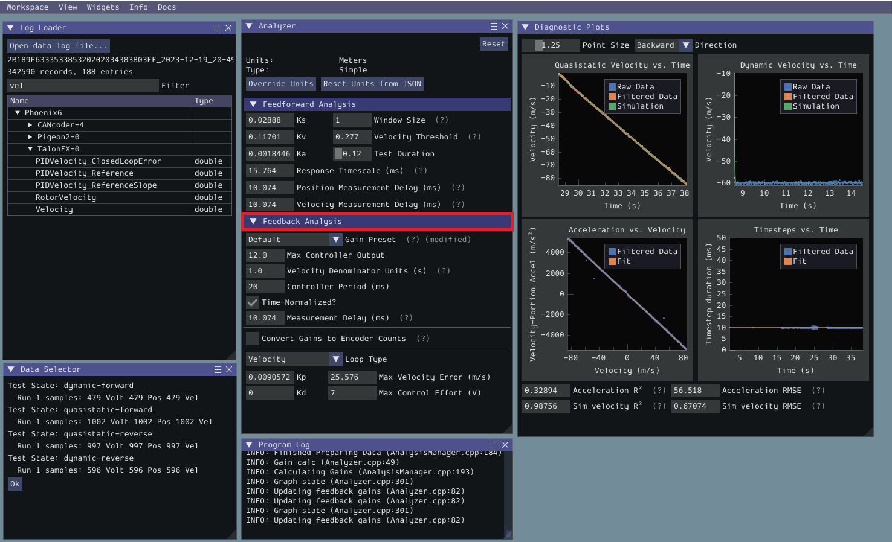
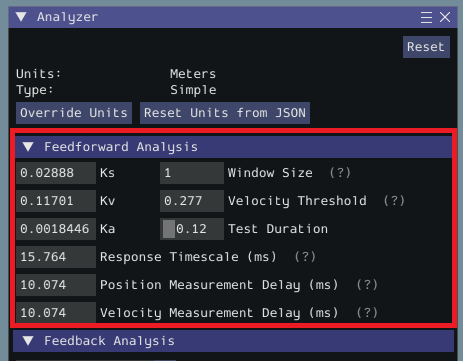
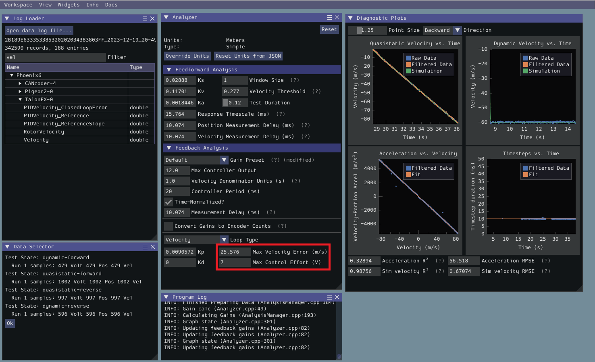
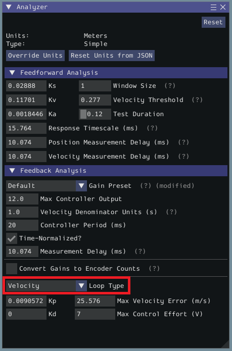

.. include:: <isonum.txt>

Feedback Analysis
=================

.. important:: These gains are, in effect, "educated guesses" - they are not guaranteed to be perfect, and should be viewed as a "starting point" for further tuning.

To view the feedback constants, click on the dropdown arrow on the :guilabel:`Feedback` section.

This view can be used to calculate optimal feedback gains for a PD or P controller for your mechanism (via :term:`LQR`).

Enter Controller Parameters
---------------------------

.. note:: The "Spark Max" preset assumes that the user has configured the controller to operate in the units of analysis with the SPARK MAX API's position/velocity scaling factor feature.

The calculated feedforward gains are *dimensioned quantities*. Unfortunately, not much attention is often paid to the units of PID gains in FRC\ |reg| controls, and so the various typical options for PID controller implementations differ in their unit conventions (which are often not made clear to the user).

To specify the correct settings for your PID controller, use the following options.

- :guilabel:`Gain Settings Preset` This drop-down menu will auto-populate the remaining fields with likely settings for one of a number of common FRC controller setups. Note that some settings, such as post-encoder gearing, PPR, and the presence of a follower motor must still be manually specified (as the analyzer has no way of knowing these without user input), and that others may vary from the given defaults depending on user setup.
- :guilabel:`Controller Period` This is the execution period of the control loop, in seconds. The default RIO loop rate is 50Hz, corresponding to a period of 0.02s. The onboard controllers on most "smart controllers" run at 1Khz, or a period of 0.001s.
- :guilabel:`Max Controller Output` This is the maximum value of the controller output, with respect to the PID calculation. Most controllers calculate outputs with a maximum value of 1, but Talon controllers have a maximum output of 1023.
- :guilabel:`Time-Normalized Controller` This specifies whether the PID calculation is normalized to the period of execution, which affects the scaling of the D gain.
- :guilabel:`Controller Type` This specifies whether the controller is an onboard RIO loop, or is running on a smart motor controller such as a Talon or a SPARK MAX.
- :guilabel:`Post-Encoder Gearing` This specifies the gearing between the encoder and the mechanism itself. This is necessary for control loops that do not allow user-specified unit scaling in their PID computations (e.g. those running on Talons). This will be disabled if not relevant.
- :guilabel:`Encoder EPR` This specifies the edges-per-revolution (not cycles per revolution) of the encoder used, which is needed in the same cases as Post-Encoder Gearing.
- :guilabel:`Has Follower` Whether there is a motor controller following the controller running the control loop, if the control loop is being run on a peripheral device. This changes the effective loop period.
- :guilabel:`Follower Update Period` The rate at which the follower (if present) is updated. By default, this is 100Hz (every 0.01s) for the Talon SRX, Talon FX, and the SPARK MAX, but can be changed.

.. note:: If you select a smart motor controller as the preset (e.g. TalonSRX, SPARK MAX, etc.) the :guilabel:`Convert Gains` checkbox will be automatically checked. This means the tool will convert your gains so that they can be used through the smart motor controller's PID methods. Therefore, if you would like to use WPILib's PID Loops, you must uncheck that box.

Measurement Delays
^^^^^^^^^^^^^^^^^^

.. note:: If you are using default smart motor controller settings or WPILib PID Control without additional filtering, SysId handles this for you.

Many "smart motor controllers" (such as the ``Talon SRX``, ``Venom``, ``Talon FX``, and ``SPARK MAX``) apply substantial :ref:`low-pass filtering <docs/software/advanced-controls/filters/introduction:Introduction to Filters>` to their encoder velocity measurements, which can introduce a significant amount of phase lag.  This can cause the calculated gains for velocity loops to be unstable. This can be accounted for with the :guilabel:`Measurement Delay` box.

However, the measurement delays have already been calculated for the default settings of the previously mentioned motor controllers so for most users this is handled by selecting the right preset in :guilabel:`Gain Settings Preset`.

The following only applies if the user decides to implement their own custom filtering settings (e.g. adding a moving average filter to a WPILib PID loop or changing smart motorcontroller measurement period and/or measurement window size) as the measurement delay must be recalculated. Here is the general formula that can be used for filters with moving windows (e.g. median filter + moving average filter):

.. math:: d = \frac{T(n - 1)}{2}

Where ``T`` is the period at which measurements are sampled (RIO default is 20 ms) and ``n`` is the size of the moving window used.

Specify Optimality Criteria
---------------------------

Finally, the user must specify what will be considered an "optimal" controller.  This takes the form of desired tolerances for the system error and control effort - note that it is *not* guaranteed that the system will obey these tolerances at all times.

As a rule, smaller values for the :guilabel:`Max Acceptable Error` and larger values for the :guilabel:`Max Acceptable Control Effort` will result in larger gains - this will result in larger control efforts, which can grant better setpoint-tracking but may cause more violent behavior and greater wear on components.

The :guilabel:`Max Acceptable Control Effort` should never exceed 12V, as that corresponds to full battery voltage, and ideally should be somewhat lower than this.

Select Loop Type
----------------

It is typical to control mechanisms with both position and velocity PIDs, depending on application. Either can be selected using the drop-down :guilabel:`Loop Type` menu.

